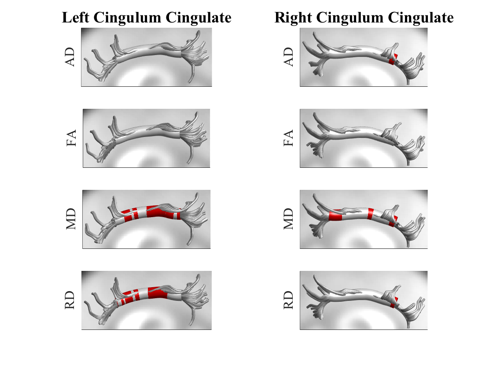

## Objectives

After you complete this section, you should be able to:

1. Define Tract Profiles and describe why this analysis is better than taking tract averages
1. Plot Tract Profiles for groups with 90% confidence interval
2. Plot Tract Profiles for the control group with DTI scalar as a heatmap
3. Render individual tracts for each participant
4. Render individual tracts for each participant with DTI scalars as a Tract Profile
5. Generate group statistics and save the Tract Profile
6. Render group statistics

## Before You Begin

<iframe src="https://player.vimeo.com/video/187850291?byline=0&portrait=0" frameborder="0" webkitallowfullscreen mozallowfullscreen allowfullscreen></iframe>

 

For most of the visualizations and analyses, the only file needed is the afq.mat file that also contains the corpus callosum segmentation:


rsync -rauv intj5@ssh.fsl.byu.edu:~/compute/analyses/EDSD/AFQ-CC/ ~/Desktop/


On your local computer, you need a working version of MATLAB and the following MATLAB packages: SPM 5, SPM 8, VistaSoft, AFQ, and LHON2. You can follow the code here if you need to figure out how to install these additional packages:


cd ~/Applications/
git clone https://github.com/shmp0722/LHON2.git LHON2
git clone https://github.com/yeatmanlab/AFQ.git afq
git clone https://github.com/vistalab/vistasoft.git vistasoft
wget http://www.fil.ion.ucl.ac.uk/spm/download/restricted/contradistinction/spm5.zip
unzip spm5.zip && rm spm5.zip
wget http://www.fil.ion.ucl.ac.uk/spm/download/restricted/idyll/spm8.zip
unzip spm8.zip && rm spm8.zip


## Tract Profiles

Due to anatomical factors like crossing fibers, nearness to cerebrospinal fluid and/or grey matter, or microstructural factors like axon density and/or diameter, diffusion measures can vary along tract trajectories. Averaging along the entire tract will obscure potentially important information and may not be optimal for localization of group differences. If there is damage or change that occurs within a small portion of the tract, those differences may be missed when the whole tract is averaged. Given that there are suffcient reports emphasizing the utility of analyzing diffusion properties along the tract in healthy brain anatomy, aging, and clinical conditions, any tractography analysis should look at diffusion measures along the tract and not averaged across the entire tract.

For identified pathways in each hemisphere, the average FA is calculated along the tract to generate tract profiles. Because the endpoints vary tremendously across participants, fiber tracts are clipped at each waypoint ROI. Remember that to generate the tracts, 2 waypoint ROIs were used to define the tract. Now those ROIs are used to clip the tract. With just the central portion of the fiber tracts, the AFQ program aligns and resamples each participant's fiber tracts into 100 equidistant segments, then the average FA is calculated within each segment using a weighted-average approach. In other words, if you have 100 fibers forming the cingulum, those 100 fibers are segmented into 100 equal parts and the DTI scalars like FA are averaged across those 100 fibers within a single segment. This is different than just takeing FA across the whole tract and across all 100 fibers and just generating a single data point. Although we are still averaging FA across all the fibers, it is not across the entire tract but only within 1 segment of the tract. The Tract Profile is created when you draw out all 100 segments to show how the DTI scalars change along the tracts.

## Plots

When you run MATLAB, you'll always need to run the following code to set MATLAB's path directory. If you ever quit MATLAB, these variables will always need to be re-entered:


% Get home directory:
var = getenv('HOME');

% Add modules to MATLAB. Do not change the order of these programs:
SPM8Path = [var,'/Applications/spm8'];
addpath(genpath(SPM8Path));
vistaPath = [var,'/Applications/vistasoft'];
addpath(genpath(vistaPath));
AFQPath = [var,'/Applications/afq'];
addpath(genpath(AFQPath));
LHON2Path = [var,'/Applications/LHON2'];
addpath(genpath(LHON2Path));


To load the afq.mat file type the following into MATLAB:


load ~/Desktop/afq_cc_2016_09_30_1005.mat


### Fiber Groups

You'll need to keep track of fiber group number and names. If at any point you need that information, it is contained within the afq matrix:


afq.fgnames


Here's the fiber group and corresponding number:

1. Left Thalamic Radiation
2. Right Thalamic Radiation
3. Left Corticospinal Tract
4. Right Corticospinal Tract
5. Left Cingulum Cingulate
6. Right Cingulum Cingulate
7. Left Cingulum Hippocampus
8. Right Cingulum Hippocampus
9. Corpus Callosum Forceps Major
10. Corpus Callosum Forceps Minor
11. Left IFOF
12. Right IFOF
13. Left ILF
14. Right ILF
15. Left SLF
16. Right SLF
17. Left Uncinate Fasciculus
18. Right Uncinate Fasciculus
19. Left Arcuate Fasciculus
20. Right Arcuate Fasciculus
21. Corpus Callosum Occipital Segment
22. Corpus Callosum Posterior Parietal Segment
23. Corpus Callsoum Superior Parietal Segment
24. Corpus Callosum Motor Segment
25. Corpus Callosum Superior Frontal Segment
26. Corpus Callosum Anterior Frontal Segment
27. Corpus Callosum Orbital Frontal Segment
28. Corpus Callosum Temporal Lobe Segment

### Group Averages

<iframe src="https://player.vimeo.com/video/187850294?byline=0&portrait=0" frameborder="0" webkitallowfullscreen mozallowfullscreen allowfullscreen></iframe>

 

Tract profiles (DTI scalars along the tract) can be automatically plotted in MATLAB though clumsily. Long term you'll want develop your own code in R to graph the results. After loading your afq.mat dataset, you can generate group average graphs for ALL 28 tracts:


all = [1,2,3,4,5,6,7,8,9,10,11,12,13,14,15,16,17,18,19,20,21,22,23,24,25,26,27,28];
AFQ_plot('AD',afq.patient_data,...
'HC',afq.control_data,...
'tracts',all,...
'group',...
'property','fa');


If you just want to look at one specific tract type:


AFQ_plot('AD',afq.patient_data,...
'HC',afq.control_data,...
'tracts',[1],...
'group',...
'property','fa');


If you want to change from FA to other DTI scalars, change the 'property' option to either: 'fa', 'rd', 'md', 'ad'.

### Control Group Heatmap

You are also able to plot a heatmap of the control group. The gray lines are individual participants and the average of the group is represented by the heatmap. The color changes with the y-axis, so in the following image as FA increases the heatmap gets redder and as FA decreases it goes bluer. This type of image is nice to pair with a 3D view of the tract later on. To change the fiber group, change the number associated with **'tracts',[3]**. The numbers correspond to each fiber group (see above):


AFQ_plot(afq,'colormap','tracts',[3])


## Individual Renderings

<iframe src="https://player.vimeo.com/video/187850293?byline=0&portrait=0" frameborder="0" webkitallowfullscreen mozallowfullscreen allowfullscreen></iframe>

 

To look at an individual participant, you need to load their fiber group data, their processed DTI data, and a background image. For now let us just download one participant and not the entire data set:


rsync -rauv --exclude="DICOM" intj5@ssh.fsl.byu.edu:~/compute/images/EDSD/FRE_AD001 ~/Desktop/


In MATLAB, load the participant's fiber group (fg), their dt6.mat file (dt) and an image to use as a background to overlay fibers. Because we registered all the participants brains affinely to an MNI template, we can use the FA MNI template as a general background. This is more for visualization and not about precision:


fg = dtiReadFibers(fullfile([var,'/Desktop/FRE_AD001/dti55trilin/fibers/MoriGroups_clean_D5_L4.mat']));
dt = dtiLoadDt6(fullfile([var,'/Desktop/FRE_AD001/dti55trilin/dt6.mat']));
t1 = readFileNifti([var,'/Applications/vistasoft/mrDiffusion/templates/MNI_JHU_FA.nii.gz']);


### Fiber Tracts

You can plot the fibers of a participant. There are a LOT of options under AFQ_RenderFibers, so explore the help file (`help AFQ_RenderFibers`) to learn more:


AFQ_RenderFibers(fg(3),'numfibers',500,'color',[1 0 0],'subplot',[1 2 1]);
title(fg(3).name,'fontsize',18)
AFQ_RenderFibers(fg(4),'numfibers',500,'color',[1 0 0],'subplot',[1 2 2]);
title(fg(4).name,'fontsize',18)


### Corpus Callosum

Here's the code of rendering the corpus callosum fibers. You have to load each fiber group separately as they were created and saved separately:


% Load Fiber Groups
fg1=dtiReadFibers(fullfile([var,'/Desktop/FRE_AD001/dti55trilin/fibers/CC_Orb_Frontal_clean_D5_L4.mat']));
fg2=dtiReadFibers(fullfile([var,'/Desktop/FRE_AD001/dti55trilin/fibers/CC_Ant_Frontal_clean_D5_L4.mat']));
fg3=dtiReadFibers(fullfile([var,'/Desktop/FRE_AD001/dti55trilin/fibers/CC_Sup_Frontal_clean_D5_L4.mat']));
fg4=dtiReadFibers(fullfile([var,'/Desktop/FRE_AD001/dti55trilin/fibers/CC_Motor_clean_D5_L4.mat']));
fg5=dtiReadFibers(fullfile([var,'/Desktop/FRE_AD001/dti55trilin/fibers/CC_Sup_Parietal_clean_D5_L4.mat']));
fg6=dtiReadFibers(fullfile([var,'/Desktop/FRE_AD001/dti55trilin/fibers/CC_Post_Parietal_clean_D5_L4.mat']));
fg7=dtiReadFibers(fullfile([var,'/Desktop/FRE_AD001/dti55trilin/fibers/CC_Occipital_clean_D5_L4.mat']));
fg8=dtiReadFibers(fullfile([var,'/Desktop/FRE_AD001/dti55trilin/fibers/CC_Temporal_clean_D5_L4.mat']));

% Create Figure
AFQ_RenderFibers(fg1,'numfibers',100,'color',[1 0 0],'camera','sagittal');
AFQ_RenderFibers(fg2,'numfibers',200,'color',[1 .5 0],'newfig','0');
AFQ_RenderFibers(fg3,'numfibers',100,'color',[1 1 0],'newfig','0');
AFQ_RenderFibers(fg4,'numfibers',100,'color',[0 1 0],'newfig','0');
AFQ_RenderFibers(fg5,'numfibers',100,'color',[0 0 1],'newfig','0');
AFQ_RenderFibers(fg6,'numfibers',100,'color',[.6 0 .8275],'newfig','0');
AFQ_RenderFibers(fg7,'numfibers',100,'color',[1 .2 .6],'newfig','0');
AFQ_RenderFibers(fg8,'numfibers',100,'color',[0 1 1],'newfig','0');
AFQ_AddImageTo3dPlot(t1, [-1, 0, 0]);
set(gcf, 'Position', [100, 100, 780, 650]);
set(gca, 'XTick', [], 'YTick', [], 'ZTick', [], 'xlabel', [], 'ylabel', [], 'zlabel', []);
set(gca,'LooseInset',get(gca,'TightInset'))


### Heatmap

You can also look at the heatmap of an individual participant:


crange = [.3 .6]; numfibers=200; radius = 5; subdivs = 100; cmap = 'jet'; newfig = 0;
Profile = SO_FiberValsInTractProfiles(fg(3),dt,'SI',100,1);
AFQ_RenderFibers(fg(3),'numfibers',500,'color',[.5 .5 .5],'alpha',0.5);
AFQ_RenderTractProfile(Profile.coords.acpc, radius, Profile.vals.fa, subdivs, cmap, crange, newfig);
AFQ_AddImageTo3dPlot(t1, [-5, 0, 0]);


## Group Renderings

<iframe src="https://player.vimeo.com/video/187850292?byline=0&portrait=0" frameborder="0" webkitallowfullscreen mozallowfullscreen allowfullscreen></iframe>

 

In order to generate a tract profile you can load on top of an individual tract, we have to perform statistics. Note that these images are not the absolute statistics, because: (1) you are only running t-tests and cannot run statistics with any covariates, and (2) the t-tests do not control for multiple comparisons. This is JUST for **visualization** purposes only.

### Tract Profile

First, run a t-test between groups:


for jj = 1:20
    [hAD(jj,:),pAD(jj,:),~,TstatsAD(jj)] = ttest2(afq.patient_data(jj).AD,afq.control_data(jj).AD);
    [hFA(jj,:),pFA(jj,:),~,TstatsFA(jj)] = ttest2(afq.patient_data(jj).FA,afq.control_data(jj).FA);
    [hMD(jj,:),pMD(jj,:),~,TstatsMD(jj)] = ttest2(afq.patient_data(jj).MD,afq.control_data(jj).MD);
    [hRD(jj,:),pRD(jj,:),~,TstatsRD(jj)] = ttest2(afq.patient_data(jj).RD,afq.control_data(jj).RD);
end


Next, convert the results into a way that can be visually mapped on the tracts:


numNodes = 100;
[fa, md, rd, ad, cl, volume, TractProfile] = AFQ_ComputeTractProperties(fg,dt,numNodes);
for jj = 1:20
    TractProfile(jj) = AFQ_TractProfileSet(TractProfile(jj),'vals','pADval',pAD(jj,:));
    TractProfile(jj) = AFQ_TractProfileSet(TractProfile(jj),'vals','pFAval',pFA(jj,:));
    TractProfile(jj) = AFQ_TractProfileSet(TractProfile(jj),'vals','pMDval',pMD(jj,:));
    TractProfile(jj) = AFQ_TractProfileSet(TractProfile(jj),'vals','pRDval',pRD(jj,:));
    TractProfile(jj) = AFQ_TractProfileSet(TractProfile(jj),'vals','TstatAD',TstatsAD(jj).tstat);
    TractProfile(jj) = AFQ_TractProfileSet(TractProfile(jj),'vals','TstatFA',TstatsFA(jj).tstat);
    TractProfile(jj) = AFQ_TractProfileSet(TractProfile(jj),'vals','TstatMD',TstatsMD(jj).tstat);
    TractProfile(jj) = AFQ_TractProfileSet(TractProfile(jj),'vals','TstatRD',TstatsRD(jj).tstat);
end


Save the TractProfile data so you don't have to generate it again in the future. You can load it like you loaded the afq.mat file:


save([var,'/Desktop/TractProfile_' datestr(now,'yyyy_mm_dd_HHMM')],'TractProfile');


### Statistical Results


mymap = [1 0 0
1 1 1];
crange = [0 1]; numfibers=200; radius = 5; subdivs = 100; cmap = mymap;

AFQ_RenderFibers(fg(5),'color',[.75 .75 .75],'tractprofile',TractProfile(5),'val','pADval','numfibers',numfibers,'cmap',cmap,'crange',crange,'radius',[1 5],'subplot',[4 2 1]);
AFQ_AddImageTo3dPlot(t1,[1,0,0],[],[0]);
title('Left Cingulum Cingulate','fontsize',18)
colorbar('delete');
set(gca,'ZTickLabel',[],'YTickLabel',[]);
set(gca, 'CLim', [0, 0.05]);
zlabel('AD');
ylabel([]);
zl1=zlim;
yl1=ylim;

AFQ_RenderFibers(fg(6),'color',[.75 .75 .75],'tractprofile',TractProfile(6),'val','pADval','numfibers',numfibers,'cmap',cmap,'crange',crange,'radius',[1 5],'subplot',[4 2 2],'camera',[90 0]);
AFQ_AddImageTo3dPlot(t1,[1,0,0],[],[0]);
title('Right Cingulum Cingulate','fontsize',18)
colorbar('delete');
set(gca,'ZTickLabel',[],'YTickLabel',[]);
set(gca, 'CLim', [0, 0.05]);
zlabel('AD');
ylabel([]);
zlim(zl1);

AFQ_RenderFibers(fg(5),'color',[.75 .75 .75],'tractprofile',TractProfile(5),'val','pFAval','numfibers',numfibers,'cmap',cmap,'crange',crange,'radius',[1 5],'subplot',[4 2 3]);
AFQ_AddImageTo3dPlot(t1,[1,0,0],[],[0]);
colorbar('delete');
set(gca,'ZTickLabel',[],'YTickLabel',[]);
set(gca, 'CLim', [0, 0.05]);
zlabel('FA');
ylabel([]);
zlim(zl1);

AFQ_RenderFibers(fg(6),'color',[.75 .75 .75],'tractprofile',TractProfile(6),'val','pFAval','numfibers',numfibers,'cmap',cmap,'crange',crange,'radius',[1 5],'subplot',[4 2 4],'camera',[90 0]);
AFQ_AddImageTo3dPlot(t1,[1,0,0],[],[0]);
colorbar('delete');
set(gca,'ZTickLabel',[],'YTickLabel',[]);
set(gca, 'CLim', [0, 0.05]);
zlabel('FA');
ylabel([]);
zlim(zl1);

AFQ_RenderFibers(fg(5),'color',[.75 .75 .75],'tractprofile',TractProfile(5),'val','pMDval','numfibers',numfibers,'cmap',cmap,'crange',crange,'radius',[1 5],'subplot',[4 2 5]);
AFQ_AddImageTo3dPlot(t1,[1,0,0],[],[0]);
colorbar('delete');
set(gca,'ZTickLabel',[],'YTickLabel',[]);
set(gca, 'CLim', [0, 0.05]);
zlabel('MD');
ylabel([]);

AFQ_RenderFibers(fg(6),'color',[.75 .75 .75],'tractprofile',TractProfile(6),'val','pMDval','numfibers',numfibers,'cmap',cmap,'crange',crange,'radius',[1 5],'subplot',[4 2 6],'camera',[90 0]);
AFQ_AddImageTo3dPlot(t1,[1,0,0],[],[0]);
colorbar('delete');
set(gca,'ZTickLabel',[],'YTickLabel',[]);
set(gca, 'CLim', [0, 0.05]);
zlabel('MD');
ylabel([]);
zlim(zl1);

AFQ_RenderFibers(fg(5),'color',[.75 .75 .75],'tractprofile',TractProfile(5),'val','pRDval','numfibers',numfibers,'cmap',cmap,'crange',crange,'radius',[1 5],'subplot',[4 2 7]);
AFQ_AddImageTo3dPlot(t1,[1,0,0],[],[0]);
colorbar('delete');
set(gca,'ZTickLabel',[],'YTickLabel',[]);
set(gca, 'CLim', [0, 0.05]);
zlabel('RD');
ylabel([]);
zlim(zl1);

AFQ_RenderFibers(fg(6),'color',[.75 .75 .75],'tractprofile',TractProfile(6),'val','pRDval','numfibers',numfibers,'cmap',cmap,'crange',crange,'radius',[1 5],'subplot',[4 2 8],'camera',[90 0]);
AFQ_AddImageTo3dPlot(t1,[1,0,0],[],[0]);
colorbar('delete');
set(gca,'ZTickLabel',[],'YTickLabel',[]);
set(gca, 'CLim', [0, 0.05]);
zlabel('RD');
ylabel([]);
zlim(zl1);


Official statistics and graphing will come in a later lesson as it is far more complex and time consuming.
