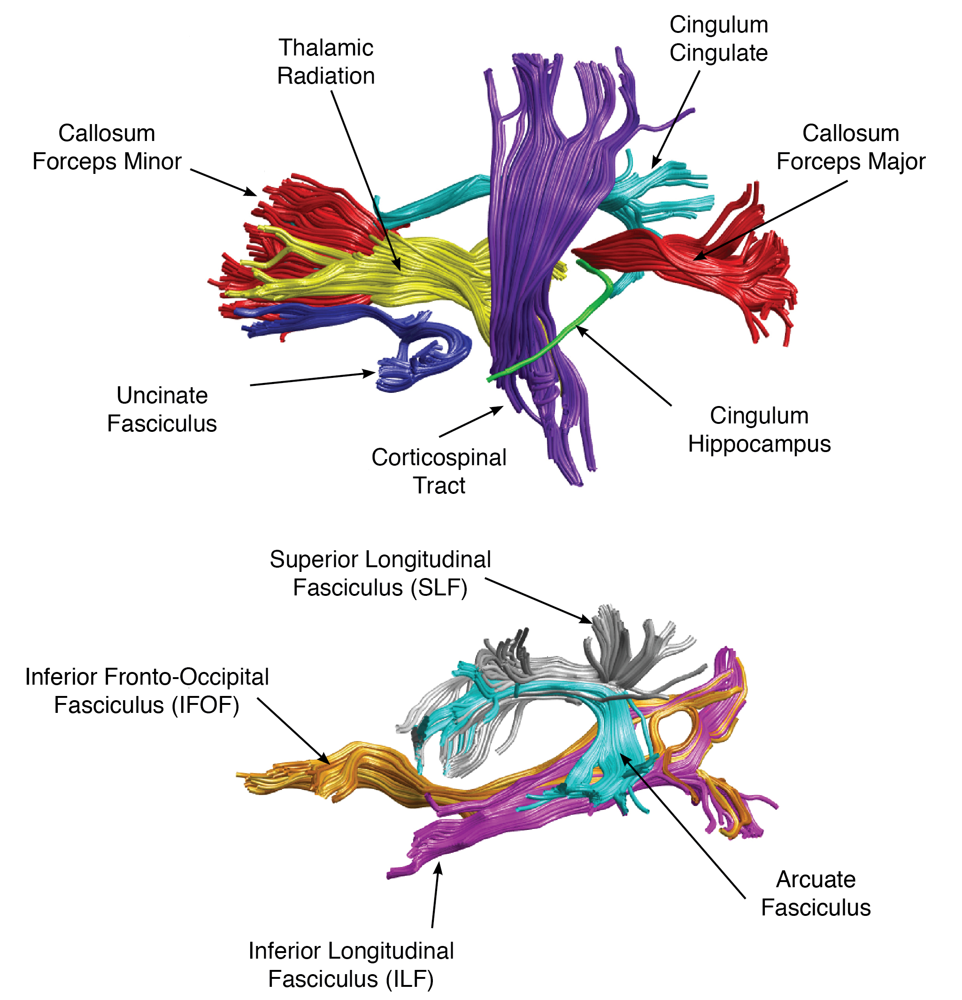
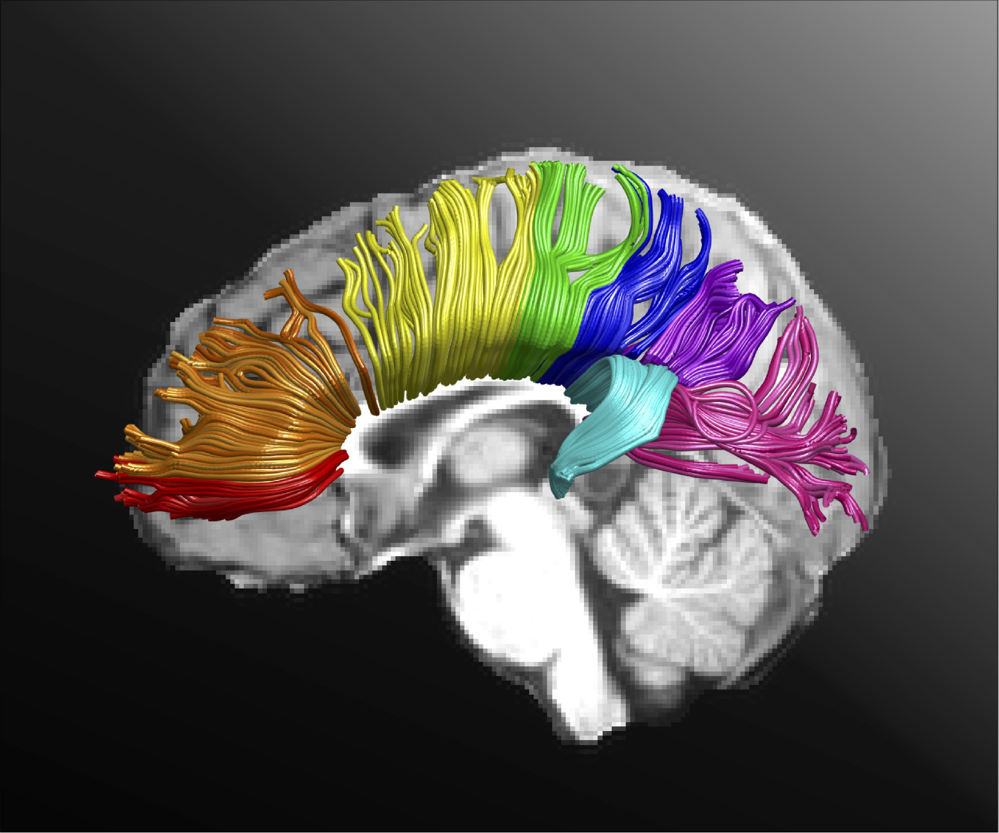

## Objectives

After you complete this section, you should be able to:

1. Describe the AFQ pipeline
2. Identify the 20 fiber tracts generated by AFQ
3. Identify the 8 corpus callosum regions segmented
4. Run AFQ on the supercomputer
5. Segment the corpus callosum

## Automated Fiber Quantification (AFQ)

Once preprocessing is completed using **dtiInit**, white matter pathways can be automatically identified using the software package, Automated Fiber Quantification version 1.2 (https://github.com/yeatmanlab/AFQ). First, whole-brain tractography is estimated using a deterministic streamline tracking algorithm (STT). Individual fibers are assigned to a fiber tract if they pass through two waypoint ROIs that were used to define the trajectory of the pathway. ROIs are automatically placed in equivalent anatomical locations across each participant by registering a template to each participant. Finally, identified fiber tracts are validated by comparing each tract to a fiber tract probability map. Fibers within the identified fiber tract of low probability are discarded, because they do not conform to the shape of the fiber tract as defined by the fiber probability map.

### Fiber Tracts

AFQ identifies twenty major fiber tracts in an individual’s brain plus an added module will also segment the corpus callosum into 8 regions.

The 20 fiber tracts are as follows:

1. Corpus callosum forceps major and minor
2. Thalamic radiation, right and left hemisphere
3. Cingulum cingulate, right and left hemisphere
4. Cingulum hippocampus, right and left hemisphere
5. Corticospinal tract, right and left hemisphere
6. Superior Longitudinal Fasciculus, right and left hemisphere
7. Inferior Longitudinal Fasciculus, right and left hemisphere
8. Inferior Fronto-Occipital Fasciculus, right and left hemisphere
9. Arcuate Fasciculus, right and left hemisphere
10. Uncinate Fasciculus, right and left hemisphere

### Corpus Callosum

The 8 regions of the corpus callosum are as follows:

1. Orbital frontal
2. Superior frontal
3. Anterior frontal
4. Motor
5. Superior Parietal
6. Posterior Parietal
7. Occipital
8. Temporal

## VistaSoft

### Batch Script

The batch script will use the for loop to loop through all the participant's under ~/compute/images/EDSD and submit the job script with the command line variable **subj**:


vi ~/scripts/EDSD/dtiInit_batch.sh


Copy and paste:


#!/bin/bash
for subj in $(ls ~/compute/images/EDSD/); do
sbatch \
-o ~/logfiles/${1}/output_${subj}.txt \
-e ~/logfiles/${1}/error_${subj}.txt \
~/scripts/EDSD/dtiInit_job.sh \
${subj}
sleep 1
done


### Job Script

The job script simply submits the MATLAB function **subjID** with the participant ID as a command line variable:


vi ~/scripts/EDSD/dtiInit_job.sh


Copy and paste:


#!/bin/bash

#SBATCH --time=04:00:00   # walltime
#SBATCH --ntasks=1  # number of processor cores (i.e. tasks)
#SBATCH --nodes=1   # number of nodes
#SBATCH --mem-per-cpu=24576M   # memory per CPU core

# Compatibility variables for PBS. Delete if not needed.
export PBS_NODEFILE=`/fslapps/fslutils/generate_pbs_nodefile`
export PBS_JOBID=$SLURM_JOB_ID
export PBS_O_WORKDIR="$SLURM_SUBMIT_DIR"
export PBS_QUEUE=batch

# Set the max number of threads to use for programs using OpenMP. Should be <= ppn. Does nothing if the program doesn't use OpenMP.
export OMP_NUM_THREADS=$SLURM_CPUS_ON_NODE

# LOAD MODULES, INSERT CODE, AND RUN YOUR PROGRAMS HERE
cd ~/scripts/EDSD/
module load matlab/r2010a
matlab -nodisplay -nojvm -nosplash -r "subjID('$1')"


### MATLAB function

You can get the MATLAB template from the shared directory:


cp -v ~/fsl_groups/fslg_byustudent/compute/matlab.nii.gz ~/templates/


Create your MATLAB function. The reason we are creating a function versus a script, is so we can pass a variable, namely the participant ID, into the script:


vi ~/scripts/EDSD/subjID.m


Copy and paste the following into your function. You do need all those percent signs at the beginning of the function:


%%%%%%%
function subjID(x)

% Display participant ID:
display(x);

% Get home directory:
var = getenv('HOME');

% Add modules to MATLAB. Do not change the order of these programs:
SPM8Path = [var,'/apps/matlab/spm8'];
addpath(genpath(SPM8Path));
vistaPath = [var,'/apps/matlab/vistasoft'];
addpath(genpath(vistaPath));
AFQPath = [var,'/apps/matlab/AFQ'];
addpath(genpath(AFQPath));

% Set file names:
subjDir= [var,'/compute/images/EDSD/',x];
brainFile = [subjDir,'/t1/brain.nii.gz'];
t1File = [subjDir,'/t1/matlab.nii.gz'];
dtiFile = [subjDir,'/raw/dti.nii.gz'];
cd (subjDir);

% Move brain only image into the correct MATLAB FOV box:
mrAnatAverageAcpcNifti(brainFile,t1File,[var,'/templates/matlab.nii.gz']);

% Don't change the following code:
ni = readFileNifti(t1File);
ni = niftiSetQto(ni,ni.sto_xyz);
writeFileNifti(ni,t1File);

% Don't change the following code:
ni=readFileNifti(dtiFile);
ni=niftiSetQto(ni,ni.sto_xyz);
writeFileNifti(ni,dtiFile);

% Determine phase encode dir:
% > info=dicominfo([var,'/compute/images/EDSD/FRE_AD001/DICOM/diff/MR.22533.01274.dcm']);
% To get the manufacturer information:
% > info.(dicomlookup('0008','0070'))
% To get the axis of phase encoding with respect to the image:
% > info.(dicomlookup('0018','1312'))
% If phase encode dir is 'COL', then set 'phaseEncodeDir' to '2'
% If phase encode dir is 'ROW', then set 'phaseEncodeDir' to '1'
% For Siemens / Philips specific code we need to add 'rotateBvecsWithCanXform',
% AND ALWAYS DOUBLE CHECK phaseEncodeDir:
% > dwParams = dtiInitParams('rotateBvecsWithCanXform',1,'phaseEncodeDir',2,'clobber',1);
% For GE specific code,
% AND ALWAYS DOUBLE CHECK phaseEncodeDir:
% > dwParams = dtiInitParams('phaseEncodeDir',2,'clobber',1);
dwParams = dtiInitParams('rotateBvecsWithCanXform',1,'phaseEncodeDir',2,'clobber',1);

% Here's the one line of code to do the DTI preprocessing:
dtiInit(dtiFile, t1File, dwParams);

% Clean up files and exit:
movefile('dti_*','raw/');
movefile('dtiInitLog.mat','raw/');
exit;


You should not have to change any of this code for the neuroimaging class; however, if you are processing your own dataset, you need to double check the manufacturer and phaseEncodeDir and change those within the dwParams command.

### Submit Batch Script

Finally, submit the whole process by submitting the batch script:


var=`date +"%Y%m%d-%H%M%S"`
mkdir -p ~/logfiles/${var}
sh ~/scripts/EDSD/dtiInit_batch.sh $var

