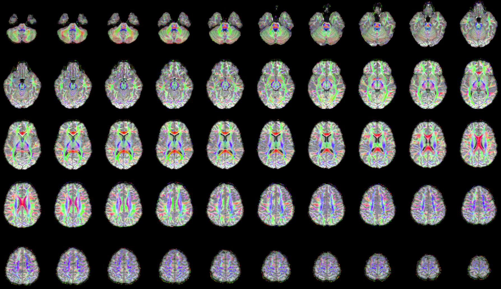

## Sync Example Participant

Log into supercomputer:

```
ssh <username>@ssh.fsl.byu.edu
```

Copy over data:

```
rsync \
-rauv \
~/fsl_groups/fslg_byustudent/compute/examples/dti \
~/compute/examples
```

## Convert DICOM to NIfTI

Set participant directory:

```
subjDir=~/compute/examples/dti/
```

Make a new directory for your T1 NIfTI image:

```
mkdir ${subjDir}/t1
```

Make a new directory for your DWI NIfTI image:

```
mkdir ${subjDir}/raw
```

## dcm2nii

Convert your T1 image:

```
~/apps/mricron/dcm2nii \
-a y \
-g n \
-x y \
-o ${subjDir}/t1 \
${subjDir}/DICOMs/sag-spgr/*
```

Convert your DWI image:

```
~/apps/mricron/dcm2nii \
-a y \
-g y \
-o ${subjDir}/raw \
${subjDir}/DICOMs/dti/*
```

## Rename

The output from the `dcm2nii` program results in file names that are uniquely different across participants. For analyses though, we want all the files named exactly the same from participant to participant. In this case, we want all the files named t1.nii. In addition to renaming the file, we want to use just the cropped and reorientated file (co). We want to delete the reorientation only (o) and original file (no co or o prefix).

```
cd ${subjDir}/t1
mv co*.nii t1.nii
rm o*.nii | rm 2*.nii
```

We want all files to be named exactly the same, dti.nii.gz. The .bvec and .bval files also need to be renamed, dti.bvec and dti.bval, respectively.

```
cd ${subjDir}/raw
mv -f 2*.nii.gz dti.nii.gz
mv -f 2*.bval dti.bval
mv -f 2*.bvec dti.bvec
```

## acpcdetect

The program `acpcdetect` will AC-PC align T1 images:

```
~/apps/art/acpcdetect \
-M \
-o ${subjDir}/t1/acpc.nii \
-i ${subjDir}/t1/t1.nii
```

## N4 Bias Field Correction

The way to fix the bias field is to use ANTs N4 Bias Field Correction tool:

```
~/apps/ants/bin/N4BiasFieldCorrection \
-d 3 \
-i ${subjDir}/t1/acpc.nii \
-o [${subjDir}/t1/n4.nii.gz,${subjDir}/t1/biasfield.nii.gz] \
-s 4 \
-b [200] \
-c [50x50x50x50,0.000001]
```

## Brain Extraction

A job script has already been created, `BrainExtraction.sh`, but the username information needs to be changed. *Preferably you would run the full ANTs Cortical Thickness Pipeline*, but for the sake of time the brain extraction protocol is slightly "faster". It takes ~1.5 hours instead of the 8+ hours that ANTs Cortical Thickness pipeline takes.

To submit the job script:

```
sbatch ~/compute/examples/dti/brainExtraction.sh
```

You can check the status of your job by typing:

```
cat ~/compute/examples/dti/output.txt
```

## brainExtraction.sh

```
#!/bin/bash

#SBATCH --time=50:00:00   # walltime
#SBATCH --ntasks=2  # number of processor cores (i.e. tasks)
#SBATCH --nodes=1   # number of nodes
#SBATCH --mem-per-cpu=8192M   # memory per CPU core
#SBATCH -o /fslhome/<username>/examples/dti/output.txt
#SBATCH -e /fslhome/<username>/examples/dti/error.txt
#SBATCH -J "brainExtraction"   # job name

# LOAD MODULES, INSERT CODE, AND RUN YOUR PROGRAMS HERE
export ANTSPATH=/fslhome/<username>/apps/ants/bin/
PATH=${ANTSPATH}:${PATH}
subjDir=/fslhome/<username>/examples/dti/t1
templateDir=/fslhome/<username>/examples/dti/templates/NKI10andUnder
/fslhome/<username>/apps/ants/bin/antsBrainExtraction.sh \
-d 3 \
-a ${subjDir}/n4.nii.gz \
-e ${templateDir}/T_template0_BrainCerebellum.nii.gz \
-m ${templateDir}/T_template0_BrainCerebellumProbabilityMask.nii.gz \
-o ${subjDir}/brain
```

## dtiInit

In order to run MATLAB on the super computer, you have to generate an extra script. You need to generate a MATLAB script (`*.m`) with your MATLAB code. You also need to generate a job script to submit the MATLAB script. Confused? Ask questions! Both scripts have already been generated.

To submit the job script:

```
sbatch ~/compute/examples/dti/dtiInitscript.sh
```

You can check the status of your job by typing:

```
cat ~/compute/examples/dti/output.txt
```

## dtiInitscript.m

```
SPM8Path = '/fslhome/<username>/apps/matlab/spm8';
addpath(genpath(SPM8Path));
vistaPath = '/fslhome/<username>/apps/matlab/git/vistasoft';
addpath(genpath(vistaPath));
AFQPath = '/fslhome/<username>/apps/matlab/git/AFQ';
addpath(genpath(AFQPath));

subjDir= ['/fslhome/<username>/compute/examples/dti/'];
brainFile = [subjDir,'/t1/brainBrainExtractionBrain.nii.gz'];
t1File = [subjDir,'/t1/aveT1.nii.gz'];
dtiFile = [subjDir,'/raw/dti.nii.gz'];
cd (subjDir);

mrAnatAverageAcpcNifti(brainFile,t1File,...
['/fslhome/<username>/compute/examples/dti/templates/matlab.nii.gz']); 
 
ni = readFileNifti(t1File);
ni = niftiSetQto(ni,ni.sto_xyz);
writeFileNifti(ni,t1File);

ni=readFileNifti(dtiFile);
ni=niftiSetQto(ni,ni.sto_xyz);
writeFileNifti(ni,dtiFile);

dwParams = dtiInitParams('rotateBvecsWithCanXform',1,...
'phaseEncodeDir',2,'clobber',1);
dtiInit(dtiFile, t1File, dwParams); 
```

## dtiInitscript.sh

```
#!/bin/bash

#SBATCH --time=50:00:00   # walltime
#SBATCH --ntasks=2  # number of processor cores (i.e. tasks)
#SBATCH --nodes=1   # number of nodes
#SBATCH --mem-per-cpu=8192M   # memory per CPU core
#SBATCH -o /fslhome/<username>/compute/examples/dti/output.txt
#SBATCH -e /fslhome/<username>/compute/examples/dti/error.txt
#SBATCH -J "dtiInit"   # job name

# LOAD MODULES, INSERT CODE, AND RUN YOUR PROGRAMS HERE
cd /fslhome/<username>/compute/examples/dti/
module load matlab
matlab -nodisplay -nojvm -nosplash -r dtiInitscript
```

## Clean up the directory

```
cd /fslhome/<username>/compute/examples/dti/
mv dti*trilin/ dt6dir
mv dti_* raw/
mv dtiInitLog.mat raw/
```

## Generate FA Map

Load MATLAB:

```bash
module load matlab
matlab -nodisplay -nojvm -nosplash
```

Run in MATLAB:

```matlab
SPM8Path = '/fslhome/<username>/apps/matlab/spm8';
addpath(genpath(SPM8Path));
vistaPath = '/fslhome/<username>/apps/matlab/git/vistasoft';
addpath(genpath(vistaPath));
AFQPath = '/fslhome/<username>/apps/matlab/git/AFQ';
addpath(genpath(AFQPath));

subjDir= ['/fslhome/<username>/compute/examples/dti/'];
cd (subjDir);
[dt6, xformToAcpc, mmPerVox] = dtiLoadTensorsFromNifti('dt6dir/bin/tensors.nii.gz');
[fa,md] = dtiComputeFA(dt6);
dtiWriteNiftiWrapper(fa,xformToAcpc,'t1/fa.nii.gz',1,'FA');
```

## Check Output

Part of the output provides a file that shows the RGB vector overlay. The file is located under the dt6dir and is called, t1pdd.png. This file shows a montage of the brain with the RGB overlay. The colors of the overlay signify the tensor direction. When looking at DTI overlays, red indicates tensors that are orientated right to left, green indicates tensors that are orientated anterior to posterior, and blue indicates tensors that are orientated superior to inferior. When looking at the RGB overlay, the corpus callosum should be solid red, because the tensors are moving back and forth from the right hemisphere to left hemisphere. If the corpus callosum is not bright red, you know you immediately have an issue.

## Copy files to Desktop

```
rsync \
-rauv \
--exclude="DICOMs" \
--exclude="templates" \
intj5@ssh.fsl.byu.edu:~/compute/examples/dti \
~/Desktop
```

## Montage

Open a montage image to see the tensor information. The corpus callosum should be bright red. The longitudinal fasciculus should be green. The cortical spinal tract (i.e., internal capsule) should be blue.

```
open ~/Desktop/dti/dt6dir/t1pdd.png
```

----

 
