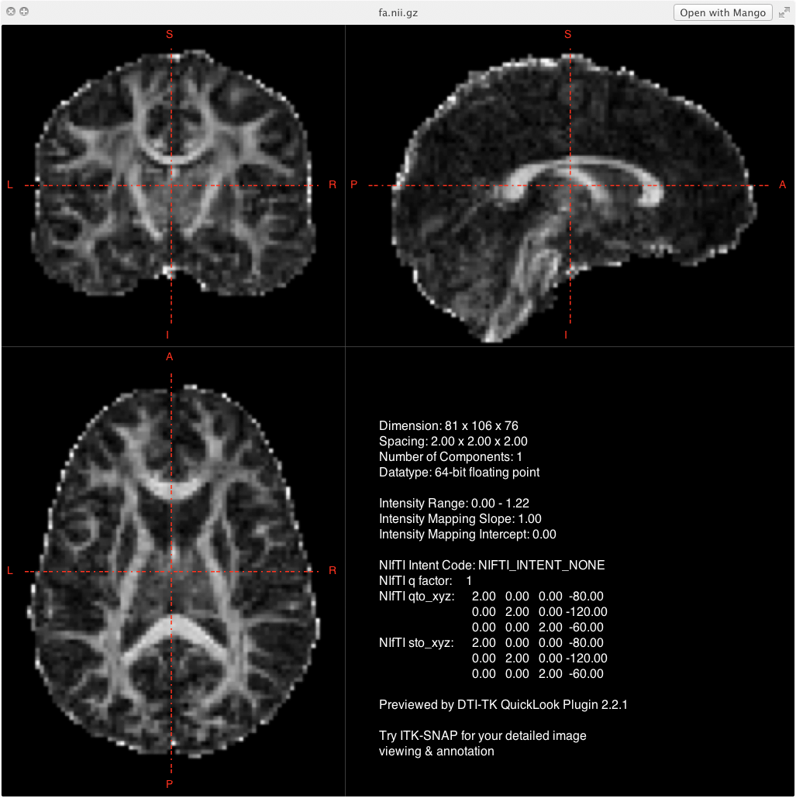
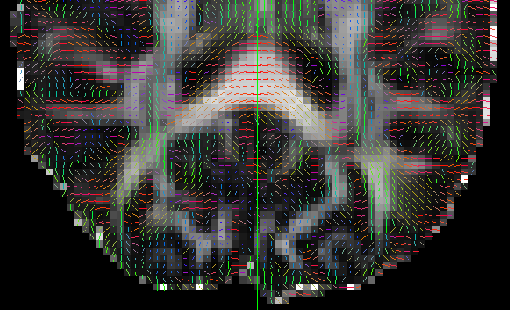

## Objectives

After you complete this section, you should be able to:

1. Generate diffusion weighted image in NIfTI format and b-value and b-vector text file
2. Preprocess T1 image and acquire a brain only image
3. Set MATLAB environmental variables to use VISTASOFT software
4. Import brain only T1 image for use in the VISTASOFT pipeline
5. Fix any possible issues when using scans from Siemens or Phillips
6. Preprocess diffusion weighted images
7. Generate FA images
8. Check for errors in preprocessing steps

Note that everything in "< >" is to be replaced. For example, \<fileName\> --> iLovePeanuts.txt

## Diffusion Imaging

*Diffusion weighted imaging* is based on water movement within a voxel of tissue. Therefore, the intensity value of each voxel represents the rate of water diffusion at that location. *Diffusion tensor imaging* is specific type of modeling of diffusion weighted images. The general theory behind DTI is that water molecules diffuse differently along the tissue depending on the tissue's type and integrity. With DTI analyses it is possible to infer at the level of each voxel properties like molecular diffusion rate (mean diffusivity), the direction preference of diffusion (fractional anisotropy), diffusion along the main axis (axial diffusivity), and diffusion in transverse direction (radial diffusivity).  

All DTI preprocessing steps are conducted using the dtiInit preprocessing pipeline wrapper from Stanford open-source VISTASOFT package. The steps of preprocessing any diffusion weighted images includes the following: 

1. Eddy-current correction
2. Register to T1 weighted image
3. Tensor Fitting
4. Compute DTI Scalars: FA, RD, MD, and AD

## Convert DWIs and Scan Parameters from DICOM to NIfTI

First let's create specific DWI directory within our participant directory. Often times you will be working with multiple scan modalities and you will want to put those in separate directories (e.g., DTI, fMRI, t2w, etc.). This directory is labeled raw and not dti simply because it follows the protocols as written by the [Stanford group whose pipeline is being used](http://white.stanford.edu/newlm/index.php/DTI_Preprocessing). You can change the name to something else if you prefer.


subjDir=</path/to/subject/directory>
mkdir ${subjDir}/raw
	

Certain scan parameters must also be extracted from the DICOM files in order to determine tensor information in the DWIs. Two files need to be created: b-value file and diffusion gradient table.

### B-Value (.bval)

The b-values are the amount of diffusion weighting used for each volume. Depending on how many non-diffusion weighted or B0 scans you collect and what diffusion weighting max you use your b-value file is going to look something like this: 

### Diffusion Gradient Table (.bvec)

Your b-vector are the gradient directions that you collect, often predetermined by the scanner depending on how many total directions you choose to collect. A b-vector file will look something like this:

In `dcm2nii` these files are automatically created. However, depending on the brand of the scanner, e.g., Siemens or GE, these scan parameters may not always be applied to the images correctly. **Therefore, it is important to always visually check that tensors were applied correctly.**


dcm2nii \
-a y 
-g y \
-o ${subjDir}/raw \
${subjDir}/DICOMs/*


### Rename 

The output from the `dcm2nii` program results in file names that are uniquely different across participants. For analyses though, we want all the files named exactly the same from participant to participant. In this case, we want all files to be named exactly the same, dti.nii.gz. The .bvec and .bval files also need to be renamed, dti.bvec and dti.bval, respectively.
  

cd ${subjDir}/raw
mv -f 2*.nii.gz dti.nii.gz
mv -f 2*.bval dti.bval
mv -f 2*.bvec dti.bvec


## Preprocess T1 Weighted Images

Refer to the information provided here: [http://njhunsak.github.io/neuroimaging-analysis/topics/preprocessing\_T1\_weighted_images/](http://njhunsak.github.io/neuroimaging-analysis/topics/preprocessing_T1_weighted_images/). You will need to perform the following steps:

1. Convert DICOMs to NIfTI, cropping and reorienting the image
2. AC-PC align the image
3. Resample image to 1 isotropic
4. Run the antsCorticalThickness.sh pipeline

## VISTASOFT

One of the outputs from the antsCorticalThickness.sh pipeline is a skull-stripped image; however, the image is sometimes named differently:

* ExtractedBrain0N4.nii.gz
* BrainSegmentation0N4.nii.gz

Copy the brain only file into the `t1` directory and rename the file `brain.nii.gz`:


cd ${subjDir}/t1
cp antsCorticalThickness/ExtractedBrain0N4.nii.gz brain.nii.gz


### Set MATLAB Environmental Variables

DTI preprocessing uses a toolbox through MATLAB called VISTASOFT. For more information about how to install VISTASOFT visit [https://github.com/vistalab/vistasoft](https://github.com/vistalab/vistasoft). You will need to set the environment variables for MATLAB to find SPM5, VISTASOFT, and AFQ (which we will discuss later). The order in which you enter these environmental variables is ***CRITICAL***. Do not place vistaPath before SPM5. In MATLAB:


SPM5Path = '/1/spm5';
addpath(genpath(SPM5Path));
vistaPath = '/1/git/vistasoft';
addpath(genpath(vistaPath));
AFQPath = '/1/git/AFQ';
addpath(genpath(AFQPath));


### Prior to Running *dtiInit*

Make sure you have your directory structure set up such that you have:


.
|-- <subjectDirectory>
|	|-- t1
|	|	|-- brain.nii.gz
|	|-- raw
|	|	|-- dti.nii.gz
|	|	|-- dti.bvec
|	|	|-- dti.bval


### Import T1 image

If you have already processed your T1 files through another pipeline you could have difficulties aligning the DTI data to your T1. This is due to the header information being different from what is expected by the VISTASOFT software. This can be fixed by running (in MATLAB) `mrAnatAverageAcpcNifti`. Open MATLAB to update the brain image so it will work in the mrDiffusion pipeline and save the new brain image as aveT1.nii.gz. The T1 image ('t1/brain.nii.gz') is rigidly aligned to an MNI template ('templates/matlab.nii.gz'). Note that this alignment is rather arbitrary and is only useful in establishing the correct header information (e.g. origin, FOV size, etc.):


subjDir= ['</path/to/participant/directory/>'];
brainFile = [subjDir,'/t1/brain.nii.gz'];
t1File = [subjDir,'/t1/aveT1.nii.gz'];
dtiFile = [subjDir,'/raw/dti.nii.gz'];
cd (subjDir);
mrAnatAverageAcpcNifti(brainFile,t1File,['</path/to/templates/matlab.nii.gz>']);


### Fix *dcm2nii* Transformation

This section is for those who have collected diffusion data on a Siemens or Phillips scanner, or on a GE scanner using the GE-supplied diffusion sequence (rather than Roland Bammer's DTI sequence at the Stanford Lucas center). *dcm2nii* does not properly handle the transforms for use with the VISTASOFT pipeline. To fix this, run a little code in MATLAB that will fix that transform and get things working.

To fix T1 image:


ni = readFileNifti(t1File);
ni = niftiSetQto(ni,ni.sto_xyz);
writeFileNifti(ni,t1File);


To fix diffusion image:


ni=readFileNifti(dtiFile);
ni=niftiSetQto(ni,ni.sto_xyz);
writeFileNifti(ni,dtiFile);


### Setting Parameters: *dtiInitParams*

Specific parameters can be set using the function *dtiInitParams*:


dwParams = dtiInitParams('rotateBvecsWithCanXform',1,'phaseEncodeDir',2,'clobber',1);


Note that for Siemens data, we need to change the parameter as follows:


dwParams.rotateBvecsWithCanXform = 1


Check parameters. It should look like this:


> dwParams

dwParams =

    bvalue: []
    gradDirsCode: []
    dt6BaseName: ''
    flipLrApFlag: 0
    numBootStrapSamples: 500
    fitMethods: 'ls'
    nStep: 50
    eddyCorrect: 1
    exclude Vols: []
    bsplineInterpFlag: 0
    phaseEncoderDir: 2
    dwOutMm: [2 2 2]
    rotateBvecsWithRx: 0
    rotate BvecsWithCanXform: 1
    bvecsFile: ''
    bvalsFile: ''


### Running *dtiInit*

Running dtiInit is very simple (usually):


dtiInit(dtiFile, t1File, dwParams);


### Wait Awhile

... and you're done! You should have a directory structure that looks something like the following.


.
|-- <subjectDirectory>
|	|-- t1
|	|	|-- brain.nii.gz
|	|-- raw
|	|	|-- dti.nii.gz
|	|	|-- dti.bvec
|	|	|-- dti.bval
|	|-- dti32trilin
|	|	|-- bin
|	|	|	|-- tensors.nii.gz
|	|	|	|-- b0.nii.gz
|	|	|	|-- brainMask.nii.gz
|	|	|	|-- vectorRBG.nii.gz
|	|	|	|-- wmMask.nii.gz
|	|	|	|-- wmProb.nii.gz
|	|	|	|-- faStd.nii.gz
|	|	|	|-- mdStd.nii.gz
|	|	|	|-- pddDispersion.nii.gz
|	|	|-- dt6.mat
|	|	|-- t1ppd.png


### Generate FA Maps

If you ever need to place landmarks on the DTI image (e.g. fornix), then it is easiest on an FA image. To generate the FA map, use the following code:


subjDir= ['</path/to/participant/directory/>'];
cd (subjDir);
[dt6, xformToAcpc, mmPerVox] = dtiLoadTensorsFromNifti('dt6dir/bin/tensors.nii.gz');
[fa,md] = dtiComputeFA(dt6);
dtiWriteNiftiWrapper(fa,xformToAcpc,'t1/fa.nii.gz',1,'FA');


### Check Output

Part of the output provides a file that shows the RGB vector overlay. The file is located under the dt6dir and is called, t1pdd.png. This file shows a montage of the brain with the RGB overlay. The colors of the overlay signify the tensor direction. When looking at DTI overlays, red indicates tensors that are orientated right to left, green indicates tensors that are orientated anterior to posterior, and blue indicates tensors that are orientated superior to inferior. When looking at the RGB overlay, the corpus callosum should be solid red, because the tensors are moving back and forth from the right hemisphere to left hemisphere. If the corpus callosum is not bright red, you know you immediately have an issue:

Depending on the scanner and whether or not dcm2nii properly reads the header information, it is highly probable that the diffusion gradient directions may be reversed. After preprocessing, it is important that you check to make sure the gradient directions are visually inline with the white matter pathways. Here's an example of misalignment:

If the tensors are aligned correctly, they should like this:

#### Reference Manuals

* mrDiffusion - http://white.stanford.edu/newlm/index.php/DTI_Preprocessing

### Additional Classroom Materials

* [Lecture](presentation)
* [Assignment](assignment)
