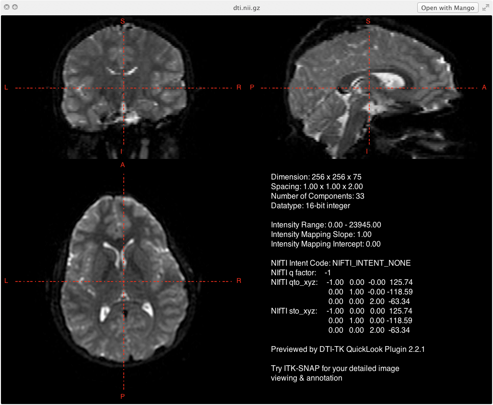
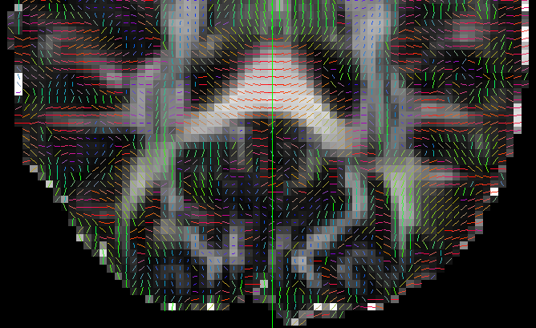

## Diffusion Weighted Imaging

The intensity value of each voxel represents the rate of water diffusion at that location. White signifies low diffusion (CSF) and black signifies high diffusion (corpus callosum).

 

## Diffusion Tensor Imaging

Diffusion tensor imaging is a specific type of *modeling* of diffusion weighted images. The general theory behind DTI is that water molecules diffuse differently along the tissue depending on the tissue's type and integrity. Integrity meaning is the white matter path normal or damaged.

With DTI analyses it is possible to infer at the level of each voxel, properties like molecular diffusion rate (mean diffusivity), the direction preference of diffusion (fractional anisotropy), diffusion along the main axis (axial diffusivity), and diffusion in transverse direction (radial diffusivity).

## Convert DWIs from DICOM to NIFTI

Besides converting the DICOMs to a NIfTI file, certain scan parameters must also be extracted from the DICOM files in order to determine tensor information in the DWIs: b-value file and diffusion gradient table.

### B-Value (.bval)

The b-values are the amount of diffusion weighting used for each volume. Depending on how many non-diffusion weighted or B0 scans you collect and what diffusion weighting max you use, your b-value file begins with 1 or more zeros and the remaining numbers are the weighting for each direction (typically 30).

### Diffusion Gradient Table (.bvec)

Your b-vector are the gradient directions that you collect, often predetermined by the scanner depending on how many total directions you choose to collect. A b-vector file will have three lines, one for each axis. So if you are working with a 30 direction scan, your first line will be your x-axis. The second row is the y-axis and third row is the z-axis. This file is needed in order to determine the direction of each tensor.

----


----


## dcm2nii

In `dcm2nii` these files are automatically created. However, depending on the brand of the scanner, e.g., Siemens or GE, these scan parameters may not always be applied to the images correctly. **Therefore, it is important to always visually check that tensors were applied correctly.**

*Do not use any other program to convert DWI DICOMs unless specifically told to do so by the pipeline*

```
subjDir=/path/to/subject/
mkdir ${subjDir}/raw
dcm2nii \
-a y 
-g y \
-o ${subjDir}/raw \
${subjDir}/DICOMs/*
```

## Rename 

The output from the `dcm2nii` program results in file names that are uniquely different across participants. For analyses though, we want all the files named exactly the same from participant to participant. In this case, we want all files to be named exactly the same, dti.nii.gz. The .bvec and .bval files also need to be renamed, dti.bvec and dti.bval, respectively.
  
```
cd ${subjDir}/raw
mv -f 2*.nii.gz dti.nii.gz
mv -f 2*.bval dti.bval
mv -f 2*.bvec dti.bvec
```

## Preprocess T1 Weighted Images

Refer to the information provided here: 

* [http://njhunsak.github.io/neuroimaging-analysis/topics/preprocessing_T1_weighted_images/](http://njhunsak.github.io/neuroimaging-analysis/topics/preprocessing_T1_weighted_images/). 
* [http://njhunsak.github.io/neuroimaging-analysis/topics/cortical_thickness/](http://njhunsak.github.io/neuroimaging-analysis/topics/cortical_thickness). 

You will need to perform the following steps:

1. Convert DICOMs to NIfTI, cropping and reorienting the image
2. AC-PC align the image
3. Resample image to 1 isotropic
4. Run the antsCorticalThickness.sh pipeline

## Skull Stripped T1 Image

One of the outputs from the antsCorticalThickness.sh pipeline is a skull-stripped image; however, the image is sometimes named differently:

* ExtractedBrain0N4.nii.gz
* BrainSegmentation0N4.nii.gz

Copy the brain only file into the `t1` directory and rename the file `brain.nii.gz`:

```bash
cd ${subjDir}/t1
cp antsCorticalThickness/ExtractedBrain0N4.nii.gz brain.nii.gz
```

## Set MATLAB Environmental Variables

DTI preprocessing uses a toolbox through MATLAB called VISTASOFT. For more information about how to install VISTASOFT visit [https://github.com/vistalab/vistasoft](https://github.com/vistalab/vistasoft). You will need to set the environment variables for MATLAB to find SPM5, VISTASOFT, and AFQ (which we will discuss later). The order in which you enter these environmental variables is ***CRITICAL***. Do not place vistaPath before SPM5. In MATLAB:

```matlab
SPM5Path = '/path/to/spm8';
addpath(genpath(SPM8Path));
vistaPath = '/path/to/git/vistasoft';
addpath(genpath(vistaPath));
AFQPath = '/path/to/git/AFQ';
addpath(genpath(AFQPath));
```

## Prior to Running *dtiInit*

Make sure you have your directory structure set up such that you have:

```bash
.
|-- <subjectDirectory>
| |-- t1
| | |-- brain.nii.gz
| |-- raw
| | |-- dti.nii.gz
| | |-- dti.bvec
| | |-- dti.bval
```

## Import T1 image

If you have already processed your T1 files through another pipeline you could have difficulties aligning the DTI data to your T1. This is due to the header information being different from what is expected by the VISTASOFT software. This can be fixed by running (in MATLAB) `mrAnatAverageAcpcNifti`. Open MATLAB to update the brain image so it will work in the mrDiffusion pipeline and save the new brain image as aveT1.nii.gz. The T1 image ('t1/brain.nii.gz') is rigidly aligned to an MNI template ('templates/matlab.nii.gz'). Note that this alignment is rather arbitrary and is only useful in establishing the correct header information (e.g. origin, FOV size, etc.):

```matlab
subjDir= ['</path/to/participant/directory/>'];
brainFile = [subjDir,'/t1/brain.nii.gz'];
t1File = [subjDir,'/t1/aveT1.nii.gz'];
dtiFile = [subjDir,'/raw/dti.nii.gz'];
cd (subjDir);
mrAnatAverageAcpcNifti(brainFile,t1File,['</path/to/templates/matlab.nii.gz>']);
```

Note the matlab template is not any special template. Just use the template I've provided.

## Fix *dcm2nii* Transformation

This section is for those who have collected diffusion data on a Siemens or Phillips scanner, or on a GE scanner using the GE-supplied diffusion sequence (rather than Roland Bammer's DTI sequence at the Stanford Lucas center). *dcm2nii* does not properly handle the transforms for use with the VISTASOFT pipeline. To fix this, run a little code in MATLAB that will fix that transform and get things working.

To fix T1 image:

```matlab
ni = readFileNifti(t1File);
ni = niftiSetQto(ni,ni.sto_xyz);
writeFileNifti(ni,t1File);
```

To fix diffusion image:

```matlab
ni=readFileNifti(dtiFile);
ni=niftiSetQto(ni,ni.sto_xyz);
writeFileNifti(ni,dtiFile);
```

## Setting Parameters: *dtiInitParams*

Specific parameters can be set using the function *dtiInitParams*:

```matlab
dwParams = dtiInitParams('rotateBvecsWithCanXform',1,'phaseEncodeDir',2,'clobber',1);
```

Note that for Siemens data, we need to change the parameter as follows:

```matlab
dwParams.rotateBvecsWithCanXform = 1
```

## Check Parameters

```matlab
> dwParams

dwParams =

    bvalue: []
    gradDirsCode: []
    dt6BaseName: ''
    flipLrApFlag: 0
    numBootStrapSamples: 500
    fitMethods: 'ls'
    nStep: 50
    eddyCorrect: 1
    exclude Vols: []
    bsplineInterpFlag: 0
    phaseEncoderDir: 2
    dwOutMm: [2 2 2]
    rotateBvecsWithRx: 0
    rotate BvecsWithCanXform: 1
    bvecsFile: ''
    bvalsFile: ''
```

## Running *dtiInit*

Running dtiInit is very simple (usually):

```matlab
dtiInit(dtiFile, t1File, dwParams);
```

## Wait awhile...and you're done!

```bash
.
|-- <subjectDirectory>
| |-- t1
| | |-- brain.nii.gz
| |-- raw
| | |-- dti.nii.gz
| | |-- dti.bvec
| | |-- dti.bval
| |-- dti32trilin
| | |-- bin
| | | |-- tensors.nii.gz
| | | |-- b0.nii.gz
| | | |-- brainMask.nii.gz
| | | |-- vectorRBG.nii.gz
| | | |-- wmMask.nii.gz
| | | |-- wmProb.nii.gz
| | | |-- faStd.nii.gz
| | | |-- mdStd.nii.gz
| | | |-- pddDispersion.nii.gz
| | |-- dt6.mat
| | |-- t1ppd.png
```

## Generate FA Maps

If you ever need to place landmarks on the DTI image (e.g. fornix), then it is easiest on an FA image. To generate the FA map, use the following code:

```matlab
subjDir= ['</path/to/participant/directory/>'];
cd (subjDir);
[dt6, xformToAcpc, mmPerVox] = dtiLoadTensorsFromNifti('dt6dir/bin/tensors.nii.gz');
[fa,md] = dtiComputeFA(dt6);
dtiWriteNiftiWrapper(fa,xformToAcpc,'t1/fa.nii.gz',1,'FA');
```

## FA

 

## Check Output

Part of the output provides a file that shows the RGB vector overlay. The file is located under the dt6dir and is called, t1pdd.png. This file shows a montage of the brain with the RGB overlay. The colors of the overlay signify the tensor direction. When looking at DTI overlays, red indicates tensors that are orientated right to left, green indicates tensors that are orientated anterior to posterior, and blue indicates tensors that are orientated superior to inferior. When looking at the RGB overlay, the corpus callosum should be solid red, because the tensors are moving back and forth from the right hemisphere to left hemisphere. If the corpus callosum is not bright red, you know you immediately have an issue.

----

 

## Failed Tensor Registration

Depending on the scanner and whether or not dcm2nii properly reads the header information, it is highly probable that the diffusion gradient directions may be reversed. After preprocessing, it is important that you check to make sure the gradient directions are visually inline with the white matter pathways. Here's an example of misalignment and correct:

 