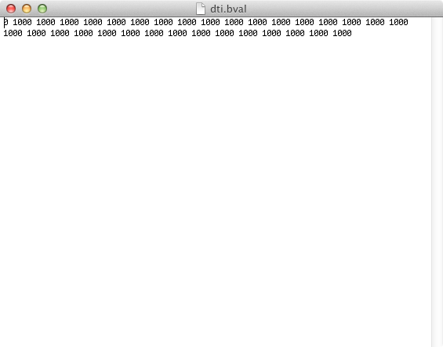

## Objectives

After you complete this section, you should be able to:

1. Define diffusion imaging
2. Describe the need for the bval and bvec files
3. Describe the structure of the European DTI Study of Dementia
4. Preprocess T1 weighted images using job and batch scripts

## Diffusion Imaging

*Diffusion weighted imaging* (DWI) is based on water movement within a voxel of tissue. Therefore, the intensity value of each voxel represents the rate of water diffusion at that location. *Diffusion tensor imaging* (DTI) is specific type of modeling of diffusion weighted images. The general theory behind DTI is that water molecules diffuse differently along the tissue depending on the tissue's type and integrity. With DTI analyses it is possible to infer at the level of each voxel properties like molecular diffusion rate (mean diffusivity), the direction preference of diffusion (fractional anisotropy), diffusion along the main axis (axial diffusivity), and diffusion in transverse direction (radial diffusivity).

## Converting DICOM to NIfTI

When converting DWI from DICOM to NIfTI certain scan parameters must also be extracted from the DICOM files in order to determine tensor information in the DWIs. Two files need to be created: b-value file and diffusion gradient table.

### B-Value (.bval)

The b-values are the amount of diffusion weighting used for each volume. Depending on how many non-diffusion weighted or B0 scans you collect and what diffusion weighting max you use your b-value file is going to look something like this:

### Diffusion Gradient Table (.bvec)

Your b-vector are the gradient directions that you collect, often predetermined by the scanner depending on how many total directions you choose to collect. A b-vector file will look something like this:

**dcm2niix** automatically generates these files during DICOM conversion. However, depending on the brand of the scanner, e.g., Siemens or GE, these scan parameters may not always be applied to the images correctly. We will discuss this issue in more detail when we get to preprocessing.

## European DTI Study of Dementia

> The European DTI Study on Dementia (EDSD) is a multicenter framework created to study the diagnostic accuracy and inter-site variability of DTI-derived markers in patients with manifest and prodromal Alzheimer's disease (AD). The dynamically growing database presently includes 493 DTI, 512 T1-weighted MRI, and 300 FLAIR scans from patients with AD dementia, patients with Mild Cognitive Impairment (MCI) and matched Healthy Controls, acquired on 13 different scanner platforms. The imaging data is publicly available, along with the subjects' demographic and clinical characterization. Detailed neuropsychological information, cerebrospinal fluid information on biomarkers and clinical follow-up diagnoses are included for a subset of subjects. This paper describes the rationale and structure of the EDSD, summarizes the available data, and explains how to gain access to the database. The EDSD is a useful database for researchers seeking to investigate the contribution of DTI to dementia diagnostics.

We are going to use data for one site only just to keep our analyses consistent; however, future anayses really need to look at differences across sites and scanners. For more information about the EDSD refer to their manuscript:

[http://dx.doi.org/10.1016/j.neuroimage.2016.03.067](http://dx.doi.org/10.1016/j.neuroimage.2016.03.067)

## Preprocess T1 and Diffusion Weighted Images

First copy the data from the shared directory to your user directory on the supercomputer:


mkdir -p ~/compute/images/
rsync -rauv ~/fsl_groups/fslg_byustudent/compute/EDSD ~/compute/images/


### Job Script

The following script will be the job script that is submitted by the batch script to the supercomputer. Nothing in the script needs to be changed. It should only take the compute node a few minutes per participant. The following are the steps completed by the script:

1. Make a **t1** and a **raw** directory under your participant directory.
2. Convert the MPRAGE DICOMs into a NIfTI image and crop any excess neck and non-brain tissue. Save the file as **t1.nii** under the **t1** directory.
3. Convert the DWI DICOMs into a zipped NIfTI image as well as calculate the bval and bvec files. Save the three files under the **raw** directory.
4. AC-PC align the cropped T1 image and save it as **acpc.nii**.
5. Complete N4 bias field correction on the **acpc.nii** image and save as **n4.nii.gz**.
6. Resample the **n4.nii.gz** image and make the image 1mm isotropic and save as **resampled.nii.gz**.

For more detailed information about preprocessing T1 weighted images refer to this webpage: [http://biabl.github.io/tutorials/structural/preprocessing_T1_weighted_images/](http://biabl.github.io/tutorials/structural/preprocessing_T1_weighted_images/).

Create a new scripts directory:


mkdir -p ~/scripts/EDSD/
vi ~/scripts/EDSD/preprocess_job.sh


Copy and paste the following into the new script:


#!/bin/bash

#SBATCH --time=00:10:00   # walltime
#SBATCH --ntasks=1   # number of processor cores (i.e. tasks)
#SBATCH --nodes=1   # number of nodes
#SBATCH --mem-per-cpu=16384M  # memory per CPU core

# Compatibility variables for PBS. Delete if not needed.
export PBS_NODEFILE=`/fslapps/fslutils/generate_pbs_nodefile`
export PBS_JOBID=$SLURM_JOB_ID
export PBS_O_WORKDIR="$SLURM_SUBMIT_DIR"
export PBS_QUEUE=batch

# Set the max number of threads to use for programs using OpenMP.
export OMP_NUM_THREADS=$SLURM_CPUS_ON_NODE

# LOAD ENVIRONMENTAL VARIABLES
var=`id -un`
export ANTSPATH=/fslhome/${var}/apps/ants/bin/
PATH=${ANTSPATH}:${PATH}

# INSERT CODE, AND RUN YOUR PROGRAMS HERE
DATA_DIR=~/compute/images/EDSD/${1}/
mkdir ${DATA_DIR}/t1
mkdir ${DATA_DIR}/raw
~/apps/dcm2niix/bin/dcm2niix -o ${DATA_DIR}/t1/ -f t1 -x y -z n ${DATA_DIR}/DICOM/mprage/
~/apps/dcm2niix/bin/dcm2niix -o ${DATA_DIR}/raw/ -f dti -z y ${DATA_DIR}/DICOM/diff/
~/apps/art/acpcdetect -M -o ${DATA_DIR}/t1/acpc.nii -i ${DATA_DIR}/t1/t1_Crop_1.nii
~/apps/ants/bin/N4BiasFieldCorrection -v -d 3 -i  ${DATA_DIR}/t1/acpc.nii -o ${DATA_DIR}/t1/n4.nii.gz -s 4 -b [200] -c [50x50x50x50,0.000001]
~/apps/c3d/bin/c3d ${DATA_DIR}/t1/n4.nii.gz -resample-mm 1x1x1mm -o ${DATA_DIR}/t1/resampled.nii.gz


### Batch Script

Create a batch script:


vi ~/scripts/EDSD/preprocess_batch.sh


Copy and paste the following into the batch script:


#!/bin/bash

for subj in $(ls ~/compute/images/EDSD/); do
sbatch \
-o ~/logfiles/${1}/output_${subj}.txt \
-e ~/logfiles/${1}/error_${subj}.txt \
~/scripts/EDSD/preprocess_job.sh \
${subj}
sleep 1
done


### Submit Batch Script

Submit the batch script, which will submit a job script for each participant in your study directory:


var=`date +"%Y%m%d-%H%M%S"`
mkdir -p ~/logfiles/$var
sh ~/scripts/class/preprocess_batch.sh $var

