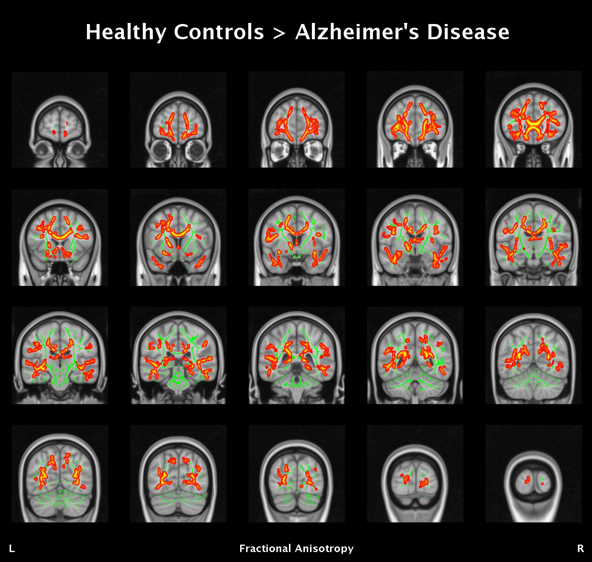
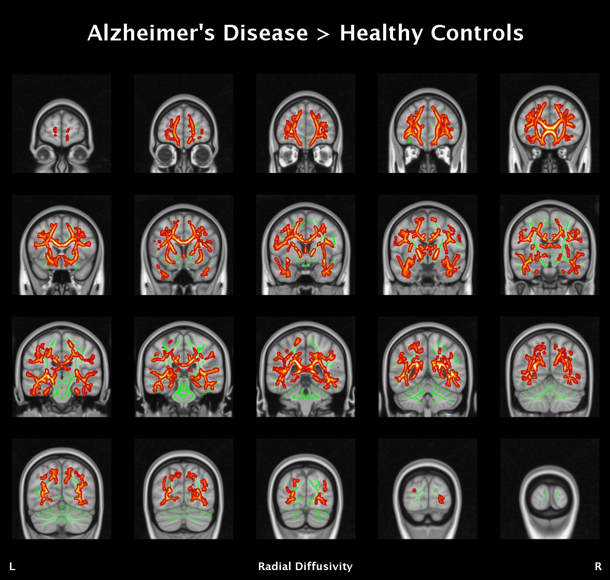
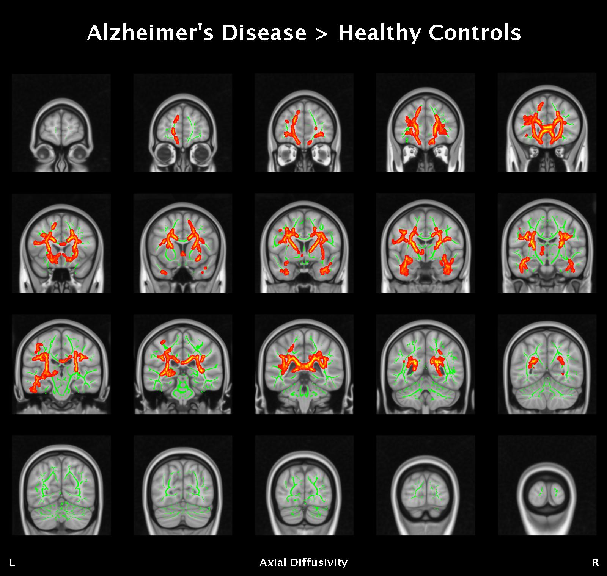

## Objectives

After you complete this section, you should be able to:

1. Setup design matrix and contrasts for a two-sample unpaired t-test
2. Perform voxelwise statistics using FSL's tool randomise
3. View results
4. Understand how FA, RD, AD, and MD are related

## Analysis Design

Before running **randomise** you will need to generate a design matrix file, e.g., **design.mat** and a contrasts file, e.g., **design.con**. Note that the order of the entries (rows) in your design matrix must match the alphabetical order of your original FA images, as that determines the order of the aligned FA images in the final 4D file all_FA_skeletonised; check this with:


cd ~/compute/analyses/EDSD/TBSS/FA
imglob *_FA.*


Luckily for our dataset, the first 10 participants are patients with Alzheimer's disease and the last 16 participants are healthy controls. If you participants are not organized by group, you will need to be extra careful when creating your design matrix.

### Design.mat

To create your design matrix, start by creating a text file within your **stats** directory. Each column in the text file represents an explanatory variable (EV) and each row represents a participant. In our design matrix example, the first column represents the Alzheimer's disease group and the second column represents the healthy control group. Looking at the text file contents below, can you imagine if your list of participants weren't organized by group, how meticulous you would need to be to make sure each row corresponded perfectly with the correct participant?


vi ~/compute/analyses/EDSD/TBSS/stats/design.txt


Copy and paste into the design.txt file:


1	0
1	0
1	0
1	0
1	0
1	0
1	0
1	0
1	0
1	0
0	1
0	1
0	1
0	1
0	1
0	1
0	1
0	1
0	1
0	1
0	1
0	1
0	1
0	1
0	1
0	1


Save these data as design.txt, then run the following:


cd ~/compute/analyses/EDSD/TBSS/stats/
Text2Vest design.txt design.mat


This will convert the design matrix data into the format used by the FSL tools, and save the matrix as design.mat.

### Design.con

Contrast files must have one row for each contrast, and a column for each EV. For example, we have 2 EVs in our design matrix above. A contrast matrix for this design might look like this (four contrasts, first two giving the mean for each group in the study and the last two comparing the two groups):


1 0
0 1
1 -1
-1 1


After you save the contrasts.txt file, simply run:


Text2Vest contrasts.txt design.con


Additionally, if you want to keep things easy to remember during the analyses, add the follow lines to the top of your design.con file:


/ContrastName1	AD mean
/ContrastName2	HC mean
/ContrastName3	AD > HC
/ContrastName4	HC > AD


## Voxelwise Statistics

**randomise** is FSL's tool for nonparametric permutation inference on neuroimaging data. **randomise** allows modeling and inference using standard GLM design setup as used for example in FEAT. It can output voxelwise, cluster-based and TFCE-based tests, and also offers variance smoothing as an option. For more information about FSL's tool, [click here for the user guide](http://fsl.fmrib.ox.ac.uk/fsl/fslwiki/Randomise/UserGuide).

Create a job script:


vi ~/scripts/EDSD/tbss_voxelwise.sh


Copy and paste into the job script:


#!/bin/bash

#SBATCH --time=04:00:00   # walltime
#SBATCH --ntasks=1   # number of processor cores (i.e. tasks)
#SBATCH --nodes=1   # number of nodes
#SBATCH --mem-per-cpu=16384M  # memory per CPU core

# Compatibility variables for PBS. Delete if not needed.
export PBS_NODEFILE=`/fslapps/fslutils/generate_pbs_nodefile`
export PBS_JOBID=$SLURM_JOB_ID
export PBS_O_WORKDIR="$SLURM_SUBMIT_DIR"
export PBS_QUEUE=batch

# Set the max number of threads to use for programs using OpenMP.
export OMP_NUM_THREADS=$SLURM_CPUS_ON_NODE

# LOAD ENVIRONMENTAL VARIABLES
var=`id -un`
FSLDIR=/fslhome/$var/apps/fsl
PATH=${FSLDIR}/bin:${PATH}
export FSLDIR PATH
. ${FSLDIR}/etc/fslconf/fsl.sh

# INSERT CODE, AND RUN YOUR PROGRAMS HERE
cd ~/compute/analyses/EDSD/TBSS/stats/
randomise -i ${1} -o ${2} -m mean_FA_skeleton_mask -d design.mat -t design.con -n 5000 --T2 -V


### Submit Job Script

When you submit the job script, you will need to include two command line arguments. The first, needs to be the name of your group skeletonised image, the second needs to be your output prefix. In the following code, if you create an array **DTI** that contains the four DTI metrics, then you can use a for loop and loop through the array **DTI** and submit four job scripts, one for each DTI measure:


var=`date +"%Y%m%d-%H%M%S"`
mkdir -p ~/logfiles/$var
DTI=( "AD" "FA" "MD" "RD" )
for x in "${DTI[@]}"; do
sbatch \
-o ~/logfiles/${var}/output_${x}.txt \
-e ~/logfiles/${var}/error_${x}.txt \
~/scripts/EDSD/tbss_voxelwise.sh \
all_${x}_skeletonised \
tbss_${x}
done


## Results

In order to view the results, you will need to download the TBSS stats directory to a local computer that has FSL installed:


rsync -rauv intj5@ssh.fsl.byu.edu:~/compute/analyses/EDSD/TBSS/stats ~/Desktop/


Let's view the results. Using fslview, load a standard MNI template and the mean FA skeleton to see the fiber tracks. Finally, load the two group contrasts, **tbss_FA_tfce_corrp_tstat3** and **tbss_FA_tfce_corrp_tstat4**. The TFCE (Threshold-Free Cluster Enhancement) p-value images are fully corrected for multiple comparisons using the family-wise error rate. Note, the files are actually 1-p for convenience of display, so thresholding at 0.95 to 1 gives significant clusters.


cd ~/Desktop/stats
fslview $FSLDIR/data/standard/MNI152_T1_1mm \
mean_FA_skeleton -l Green -b 0.2,0.8 \
tbss_FA_tfce_corrp_tstat3 -l Red-Yellow -b 0.95,1 \
tbss_FA_tfce_corrp_tstat4 -l Blue-Lightblue -b 0.95,1


Remember that contrast 3 gives the AD > HC and contrast 4 gives HC > AD test (see above under design.con). Alternatively, although showing the stats results on the TBSS skeleton is a *true* representation of the actual analysis carried out, some people find it easier to visualize the results if the skeletonised results are "thickened" somewhat. In order to make such a presentation easy, there is a script **tbss_fill**, which thickens the thresholded stats image, filling it out into the local "tracts" seen in mean_FA. For example, to apply this to the same example as above and then view in FSLView, run:


tbss_fill tbss_FA_tfce_corrp_tstat3 0.95 mean_FA tbss_FA_tfce_corrp_tstat3_fill
tbss_fill tbss_FA_tfce_corrp_tstat4 0.95 mean_FA tbss_FA_tfce_corrp_tstat4_fill


To view the contrast where FA is higher in Alzheimer's disease group compared to healthy controls run:


fslview $FSLDIR/data/standard/MNI152_T1_1mm \
mean_FA_skeleton -l Green -b 0.2,0.8 \
tbss_FA_tfce_corrp_tstat3_fill -l Red-Yellow


To view the contrast where FA is higher in healthy controls compared to the Alzheimer's disease group run:


fslview $FSLDIR/data/standard/MNI152_T1_1mm \
mean_FA_skeleton -l Green -b 0.2,0.8 \
tbss_FA_tfce_corrp_tstat4_fill -l Red-Yellow


Here are the FA results. Recall that lower FA represents loss of white matter integrity. Therefore, we would hypothesize that FA will be reduced within the Alzheimer's disease group compared to healthy controls due to processes of neurodegeneration:

## How are FA, RD, AD, and MD related?

Let's view the results for the rest of the DTI measures! How are the other DTI measures related to FA? Radial diffusivity, diffusion transverse to the main axis of diffusion (i.e., diffusion along the white matter tract), should have opposite results to FA. For example, we hypothesized that FA will be lower in Alzheimer's disease; therefore, we should predict that RD will be higher in Alzheimer's disease compared to healthy controls. Axial diffusivity represents diffusion along the principal axis of diffusion namely along the white matter tract. AD tends to be variable in white matter changes and pathology. AD can actually increase due to axonal inflammation, but then AD will decrease later on after axonal injury inflammation also decreases. All diffusion measures, AD, RD, and MD have been reported to be increased in Alzheimer's disease. Mean diffusivity is a separate measure and is more indicative of membrane integrity as opposed to tract integrity. Mean diffusivity is sensitive to cellularity, necrosis, and edema. There's reason to hypothesize the MD will increase in Alzheimer's disease because of neurodegeneration in the brain. Typically, MD is higher in damaged tissues as a result of increased free diffusion; in contrast, FA decreases due to the loss of coherence in the main preferred diffusion direction. Before we explore the results, let's make them easier to view:


DTI=( "AD" "MD" "RD" )
for x in "${DTI[@]}"; do
cd ~/Desktop/stats/
tbss_fill tbss_${x}_tfce_corrp_tstat3 0.95 mean_FA tbss_${x}_tfce_corrp_tstat3_fill
tbss_fill tbss_${x}_tfce_corrp_tstat4 0.95 mean_FA tbss_${x}_tfce_corrp_tstat4_fill
done


### Radial Diffusivity

### Axial Diffusivity

### Mean Diffusivity

