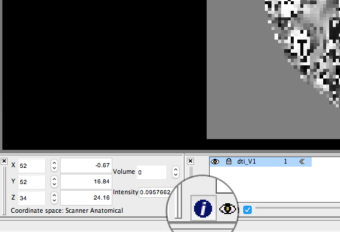
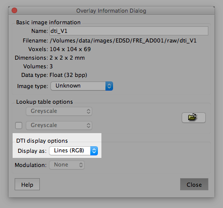
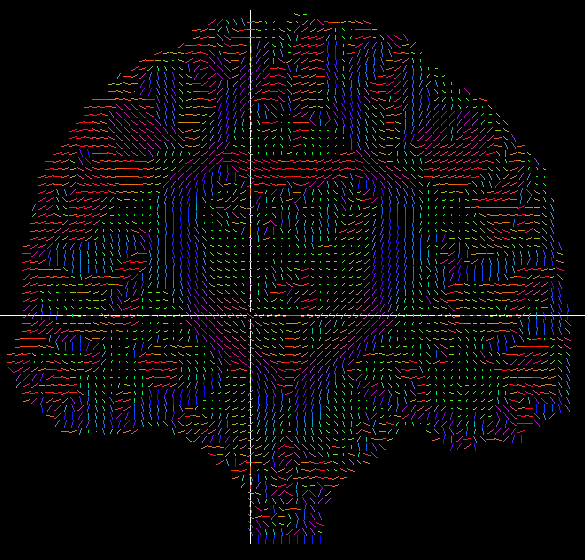

## Objectives

After you complete this section, you should be able to:

1. Describe TBSS and it's strengths and weaknesses
2. Eddy-current correct, skull strip, and fit tensors to the whole brain

## Tract Based Spatial Statistics (TBSS)

Diffusion weighted imaging (DWI) measures the direction of water diffusion in brain tissue and is thought to be an indicator of the fiber tract integrity: reflecting coherence, organization and/or density of the fiber bundles. The most common standard diffusion measure is fractional anisotropy (FA). The value of FA, which ranges from 0 to 1, is highest in major white matter tracts (FA value approaches 1), lower in gray matter, and approaches 0 in cerebrospinal fluid. FA is thought to be a marker of white matter integrity, because variations reflect myelination, axon density, axonal membrane integrity, and axon diameter. Axial diffusivity (AD) represents diffusivity along the principal eigenvector. In contrast, radial diffusivity (RD) describes an average of the eigenvectors perpendicular to the principal direction.

TBSS is an automated method that tries to combine the strengths of both voxel-based morphometry (VBM) and tract-based spatial statistic methods. In VBM analyses, each participant’s FA image is registered to a template and then voxelwise statistics are computed to find brain areas that differ between groups. One major limitation to VBM methods is that coregistration algorithms are not able to accurately align fiber tracts across participants. This has been a long-standing issue with any VBM analysis. There is no way to ensure that a voxel in standard space contains data from the same portion of the brain across participants. Long projection white matter fiber tracts vary too much in size and shape and there is no way to be sure that registration of every participant’s FA image to a common space has been completely successful. TBSS tries to overcome these limitations of VBM, but TBSS still relies on registering participants to a common template space and only provides a modest improvement over traditional VBM methods. TBSS techniques also cannot ensure that any voxel corresponds to the same tract across participants. Notwithstanding these limitations, TBSS analyses remain the most common approach to analyzing diffusion weighted images.

## Preprocessing DWI

<iframe src="https://player.vimeo.com/video/183678370" frameborder="0" webkitallowfullscreen mozallowfullscreen allowfullscreen></iframe>

 

Each diffusion-weighted image is registered to the non-diffusion-weighted (b=0) using linear image registration for motion correction using FSL eddy_correct program. After correction, diffusion weighted images are skull-stripped in order to exclude non-brain voxels from all analyses using FSL bet program. Last, the diffusion tensors are calculated with the FSL DTIfit program for whole brain volumes and resulting FA, RD, MD, and AD volumes can then be used in tract-based spatial statistics analysis.

### Job Script

Create script file:


vi ~/scripts/EDSD/fdt_job.sh


Copy and paste into the script file:


#!/bin/bash

#SBATCH --time=02:00:00   # walltime
#SBATCH --ntasks=1   # number of processor cores (i.e. tasks)
#SBATCH --nodes=1   # number of nodes
#SBATCH --mem-per-cpu=16384M  # memory per CPU core

# Compatibility variables for PBS. Delete if not needed.
export PBS_NODEFILE=`/fslapps/fslutils/generate_pbs_nodefile`
export PBS_JOBID=$SLURM_JOB_ID
export PBS_O_WORKDIR="$SLURM_SUBMIT_DIR"
export PBS_QUEUE=batch

# Set the max number of threads to use for programs using OpenMP.
export OMP_NUM_THREADS=$SLURM_CPUS_ON_NODE

# LOAD ENVIRONMENTAL VARIABLES
module load python/2/7
var=`id -un`
FSLDIR=/fslhome/$var/apps/fsl
PATH=${FSLDIR}/bin:${PATH}
export FSLDIR PATH
. ${FSLDIR}/etc/fslconf/fsl.sh

# INSERT CODE, AND RUN YOUR PROGRAMS HERE
cd ~/compute/images/EDSD/${1}/raw/
eddy_correct dti.nii.gz data.nii.gz 0
bet data data_brain -f 0.25 -g 0 -m
dtifit --data=data.nii.gz --out=dti --mask=data_brain_mask.nii.gz --bvecs=dti.bvec --bvals=dti.bval --save_tensor


### Batch Script

Create batch script file:


vi ~/scripts/EDSD/fdt_batch.sh


Copy and paste into the batch script file:


#!/bin/bash

for subj in $(ls ~/compute/images/EDSD/); do
sbatch \
-o ~/logfiles/${1}/output_${subj}.txt \
-e ~/logfiles/${1}/error_${subj}.txt \
~/scripts/EDSD/fdt_job.sh \
${subj}
sleep 1
done


### Submit Batch Script

Use the following code to submit the batch script:


var=`date +"%Y%m%d-%H%M%S"`
mkdir -p ~/logfiles/$var
sh ~/scripts/EDSD/fdt_batch.sh $var


## Quality Control

After the preprocessing steps have been completed, you always want to double check your data and confirm tensors are in the right direction. In order to view the tensor images, the data must be downloaded to your local computer:


rsync -rauv --exclude="DICOM" --exclude="t1" intj5@ssh.fsl.byu.edu:~/compute/images/EDSD ~/Desktop


In order to view the images, you will need to have FSL installed locally:


fslview -m ortho ~/Desktop/EDSD/FRE_AD001/raw/dti_V1.nii.gz


Once FSLView opens, click the "info" button in the bottom left quadrant.

Change the DTI display options to, "Lines (RGB)".

Now you can inspect your images to confirm proper tensor orientation.

## Class Slides

<iframe src="//slides.com/njhunsak/tbss-part-1/embed" scrolling="no" frameborder="0" webkitallowfullscreen mozallowfullscreen allowfullscreen></iframe>

