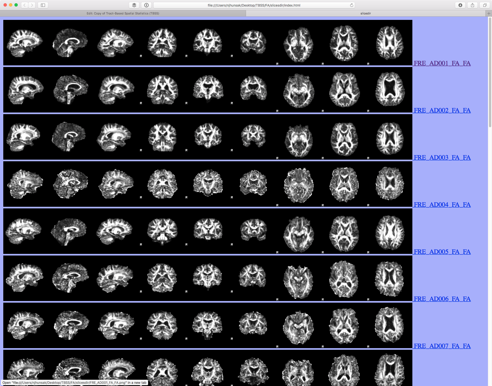
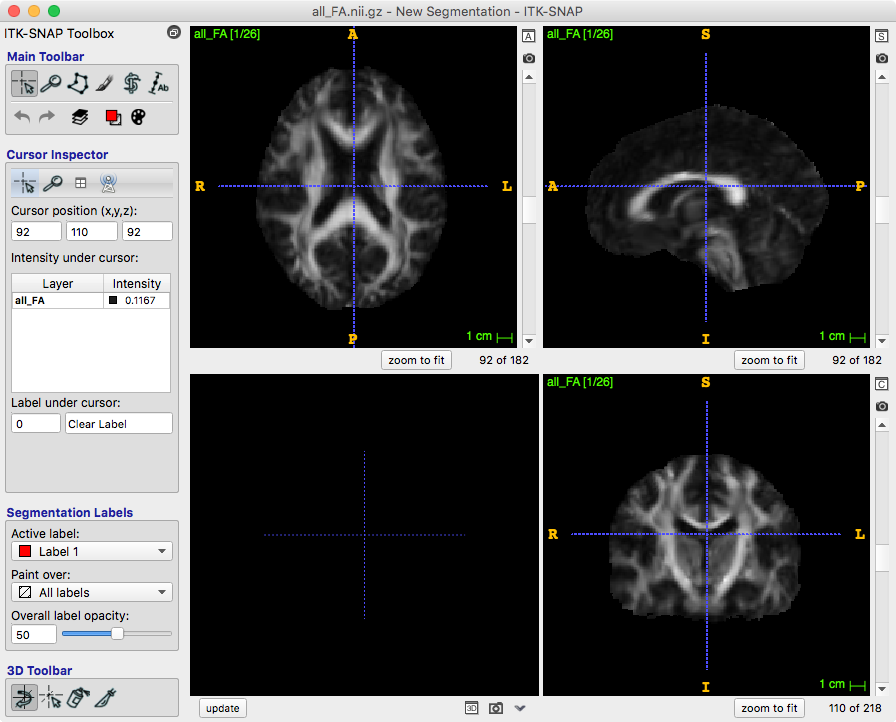
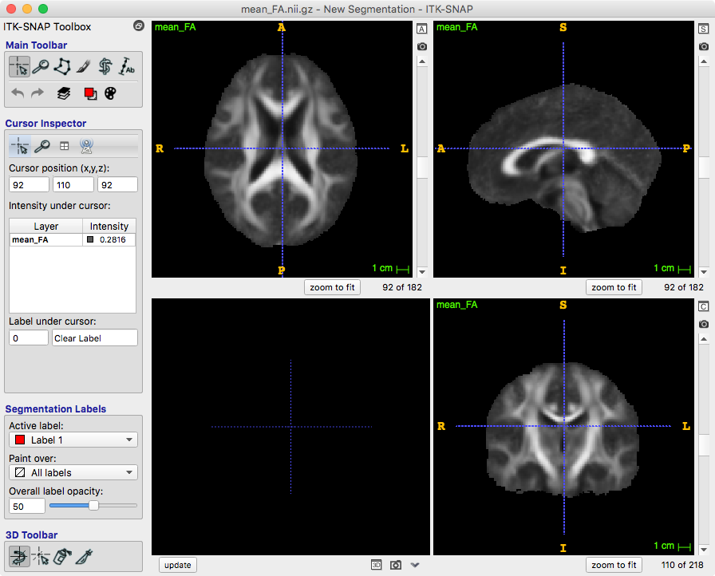
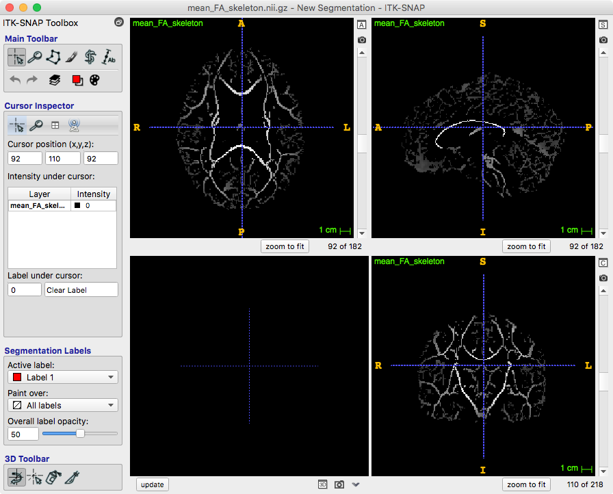

## Objectives

After you complete this section, you should be able to:

1. Run and describe the 4 steps of the TBSS analysis
2. Run TBSS on non-FA images

## tbss_1_preproc

<iframe src="https://player.vimeo.com/video/183678374" frameborder="0" webkitallowfullscreen mozallowfullscreen allowfullscreen></iframe>

 

Prepare your FA data in your TBSS working directory. You will need to copy all the FA images into a single directory:


mkdir -p ~/compute/analyses/EDSD/TBSS/
for i in $(ls ~/compute/images/EDSD/); do
cp -v ~/compute/images/EDSD/${i}/raw/dti_FA.nii.gz ~/compute/analyses/EDSD/TBSS/${i}_FA.nii.gz
done


You are now nearly ready to run the first TBSS script, which will erode your FA images slightly and zero the end slices (to remove likely outliers from the diffusion tensor fitting). This step skeletonizes all participants’ FA volumes.

Create a job script:


vi ~/scripts/EDSD/tbss_1_preproc.sh


Copy and paste the following into the new script:


#!/bin/bash

#SBATCH --time=00:05:00   # walltime
#SBATCH --ntasks=1   # number of processor cores (i.e. tasks)
#SBATCH --nodes=1   # number of nodes
#SBATCH --mem-per-cpu=24576M  # memory per CPU core

# Compatibility variables for PBS. Delete if not needed.
export PBS_NODEFILE=`/fslapps/fslutils/generate_pbs_nodefile`
export PBS_JOBID=$SLURM_JOB_ID
export PBS_O_WORKDIR="$SLURM_SUBMIT_DIR"
export PBS_QUEUE=batch

# Set the max number of threads to use for programs using OpenMP.
export OMP_NUM_THREADS=$SLURM_CPUS_ON_NODE

# LOAD ENVIRONMENTAL VARIABLES
var=`id -un`
FSLDIR=/fslhome/$var/apps/fsl
PATH=${FSLDIR}/bin:${PATH}
export FSLDIR PATH
. ${FSLDIR}/etc/fslconf/fsl.sh
module load python/2/7

# INSERT CODE, AND RUN YOUR PROGRAMS HERE
cd ~/compute/analyses/EDSD/TBSS/
tbss_1_preproc \*.nii.gz


We don't need to create a batch script to submit the FSL script, so just type in your single sbatch command:


var=`date +"%Y%m%d-%H%M%S"`
mkdir -p ~/logfiles/$var
sbatch \
-o ~/logfiles/${var}/output.txt \
-e ~/logfiles/${var}/error.txt \
~/scripts/EDSD/tbss_1_preproc.sh


Finally, the script runs slicesdir, which creates an overview webpage containing a static view of each of the input images, so that you can then quickly view each of them for obvious problems. You'll need to view these on your local computer:


rsync -rauv intj5@ssh.fsl.byu.edu:~/compute/analyses/EDSD/TBSS ~/Desktop/ --exclude="*target*" --exclude="stats" --exclude="*.nii.gz" --exclude="tbss_logs"


Type the following URL into your internet browser (edit according to your system): file:///Users/njhunsak/Desktop/TBSS/FA/slicesdir/index.html

## tbss_2_reg

<iframe src="https://player.vimeo.com/video/183678376" frameborder="0" webkitallowfullscreen mozallowfullscreen allowfullscreen></iframe>

 

Second, volumes are nonlinearly warped to the FMRIB58_FA template, which is supplied with FSL, by use of local deformation procedures performed by FNIRT, a nonlinear registration toolkit using a b-spline representation of the registration warp field.

Copy the first job script to create a new job script:


cp ~/scripts/EDSD/tbss_1_preproc.sh ~/scripts/EDSD/tbss_2_reg.sh


Change `--time=02:00:00` and the last line of code to this instead:


tbss_2_reg -T


Use the following code to submit the job script:


var=`date +"%Y%m%d-%H%M%S"`
mkdir -p ~/logfiles/$var
sbatch \
-o ~/logfiles/${var}/output.txt \
-e ~/logfiles/${var}/error.txt \
~/scripts/EDSD/tbss_2_reg.sh


## tbss_3_postreg

<iframe src="https://player.vimeo.com/video/183678375" frameborder="0" webkitallowfullscreen mozallowfullscreen allowfullscreen></iframe>

 

Next tbss_3_postreg generates a mean FA volume of all participants. This mean FA volume is thinned to create a mean FA skeleton representing the centers of all common tracts.

Copy the first job script to create a new job script:


cp ~/scripts/EDSD/tbss_1_preproc.sh ~/scripts/EDSD/tbss_3_postreg.sh


Change the last line of code to this instead:


tbss_3_postreg -S


Submit the job script:


var=`date +"%Y%m%d-%H%M%S"`
mkdir -p ~/logfiles/$var
sbatch \
-o ~/logfiles/${var}/output.txt \
-e ~/logfiles/${var}/error.txt \
~/scripts/EDSD/tbss_3_postreg.sh


The above results in a standard-space version of each subject's FA image; next these are all merged into a single 4D image file called *all_FA*, created in a new subdirectory called *stats*. 

Next, the mean of all FA images is created, called *mean_FA*.

This is then fed into the FA skeletonisation program to create *mean_FA_skeleton*.

## tbss_4_prestats

The last TBSS script carries out the final steps necessary before you run the voxelwise cross-subject stats. It thresholds the mean FA skeleton image at the chosen threshold - a common value that works well is 0.2.

Copy the first job script to create a new job script:


cp ~/scripts/EDSD/tbss_1_preproc.sh ~/scripts/EDSD/tbss_4_prestats.sh


Change the last line of code to this instead:


tbss_4_prestats 0.2


Submit tbss_4_prestats:


var=`date +"%Y%m%d-%H%M%S"`
mkdir -p ~/logfiles/$var
sbatch \
-o ~/logfiles/${var}/output.txt \
-e ~/logfiles/${var}/error.txt \
~/scripts/EDSD/tbss_4_prestats.sh


**At this point you may be asking your self, "Why not just put all the tbss_1 through tbss_4 code in a single job script?" Perfectly great question to ask. When you submit a command line, it typically should wait until the process has completed before moving to the next line in your code. Unfortunately, FSL commands don't always play nice and wait, so while you submit your code for tbss_2 it will immediately try to run tbss_3 and ultimately fail!**

## Using non-FA Images in TBSS

<iframe src="https://player.vimeo.com/video/183678372" frameborder="0" webkitallowfullscreen mozallowfullscreen allowfullscreen></iframe>

 

After you have run the full TBSS analysis on your FA data, the results can be applied to the other diffusion metrics: RD, AD, and MD. First, create a new directory called RD (or any other name) in your TBSS analysis directory (the one that contains the existing origdata, FA and stats directories from the FA analysis).


cd ~/compute/analyses/EDSD/TBSS/
mkdir RD
mkdir AD
mkdir MD


Copy your non-FA images into these new directories, making sure that they are named exactly the same as the original FA images were (look in origdata to check the original names - and keep them exactly the same, even if they include FA, which can be confusing; e.g. if there is an image origdata/subj005_FA.nii.gz then you need an image RD/subj005_FA.nii.gz and this file should contain the RD data, even though it has FA in the name). Confusing no?


for subj in $(ls ~/compute/images/EDSD/); do
cp -v ~/compute/images/EDSD/${subj}/raw/dti_MD.nii.gz ~/compute/analyses/EDSD/TBSS/MD/${subj}_FA.nii.gz;
cp -v ~/compute/images/EDSD/${subj}/raw/dti_L1.nii.gz ~/compute/analyses/EDSD/TBSS/AD/${subj}_FA.nii.gz;
cd ~/compute/images/EDSD/${subj}/raw/
fslmaths dti_L2.nii.gz -add dti_L3.nii.gz -div 2 dti_RD.nii.gz;
cp -v ~/compute/images/EDSD/${subj}/raw/dti_RD.nii.gz ~/compute/analyses/EDSD/TBSS/RD/${subj}_FA.nii.gz;
done


Now, making sure that you are in your top working TBSS directory (the one that now contains FA, stats and RD subdirectories) run the tbss_non_FA script, telling it that the alternate data is called RD. This will apply the original nonlinear registration to the RD data, merge all subjects' warped RD data into a 4D file stats/all_RD, project this onto the original mean FA skeleton (using the original FA data to find the projection vectors), resulting in the 4D projected data stats/all_RD_skeletonised. You don't really need to generate a script to run this, because the dataset is small enough, for larger datasets you will need to run these commands within a job script:


cd ~/compute/analyses/EDSD/TBSS/
tbss_non_FA AD
tbss_non_FA MD
tbss_non_FA RD


Now you are ready to run voxelwise statistics!

## Class Slides

<iframe src="//slides.com/njhunsak/tbss-part-2/embed" scrolling="no" frameborder="0" webkitallowfullscreen mozallowfullscreen allowfullscreen></iframe>

