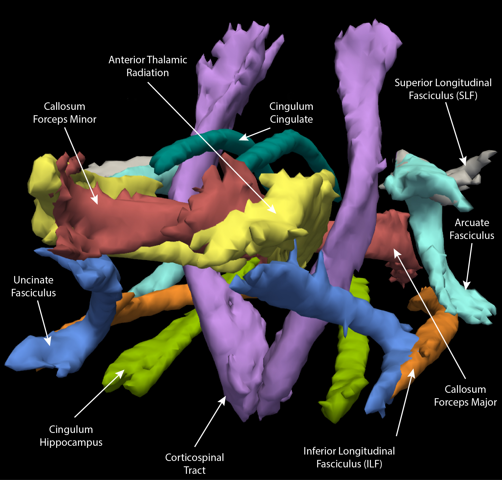

## TRACULA

<iframe src="https://player.vimeo.com/video/190892663?byline=0&portrait=0" frameborder="0" webkitallowfullscreen mozallowfullscreen allowfullscreen></iframe>

 

**DO NOT DO THIS STEP IF YOU HAVE DOWNLOADED AND INSTALLED FREESURFER VERSION 6.0**

TRACULA uses the prior anatomical information derived from the cortical parcellation and subcortical segmentation obtained from FreeSurfer. Let us make sure you have the latest version of TRACULA:


cd ~/build
wget ftp://surfer.nmr.mgh.harvard.edu/pub/dist/freesurfer/5.3.0-tracula-addons/tracula.update.centos6_x86_64.5.3.2014_05_26.tar.gz
tar xvf tracula.update.centos6_x86_64.5.3.2014_05_26.tar.gz
cp -v tracula.update.centos6_x86_64.5.3.2014_05_26/* ~/apps/freesurfer/bin/


## Configuration File

A configuration file for each participant needs to be generated using the DTI image (i.e., dti.nii.gz), bvec (i.e., dti.bvec) and bval (i.e., dti.bval) files output from dcm2nii. Unfortunately, the parallel processing tools in FSL don't work on our supercomputer, so we have to get creative and make this process run across compute nodes and not on a single node. Start by creating an analyses directory:


mkdir -p ~/compute/analyses/EDSD/TRACULA/data


Next we need to create a template configuration file:


vi ~/compute/analyses/EDSD/TRACULA/FRE_AD001.config


Copy and past this into the configuration file:


setenv SUBJECTS_DIR /fslhome/intj5/compute/analyses/EDSD/FreeSurfer/

set dtroot = /fslhome/intj5/compute/analyses/EDSD/TRACULA/data/

set subjlist = ( FRE_AD001 )

set dcmroot = /fslhome/intj5/compute/images/EDSD/

set dcmlist = ( FRE_AD001/raw/dti.nii.gz )

set bveclist = ( /fslhome/intj5/compute/images/EDSD/FRE_AD001/raw/dti.bvec )

set bvalfile = /fslhome/intj5/compute/images/EDSD/FRE_AD001/raw/dti.bval


Now that we have one configuration file, using the **sed** command, we can find and replace **FRE_AD001** with the remaining participant IDs to create configuration files for all the participants:


cd ~/compute/analyses/EDSD/TRACULA/
subjects=( FRE_AD001 FRE_AD002 FRE_AD003 FRE_AD004 FRE_AD005 FRE_AD006 FRE_AD007 FRE_AD008 FRE_AD009 FRE_AD010 FRE_HC001 FRE_HC002 FRE_HC003 FRE_HC004 FRE_HC005 FRE_HC006 FRE_HC007 FRE_HC008 FRE_HC009 FRE_HC010 FRE_HC011 FRE_HC012 FRE_HC013 FRE_HC014 FRE_HC015 FRE_HC016 )
for (( i=0; i<${#subjects[@]}; i++ )); do
sed "s/${subjects[$i]}/${subjects[$i+1]}/g" ${subjects[$i]}.config > ${subjects[$i+1]}.config;
done


## Preprocessing

<iframe src="https://player.vimeo.com/video/190892666?byline=0&portrait=0" frameborder="0" webkitallowfullscreen mozallowfullscreen allowfullscreen></iframe>

 

The preprocessing workflow of TRACULA is based on a standardized routine that utilizes tools available in the software library of FSL. Image distortions induced by eddy currents and head motion are corrected by aligning each image to the mean non-diffusion-weighted (b=0) using linear image registration using FSL eddy_correct program. After correction, diffusion weighted images are skull-stripped in order to exclude non-brain voxels from all analyses using FSL bet program. Once skull-stripped, a diffusion tensor model was fit at each voxel, generating fractional anisotropy (FA) maps using FSL DTIfit program. Although we've already completed these steps, the TRACULA pipeline redoes them for us. Once diffusion-weighted images are processed, the individual anatomical T1-weighted images are aligned to the b=0 images, and then all participants’ images are aligned to the MNI152 atlas through affine registration. Note that affine registration occurs and not diffeomorphic. Affine registration is used because it places all the participant images in a common space.

The job script for this is pretty easy and straight forward. The program **trac-all** will run the preprocessing steps **-pre** using the supplied configuration file. If you notice there's a command line variable **${1}** in the name of the configuration file, so we'll be able to use participant ID as the variable to submit a job script for each participant!


vi ~/scripts/EDSD/tracula-prep-job.sh


Copy and paste the following code into the script:


#!/bin/bash

#SBATCH --time=05:00:00   # walltime
#SBATCH --ntasks=1   # number of processor cores (i.e. tasks)
#SBATCH --nodes=1   # number of nodes
#SBATCH --mem-per-cpu=16384M  # memory per CPU core

# Compatibility variables for PBS. Delete if not needed.
export PBS_NODEFILE=`/fslapps/fslutils/generate_pbs_nodefile`
export PBS_JOBID=$SLURM_JOB_ID
export PBS_O_WORKDIR="$SLURM_SUBMIT_DIR"
export PBS_QUEUE=batch

# Set the max number of threads to use for programs using OpenMP.
export OMP_NUM_THREADS=$SLURM_CPUS_ON_NODE

# LOAD ENVIRONMENTAL VARIABLES
var=`id -un`
export FREESURFER_HOME=/fslhome/${var}/apps/freesurfer
source $FREESURFER_HOME/SetUpFreeSurfer.sh

# INSERT CODE, AND RUN YOUR PROGRAMS HERE
cd ~/compute/analyses/EDSD/TRACULA/
~/apps/freesurfer/bin/trac-all -prep -c ~/compute/analyses/EDSD/TRACULA/${1}.config


The batch script is just like we've had previously:


vi ~/scripts/EDSD/tracula-prep-batch.sh


Copy and paste the following code:


#!/bin/bash

for subj in $(ls ~/compute/images/EDSD); do
sbatch \
-o ~/logfiles/${1}/output_${subj}.txt \
-e ~/logfiles/${1}/error_${subj}.txt \
~/scripts/EDSD/tracula-prep-job.sh \
${subj}
sleep 1
done


To submit the batch script:


var=`date +"%Y%m%d-%H%M%S"`
mkdir -p ~/logfiles/$var
sh ~/scripts/EDSD/tracula-prep-batch.sh $var


## Class Slides

<iframe src="//slides.com/njhunsak/tracula/embed" scrolling="no" frameborder="0" webkitallowfullscreen mozallowfullscreen allowfullscreen></iframe>

