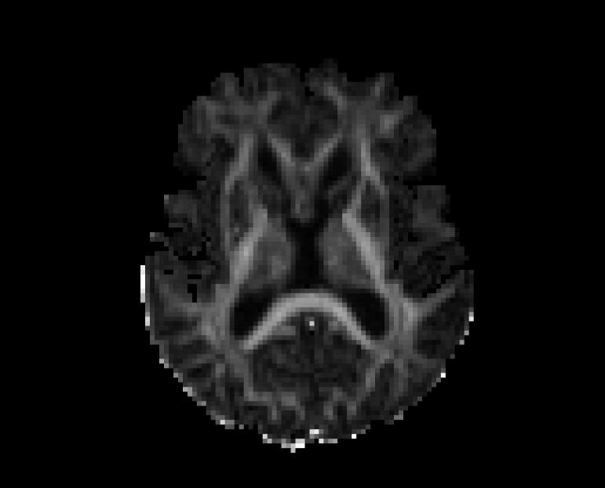
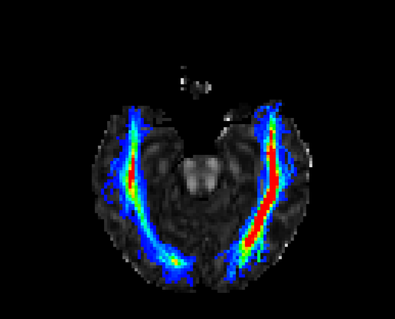
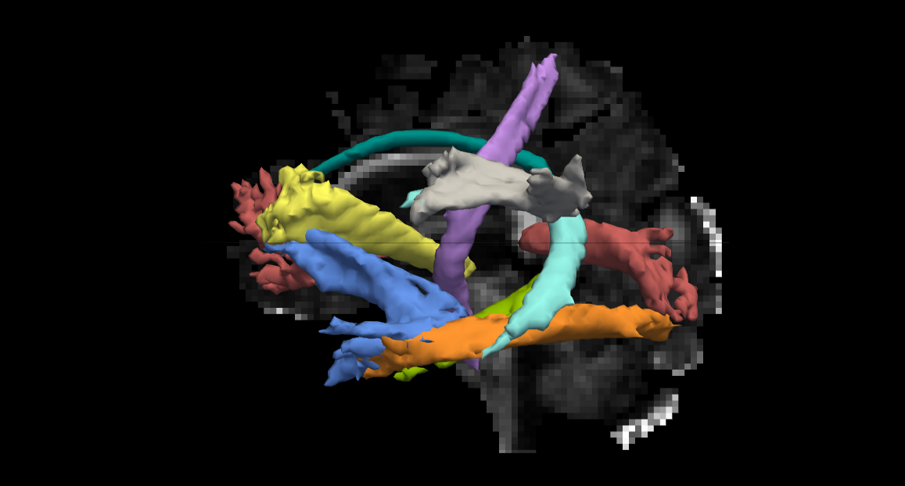

## Reconstruct Pathways

<iframe src="https://player.vimeo.com/video/190892664?byline=0&portrait=0" frameborder="0" webkitallowfullscreen mozallowfullscreen allowfullscreen></iframe>

 

FSL’s bedpostX is used to apply the ball- and-stick model of diffusion. TRACULA then uses the individual participant’s ball-and-stick model of local diffusion orientations, as well as the participant’s cortical and subcortical segmentation labels, combined with prior information of each tract to estimate the probability distributions of each tract. Eighteen major pathways are reconstructed: corticospinal tract, inferior longitudinal fasciculus, uncinate fasciculus, anterior thalamic radiation, cingulum-cingulate gyrus bundle, cingulum-angular bundle, superior longitudinal fasciculus-parietal bundle, superior longitudinal fasciculus-temporal bundle, and forceps major and forceps minor of the corpus callosum.


vi ~/scripts/EDSD/tracula-bedp-job.sh


Copy and paste the following code into the script:


#!/bin/bash

#SBATCH --time=15:00:00   # walltime
#SBATCH --ntasks=1   # number of processor cores (i.e. tasks)
#SBATCH --nodes=1   # number of nodes
#SBATCH --mem-per-cpu=16384M  # memory per CPU core

# Compatibility variables for PBS. Delete if not needed.
export PBS_NODEFILE=`/fslapps/fslutils/generate_pbs_nodefile`
export PBS_JOBID=$SLURM_JOB_ID
export PBS_O_WORKDIR="$SLURM_SUBMIT_DIR"
export PBS_QUEUE=batch

# Set the max number of threads to use for programs using OpenMP.
export OMP_NUM_THREADS=$SLURM_CPUS_ON_NODE

# LOAD ENVIRONMENTAL VARIABLES
var=`id -un`
export FREESURFER_HOME=/fslhome/${var}/apps/freesurfer
source $FREESURFER_HOME/SetUpFreeSurfer.sh

# INSERT CODE, AND RUN YOUR PROGRAMS HERE
cd ~/compute/analyses/EDSD/TRACULA/
~/apps/freesurfer/bin/trac-all -bedp -c ~/compute/analyses/EDSD/TRACULA/${1}.config


The batch script is just like we've had previously:


vi ~/scripts/EDSD/tracula-bedp-batch.sh


Copy and paste the following code:


#!/bin/bash

for subj in $(ls ~/compute/images/EDSD); do
sbatch \
-o ~/logfiles/${1}/output_${subj}.txt \
-e ~/logfiles/${1}/error_${subj}.txt \
~/scripts/EDSD/tracula-bedp-job.sh \
${subj}
sleep 1
done


To submit the batch script:


var=`date +"%Y%m%d-%H%M%S"`
mkdir -p ~/logfiles/$var
sh ~/scripts/EDSD/tracula-bedp-batch.sh $var


## Probabilistic Distrubution of Pathways

The final step of TRACULA is to generate the probability distributions for each white-matter bundles specified in the configuration file. This is done by simultaneously fitting the shape of each pathway to the results of the ball-and-stick model of diffusion from above and to the prior knowledge of the pathway anatomy given by the set of manually labeled training subjects in the TRACULA atlas. The following command reconstructs the probabilistic distribution of the pathways:


vi ~/scripts/EDSD/tracula-path-job.sh


Copy and paste the following code into the script:


#!/bin/bash

#SBATCH --time=10:00:00   # walltime
#SBATCH --ntasks=1   # number of processor cores (i.e. tasks)
#SBATCH --nodes=1   # number of nodes
#SBATCH --mem-per-cpu=16384M  # memory per CPU core

# Compatibility variables for PBS. Delete if not needed.
export PBS_NODEFILE=`/fslapps/fslutils/generate_pbs_nodefile`
export PBS_JOBID=$SLURM_JOB_ID
export PBS_O_WORKDIR="$SLURM_SUBMIT_DIR"
export PBS_QUEUE=batch

# Set the max number of threads to use for programs using OpenMP.
export OMP_NUM_THREADS=$SLURM_CPUS_ON_NODE

# LOAD ENVIRONMENTAL VARIABLES
var=`id -un`
export FREESURFER_HOME=/fslhome/${var}/apps/freesurfer
source $FREESURFER_HOME/SetUpFreeSurfer.sh

# INSERT CODE, AND RUN YOUR PROGRAMS HERE
cd ~/compute/analyses/EDSD/TRACULA/
~/apps/freesurfer/bin/trac-all -path -c ~/compute/analyses/EDSD/TRACULA/${1}.config


The batch script is just like we've had previously:


vi ~/scripts/EDSD/tracula-path-batch.sh


Copy and paste the following code:


#!/bin/bash

for subj in $(ls ~/compute/images/EDSD); do
sbatch \
-o ~/logfiles/${1}/output_${subj}.txt \
-e ~/logfiles/${1}/error_${subj}.txt \
~/scripts/EDSD/tracula-path-job.sh \
${subj}
sleep 1
done


To submit the batch script:


var=`date +"%Y%m%d-%H%M%S"`
mkdir -p ~/logfiles/$var
sh ~/scripts/EDSD/tracula-path-batch.sh $var


## Quality Assessment

<iframe src="https://player.vimeo.com/video/190892665?byline=0&portrait=0" frameborder="0" webkitallowfullscreen mozallowfullscreen allowfullscreen></iframe>

 

Since diffusion weighted imaging analyses are designed to detect the motion of water molecules, this makes diffusion MR images particularly sensitive to head motion. Head motion results in not only misalignment between consecutive diffusion weighted images, but also intensity changes. Misalignment can be corrected by registering the diffusion weighted images to each other; however, intensity alterations cannot be corrected. There are four measures of head motion outputted from the TRACULA pipeline: the average volume-by-volume translation and rotation, the percent of slices with excessive intensity drop-out, and the average drop-out score for slices with excessive intensity drop-out.


cat ~/compute/analyses/EDSD/TRACULA/data/FRE_AD001/dmri/dwi_motion.txt


Participant FRE_AD001 was pretty well-behaved. These motion measures can be used to ensure that groups of participants are matched with respect to head motion or be used as nuissance regressor in group analyses:


AvgTranslation AvgRotation PercentBadSlices AvgDropoutScore
1.026 0.0100014 0 1


## Outputs

For each identified pathway, fractional anisotropy (FA), mean diffusivity (MD), radial diffusivity (RD), and axial diffusivity (AD) are extracted along the tract at the maximum position on the a posteriori path, as well averaged over all sample paths. Because tracts are reconstructed in each participant’s native diffusion space and not on a template, diffusion measures must be interpolated to corresponding positions along the tract for all participants. Once interpolated, some participants’ endpoints contained NA values, because the endpoints vary tremendously across participants.

Sync your data to a local computer with FreeSurfer installed:


rsync -rauv \
intj5@ssh.fsl.byu.edu:~/compute/analyses/EDSD/TRACULA \
~/Desktop/


You can use freeview to view the FA image for each participant in native space. You can do this with the command below:


cd ~/Desktop/TRACULA/data/FRE_AD002
freeview dmri/dtifit_FA.nii.gz &


To visualize the probability distribution of single white-matter pathways, do the following:


freeview -v dmri/dtifit_FA.nii.gz \
dpath/rh.ilf_AS_avg33_mni_bbr/path.pd.nii.gz:colormap=jet:isosurface=0,0:color='Red':name=rh.ilf \
dpath/lh.ilf_AS_avg33_mni_bbr/path.pd.nii.gz:colormap=jet:isosurface=0,0:color='Red':name=lh.ilf


To visualize the probability distribution of all white-matter pathways, do the following:


freeview -tv dpath/merged_avg33_mni_bbr.mgz \
-v dmri/dtifit_FA.nii.gz &


When you are done, close Freeview.
