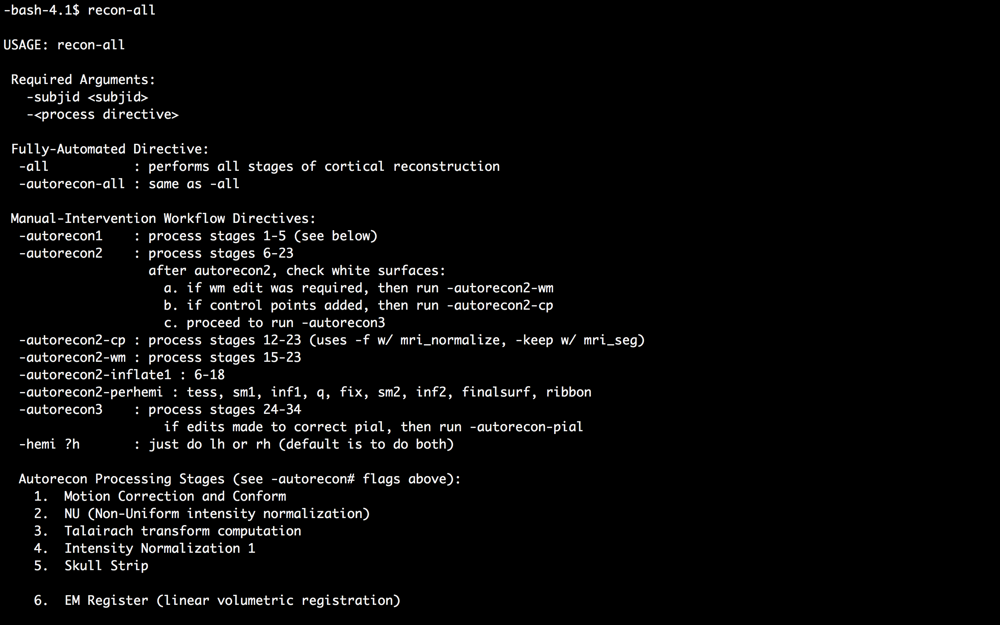
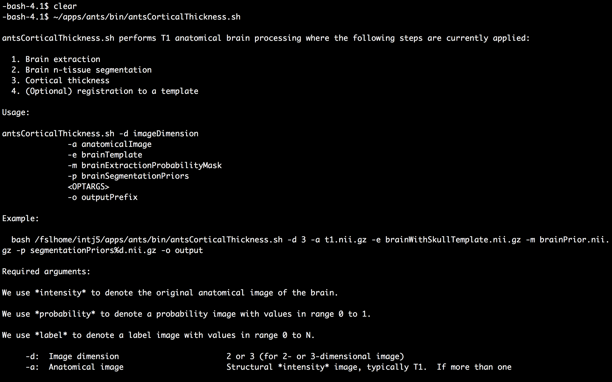

## Logging In
Interaction with the supercomputer is typically performed with command line tools. The command line tools can be run via a command prompt, also known as a shell. SSH is used to establish a secure shell with the supercomputer. In general, users should log in via the hostname ssh.fsl.byu.edu.

```
ssh {username}@ssh.fsl.byu.edu
```

where {username} is your NetID. Programs can be tested from the interactive nodes, but anything left running for more than an hour will be killed automatically.

## Check Groups
First make sure you are apart of the fslg_byustudent group. You can check which groups you belong to by typing:

```
groups
```

You should see a that you are at least a memeber of ***fslg_byustudent***.

## Make Directory
Create an apps directory in your home directory and go to that directory. First make sure you are in your home directory:

```
cd ~
```

Next, make the new directory:

```
mkdir apps
cd apps
```

## rsync
The apps can be found in the fslg_byustudent group:

```
rsync \
-rauv \
~/fsl_groups/fslg_byustudent/apps/ \
~/apps
```
I always like to add the option `--dry-run` before submitting an rsync to make sure the files I want to copy are the ones being copied.

## List contents of apps directory
 

## Set Environment Variables
For most of the neuroimaging programs we use, we need to set the environmental variable. The variable simply tells the computer the location of all the executable files for an application.

To edit text files directly in a shell window:

```
vi ~/.bash_profile
```

To enter into `insert mode`, type `a`.

## Permanently Set Environment Variable

Change username and type the following into your bash_profile:

```
# ANTS ENVIRONMENTAL VARIABLES
export ANTSPATH=/fslhome/<username>/apps/ants/bin/
PATH=${ANTSPATH}:${PATH}

# ACPCDETECT ENVIRONMENTAL VARIABLES
ARTHOME=/fslhome/<username>/apps/art/
export ARTHOME

# FSL ENVIRONMENTAL VARIABLES
FSLDIR=/fslhome/<username>/apps/fsl
PATH=${FSLDIR}/bin:${PATH}
export FSLDIR PATH
. ${FSLDIR}/etc/fslconf/fsl.sh

# FREESURFER ENVIRONMENTAL VARIABLES
export FREESURFER_HOME=/fslhome/<username>/apps/freesurfer
source $FREESURFER_HOME/SetUpFreeSurfer.sh
```

To enter into `command mode`, press the `esc` key. To save the file and exit out of vi text editor, type `:wq<Return>`.

## Check programs

 

----

 

----

 