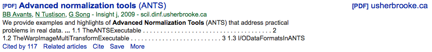
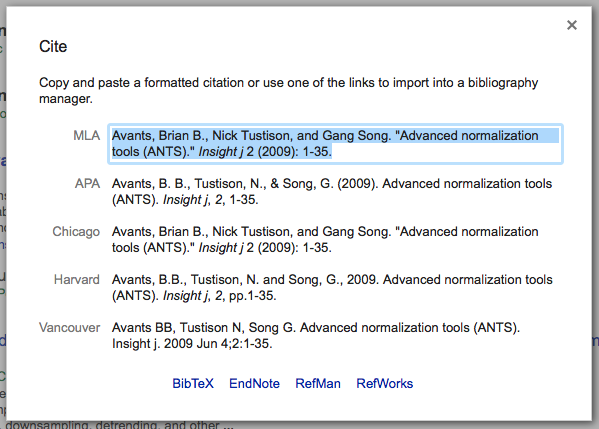
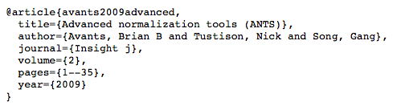

## The Bibliography File

Bibliographic references are usually kept in a bibliography file whose extension is .bib, this file consists of a list of records and fields. Each bibliography record holds relevant information for a single entry.

```
@article{           avants2014,
  author =          {Avants, BB and Tustison, N and Song, G},
  title =           {Advanced normalization tools ({ANTS})},
  volume =          {2},
  pages =           {1--35},
  bdsk-url-1 =      {http://dx.doi.org/10.1016/j.neuroimage.2014.05.044},
  date =            {2014},
  doi =             {10.1016/j.neuroimage.2014.05.044},
  journaltitle =    {Insight J}
}

@book{              matlab2015,
  title =           {version 8.6.0 (R2015{b})},
  publisher =       {The MathWorks Inc.},
  author =          {MATLAB},
  date =            {2015},
  location =        {Natick, Massachusetts}
}
```

## Using Google Scholar to download BibTeX citations

To download BibTeX citation go to Google Scholar and search for a publication. Through the cite button below a search result Google provides formatted citations for MLA, APA, and Chicago styles.



Now click the link “BibTeX” at the bottom of the window to copy and paste the BibTeX citation.



You will be presented with the BibTeX citation:



### Superfluous Cleaning of BibTex File

For an aside, you can use a tool called BibTool to clean your BibTex file. Use, homebrew to install BibTool:

```bash
brew install bib-tool
```

To delete fields that you don't want to share, e.g. notes and file locations,

```bash
bibtool -- "delete.field {annote}" -i input.bib -o output.bib
bibtool -- "delete.field {file}" -i input.bib -o output.bib
```

An easier way to deal with multiple options is to create a resource file:

```bash
delete.field      = "annote"
delete.field      = "file"
delete.field      = "keywords"
delete.field      = "abstract"
delete.field      = "mendeley-tags"
delete.field      = "language"
delete.field      = "medline-pst"
delete.field      = "date-modified"
delete.field      = "institution"
print.align.key   = 20
print.align       = 20
print.line.length = 9999
print.wide.equal  = on
print.equal.right = off
print.use.tab     = off
```

You can call this file directly with the -r option, e.g., `bibtool -r res_file -i input.bib -o output.bib`.

More options and documentation here: [http://www.gerd-neugebauer.de/software/TeX/BibTool/bibtool.pdf](http://www.gerd-neugebauer.de/software/TeX/BibTool/bibtool.pdf)

## Citations

### Single reference

To insert a single reference:

```latex
see reference \parencite{avants2014}
```

Which will render like this:

> see reference (Avants, Tustison, & Song, 2014)

### Multiple references

To insert multiple references:

```latex
see reference \parencite{matlab2015, avants2014}
```

Which will render like this:

> see reference (Avants, Tustison, & Song, 2014; MATLAB, 2015)

You do not need to have your citations in any order, as the citations will be reordered according to the format you choose to generate your bibliography.

### Text references

To insert an in-line reference:

```latex
see reference \textcite{avants2014}
```

Which will render like this:

> see reference Avants et al. (2014)

## Preamble

Add the following to your main LaTeX document's preamble in order to get the bibliography to render correctly:

```latex
\usepackage[american]{babel}
\usepackage[backend=biber,style=apa,sortcites=true,sorting=nyt]{biblatex}
\DeclareLanguageMapping{american}{american-apa}
\usepackage{hyperref}
```

After importing the package, you need to specify your bibliography file:

```latex
\addbibresource{bibliography.bib}
```

In BibLaTeX this actually does not print the bibliography itself, place the following code where you'd like to render your bibliography:

```latex
\printbibliography
```

## Example

Here's a LaTeX document example with the different types of citations:

```latex
\documentclass[doc]{apa6}

%% Packages
\usepackage{hyperref}
\usepackage[american]{babel}
\usepackage[style=apa,sortcites=true,sorting=nyt]{biblatex}
\DeclareLanguageMapping{american}{american-apa}
\addbibresource{myref.bib}

%% Title
\shorttitle{Hunsaker, N.}

%% Begin Document
\begin{document}

\section{Example 1}

\textcite{porter1998rhetorical} has stated that, ``The internetworked classroom has the potential (not yet realized) to empower students'' (p. 5), and this research project examines this potential.

\section{Example 2}

``Semantic frames/domains represent one of the two major organizing principles for conceptual structure'' \parencite[][32]{croft2004cognitive}.

\section{Example 3}

In arguing for frame semantics, \textcite{croft2004cognitive} asserted, ``Semantic frames/domains represent one of the two major organizing principles for conceptual structure'' (p. 32).

\section{Example 4}

\textcite{nicholson1820farmer} anticipated this effect when discussion farming methods in the nineteenth century:

\begin{quote} 
Perhaps it would be well, if some institution were devised, and supported at the expense of the State, which would be so organized as would tend most effectually to produce a due degree of emulation among Farmers, by rewards and honorary distinctions conferred by those who, by their successful experimental efforts and improvements, should render themselves duly entitled to them. (p. 92)
\end{quote}

%% Reference
\printbibliography

%% End Document
\end{document}
```

The associated \*.bib file contains these references:

```latex
@book{porter1998rhetorical,
  title={Rhetorical Ethics and Internetworked Writing},
  author={Porter, J.E.},
  series={New directions in computers and composition studies},
  year={1998},
  publisher={Ablex Pub.},
  address={Greenwich, CT}
}

@book{croft2004cognitive,
  title={Cognitive Linguistics},
  author={Croft, W. and Cruse, D.A.},
  series={Cambridge Textbooks in Linguistics},
  year={2004},
  publisher={Cambridge University Press},
  address={Cambridge, UK}
}

@book{nicholson1820farmer,
  title={The farmer's assistant: {B}eing a digest of all that relates to agriculture and the conducting of rural affairs, alphabetically arranged and adapted for the {U}nited {S}tates.},
  author={Nicholson, J.},
  year={1820},
  publisher={Benjamin Warner},
  address={Philedelphia, PA}
}
```

The rendered PDF will look like this:
