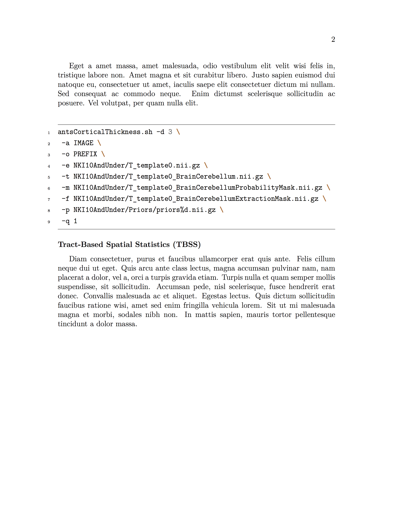

## Tips 'n Tricks with LaTeX

The following symbol characters are reserved by LATEX because they introduce a command and have a special meaning.

\# $ % ^ & _ { } ~ \\

These symbols and can be printed with special commands (in some cases - inside mathematical environment).

| Character | Function | How to Print It |
|:----------|:---------|:----------------|
| \# | Macro parameter | \\# |
| $ | Math Mode | \\$ |
| % | Comment | \\% |
| ^ | Superscript (in math mode) | \\^ or $\\textasciicircum$ |
| & | Separate column entries in tables | \\& |
| _ | Subscript (in math mode) | \\_ |
| {} | Processing block | \\{\\} |
| ~ | Unbreakable space, use it whenever you want to leave a space which is unbreakable | $\\textasciitilde$ or \\~{} |
| \\ | Starting commands, which extend until the first non-alphanumerical character | $\\textbackslash$ or $\\backslash$ |

## Organizing Your Documents

The power of writing documents in LaTeX is being able to contain chapters or sections as separate files so no one file gets too big. You can easily combine all the sections when you finally compile your LaTeX document. We will be discussing manuscript formatting, but the same idea can easily be applied to theses and dissertations.

The general sections of a manuscript are:

* Introduction
* Methods
* Results
* Discussion

Therefore, you can create four LaTeX text files for each of the sections (i.e., intro.tex, methods.tex, results.tex, and discussion.tex respectively.) On the first line of each document you will need to identify the section:

```latex
\section{Introduction}
```

The command *\\section{}* marks the beginning of a new section, inside the braces is the title of the section. You can choose the title to be whatever you want.

## Sectioning

LaTeX can organize, number, and index chapters and sections of document. There are up to 7 levels of depth for defining sections depending on the document class:

* \\part{part}
* \\chapter{chapter}
* \\section{section}
* \\subsection{subsection}
* \\subsubsection{subsubsection}
* \\paragraph{paragraph}
* \\subparagraph{subparagraph}

*\\part* and *\\chapter* are only available in report and book document classes. By organizing your documents, if needed, you will easily be able to generate a table of contents based on these sectioning commands.

## Subsectioning

Particularly within your Methods section, you will want to include subsections:

* Participants
* MRI Acquisition
* Preprocessing
* MRI Analysis (use the specific analysis here, e.g., Tract-Based Spatial Statistics)
* Statistical Analyses

In your Results section, you will also want to include subsections for your descriptive statistics and each of your analyses, i.e., head motion, TBSS results, AFQ results, etc.

### Example

Here's some example LaTeX for your method section. First create a text file (e.g., methods.tex) in TextWrangler or some similar text editor:

```latex
\section{Methods}

\subsection{Participants}
The data set used to in the current study came from the European DTI Study on Dementia (EDSD) and included 16 healthy controls and 10 participants with Alzheimer's disease (AD). Lorem ipsum dolor sit amet, mauris ac cursus pretium fringilla duis, fames aliquam nec dolor pharetra. Suscipit pellentesque at luctus sagittis, ultricies mattis sociis et quis suscipit vestibulum, mauris dignissim fringilla magna neque, quisque nec cras, egestas tellus mauris a urna libero. Nulla tincidunt leo mi mauris porta, aliquet sagittis, quam purus amet in, ac penatibus etiam. Nulla suspendisse eros in, nibh pede ornare malesuada, vivamus fusce nam elit. Sodales consectetuer mi est nulla varius ipsum. Risus odio leo dictum adipiscing, commodo parturient ante vel sed, neque risus natoque, pharetra habitasse praesent praesent eleifend. Phasellus suspendisse nisl, vivamus convallis animi senectus, congue nibh orci ut maecenas hendrerit, pulvinar donec a ipsam. Arcu nostra volutpat, ut montes accumsan convallis, in neque non, id ante mattis, malesuada nisl dolor ridiculus. Nibh tenetur volutpat quis nunc mollis laoreet, sed perferendis vestibulum vulputate, duis vehicula elit libero quam, nulla vel viverra lectus, aliquet luctus nulla. Suscipit numquam est vel a sagittis, non voluptatum ipsum etiam.

\subsection{MRI Acquisition}
Magnetic resonance images (MRI) of the participants were obtained using a Siemens TrioTim 3T scanner. High-resolution T1-weighted images were acquired using a 3D magnetization-prepared rapid gradient echo (MPRAGE) pulse sequence. The 3D MPRAGE T1-weighted sequence parameters were as follows: 176 contiguous sagittal slices with TR (repetition time) = 2200 ms; TE (echo time) = 2.2 ms; in-plane resolution = 1 $\times$ 1; slice thickness = 1; and flip angle = 12\textdegree. Diffusion MRI images were acquired using a 2D diffusion-weighted echo-planar imaging (EPI) pulse sequence with the following parameters: 61 interleaved axial slices with TR (repetition time) = 11,800 ms; TE (echo time) = 94 ms; in-plane resolution = 2 $\times$ 2 mm; and slice thickness = 2 mm. Diffusion gradients were applied in 61 directions with b = 1000 s/mm\textsuperscript{2}.

\subsection{MRI Preprocessing}
Eu sollicitudin, aliquam ultrices donec ligula ultrices, lacinia dapibus in felis, sit nonummy sapien nunc felis sollicitudin rutrum, tempor eget a massa condimentum donec non. Velit aliquam aliquam nunc sed, mauris amet, justo sociosqu nunc suspendisse. Accumsan etiam felis nec massa, necessitatibus eros ut duis suspendisse. Nam risus aute. Eget sodales felis magna.

\begin{minted}[frame=lines,framesep=2mm,baselinestretch=1.2,linenos,escapeinside=||]{bash}
dcm2niix -o <output directory> -x n -f t1 -z n <DICOM directory>
\end{minted}

Eget a amet massa, amet malesuada, odio vestibulum elit velit wisi felis in, tristique labore non. Amet magna et sit curabitur libero. Justo sapien euismod dui natoque eu, consectetuer ut amet, iaculis saepe elit consectetuer dictum mi nullam. Sed consequat ac commodo neque. Enim dictumst scelerisque sollicitudin ac posuere. Vel volutpat, per quam nulla elit.

\begin{minted}[frame=lines,framesep=2mm,baselinestretch=1.2,linenos,escapeinside=||]{bash}
antsCorticalThickness.sh -d 3 \
 -a IMAGE \
 -o PREFIX \
 -e NKI10AndUnder/T_template0.nii.gz \
 -t NKI10AndUnder/T_template0_BrainCerebellum.nii.gz \
 -m NKI10AndUnder/T_template0_BrainCerebellumProbabilityMask.nii.gz \
 -f NKI10AndUnder/T_template0_BrainCerebellumExtractionMask.nii.gz \
 -p NKI10AndUnder/Priors/priors%d.nii.gz \
 -q 1
\end{minted}

\subsection{Tract-Based Spatial Statistics (TBSS)}
Diam consectetuer, purus et faucibus ullamcorper erat quis ante. Felis cillum neque dui ut eget. Quis arcu ante class lectus, magna accumsan pulvinar nam, nam placerat a dolor, vel a, orci a turpis gravida etiam. Turpis nulla et quam semper mollis suspendisse, sit sollicitudin. Accumsan pede, nisl scelerisque, fusce hendrerit erat donec. Convallis malesuada ac et aliquet. Egestas lectus. Quis dictum sollicitudin faucibus ratione wisi, amet sed enim fringilla vehicula lorem. Sit ut mi malesuada magna et morbi, sodales nibh non. In mattis sapien, mauris tortor pellentesque tincidunt a dolor massa.
```

This is what this file looks like once it is complied:





