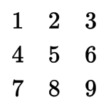
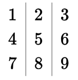
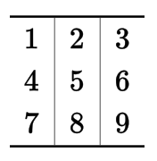
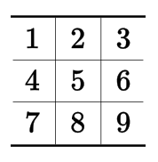
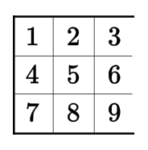

## Online Table Generator

Generating tables in LaTeX can be a little difficult at times, but to simply the process you can always go online and enter your information and it will generate the table for your automatically:

[http://www.tablesgenerator.com/latex_tables](http://www.tablesgenerator.com/latex_tables)

## Tabular Environment

The tabular environment can be used to typeset tables with optional horizontal and vertical lines. LaTeX determines the width of the columns automatically.

The first line of the environment has the form:

```latex
\begin{tabular}{table spec}
```

The table spec argument tells LaTeX the alignment to be used in each column and the vertical lines to insert. The following symbols are available to describe the table columns: l (left-justified column), r (right-justified column), c (center justified column).

In the first line you have pointed out how many columns you want, their alignment and the vertical lines to separate them. Once in the environment, you have to introduce the text you want, separating between cells and introducing new lines. The commands you have to use are the following:

|               |                                                                                                   |
|:--------------|:--------------------------------------------------------------------------------------------------|
| `&`           | column separator                                                                                  |
| `||`          | start new row (additional space may be specified after \\ using square brackets, such as \\[6pt]) |
| `\hline`      | horizontal line                                                                                   |
| `\newline`    | start a new line within a cell (in a paragraph column)                                            |
| `\cline{i-j}` | partial horizontal line beginning in column i and ending in column j                              |

## Basic Examples

For a simple 3 x 3 table:



```latex
\begin{tabular}{ l c r }
  1 & 2 & 3 \\
  4 & 5 & 6 \\
  7 & 8 & 9 \\
\end{tabular}
```

To add vertical lines:



```latex
\begin{tabular}{ l | c | r }
  1 & 2 & 3 \\
  4 & 5 & 6 \\
  7 & 8 & 9 \\
\end{tabular}
```

To add horizontal lines to the top and bottom:



```latex
\begin{tabular}{ l | c | r }
  \hline			
  1 & 2 & 3 \\
  4 & 5 & 6 \\
  7 & 8 & 9 \\
  \hline  
\end{tabular}
```

To add horizontal lines between all rows and to center the table on the page:



```latex
\begin{center}
  \begin{tabular}{ l | c | r }
    \hline
    1 & 2 & 3 \\ \hline
    4 & 5 & 6 \\ \hline
    7 & 8 & 9 \\
    \hline
  \end{tabular}
\end{center}
```



```latex
\begin{center}
  \begin{tabular}{ | l | c | r }
    \hline
    1 & 2 & 3 \\ \hline
    4 & 5 & 6 \\ \hline
    7 & 8 & 9 \\
    \hline
  \end{tabular}
\end{center}
```

[For more examples, view the LaTeX wiki page.](https://en.wikibooks.org/wiki/LaTeX/Tables)
