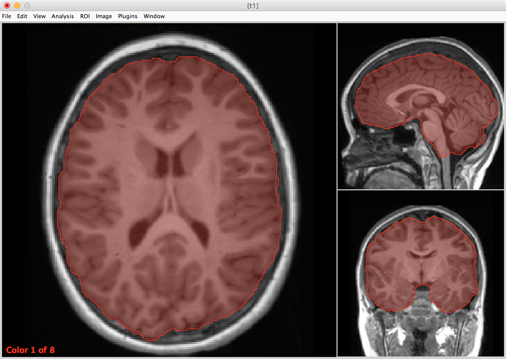
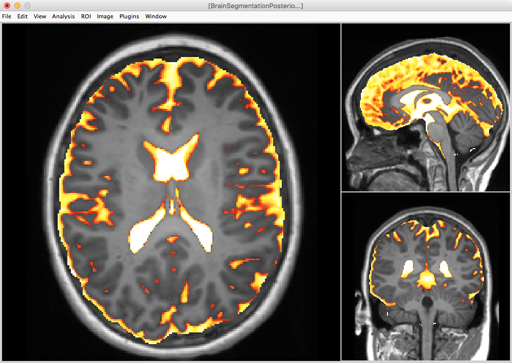
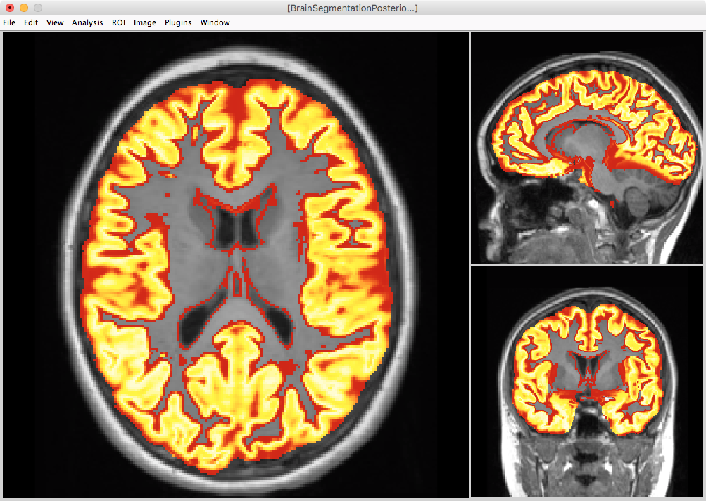
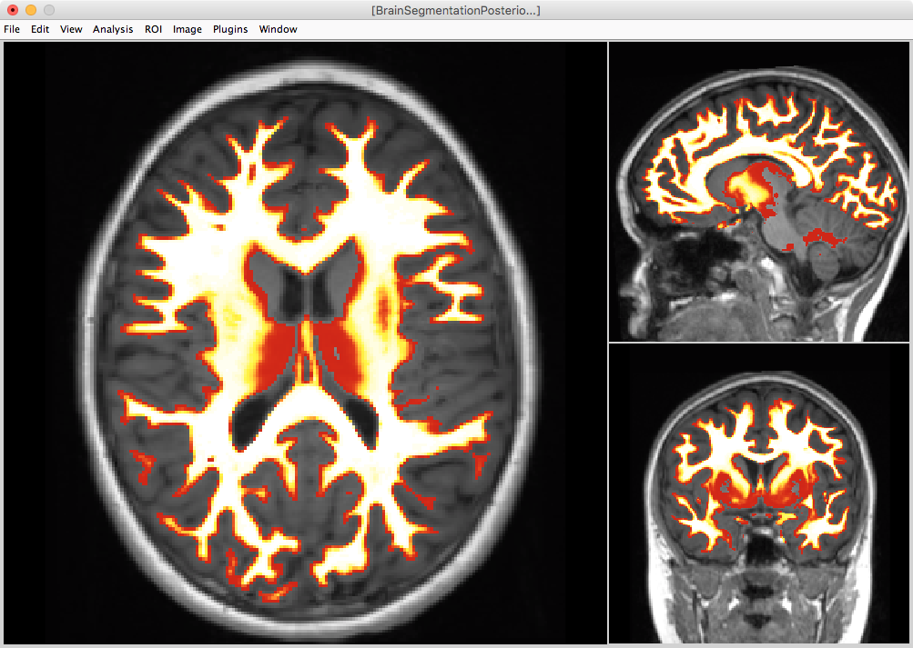
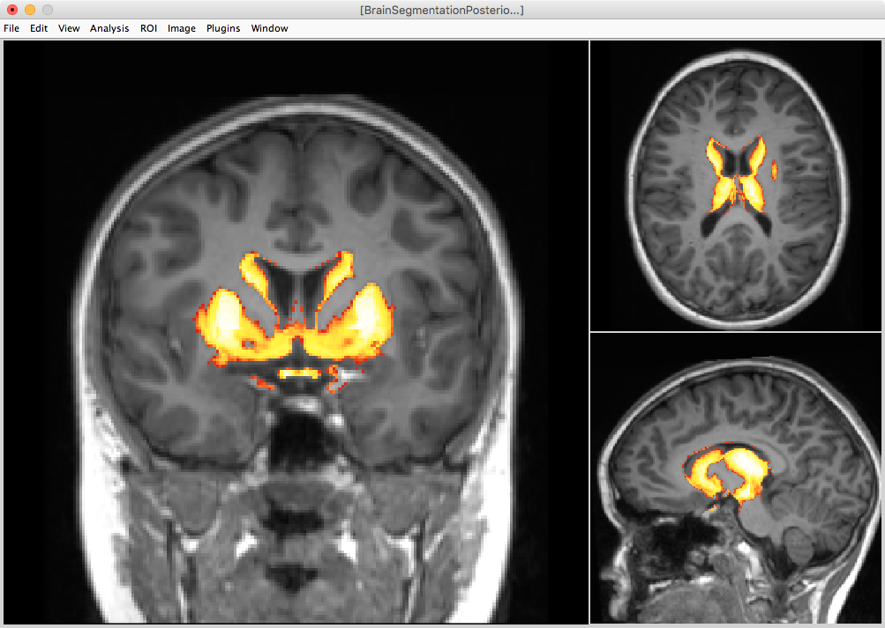
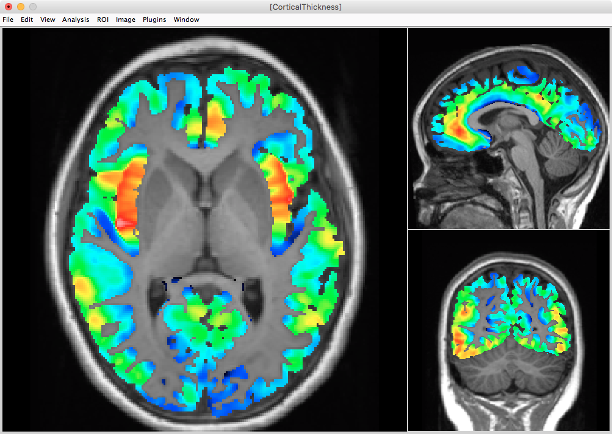
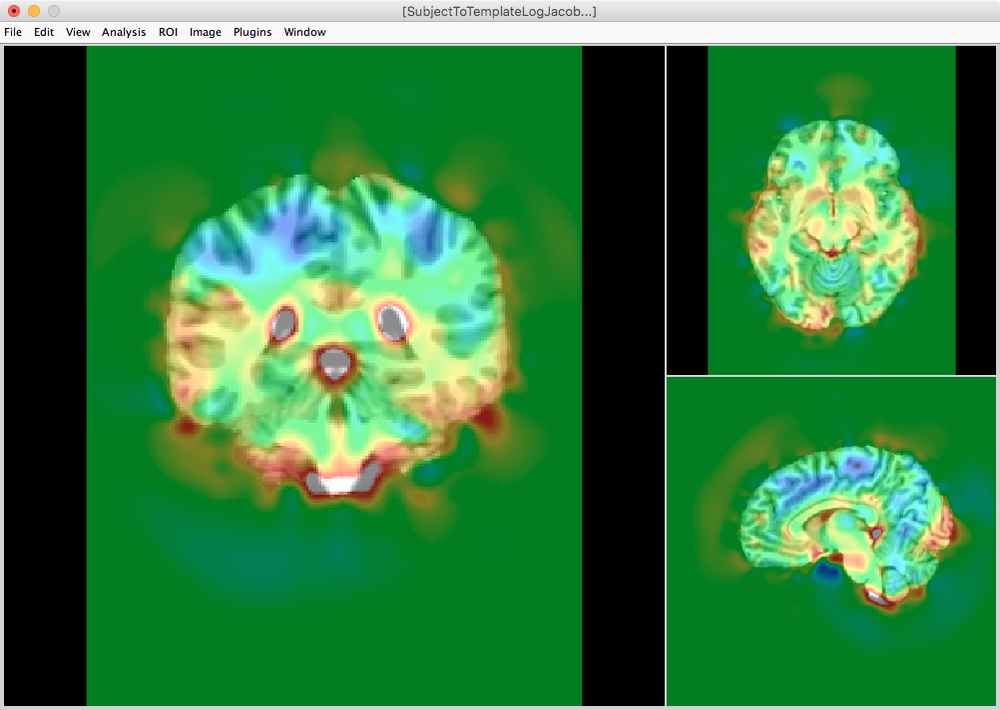

## Copy Example to your Desktop:

```
rsync \
-rauv \
<username>@ssh.fsl.byu.edu:~/fsl_groups/fslg_byustudent/compute/examples/corticalthickness \
~/Desktop
```

----

T1.nii.gz with BrainExtractionMask.nii.gz as ROI



----

T1.nii.gz with BrainSegmentation.nii.gz as ROI


----

T1.nii.gz with Posteriors1.nii.gz as Overlay [0.25,1]



----

T1.nii.gz with Posteriors2.nii.gz as Overlay [0.25,1]



----

T1.nii.gz with Posteriors3.nii.gz as Overlay [0.25,1]



----

T1.nii.gz with Posteriors4.nii.gz as Overlay [0.25,1]



----

T1.nii.gz with Posteriors5.nii.gz as Overlay [0.25,1]


----

T1.nii.gz with Posteriors6.nii.gz as Overlay [0.25,1]


----

T1.nii.gz with CorticalThickness.nii.gz as Overlay [1,9]



----

Extracted Brain


----

BrainNormalizedToTemplate.nii.gz with CorticalThicknessNormalizedToTemplate.nii.gz as Overlay [1,9]


----

BrainNormalizedToTemplate.nii.gz with SubjectToTemplateLogJacobian.nii.gz as Overlay [-0.5,0.5]



----

Subject to template inverse (AKA template normalized to subject)

