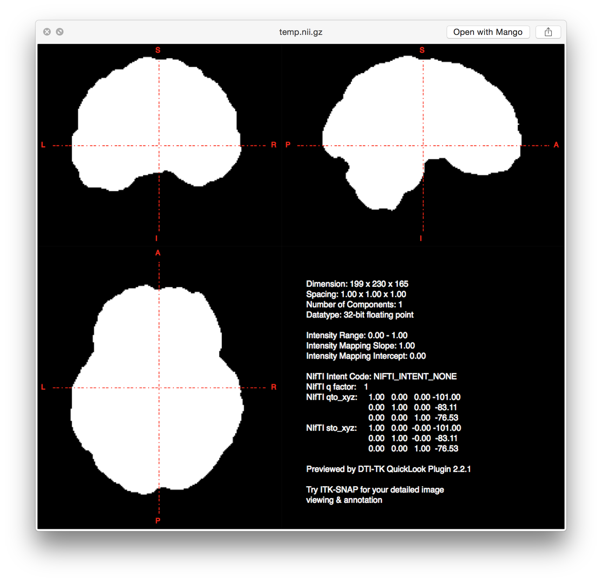
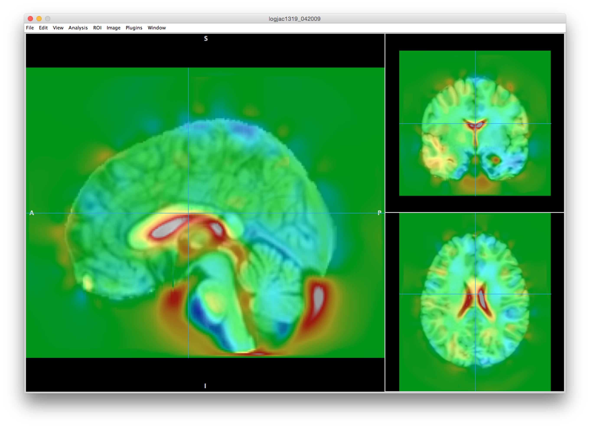
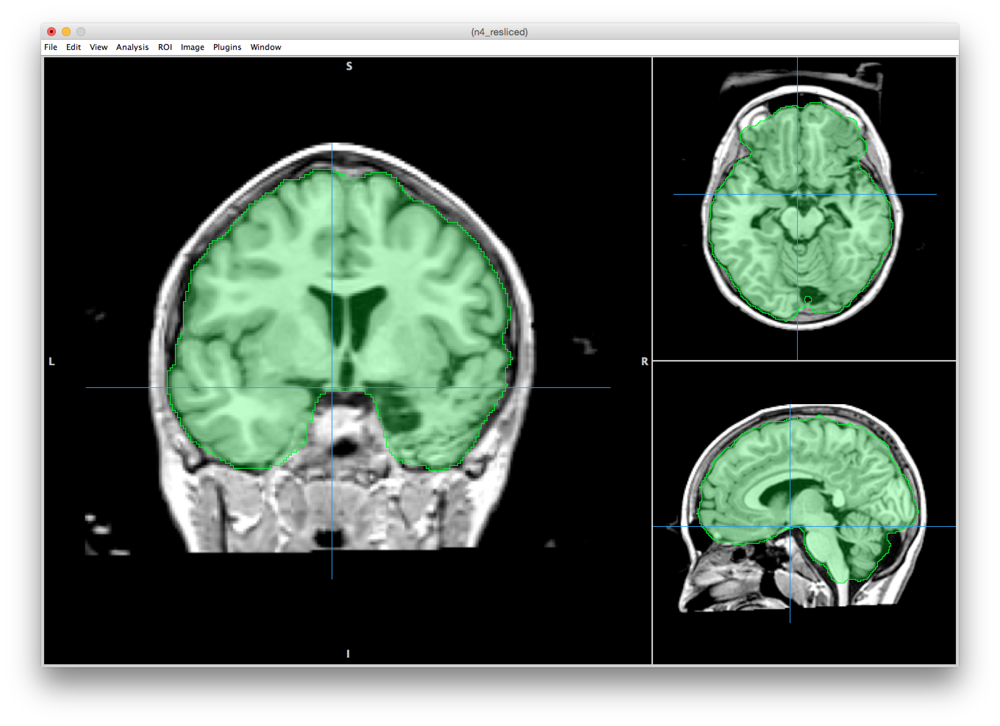
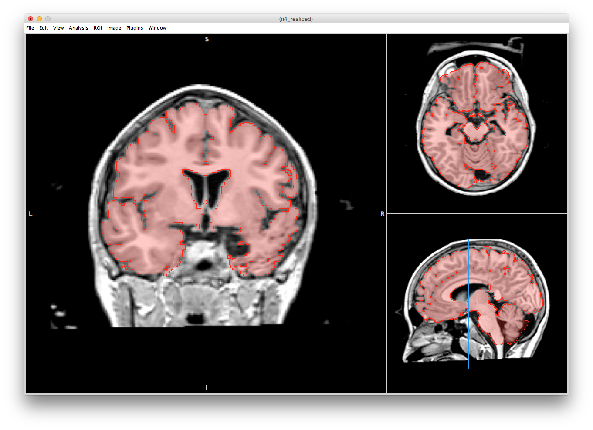

## Objectives

After the preprocessing steps, there are some things to do that will be helpful (and sometimes necessary) for other pipelines. Those things that are helpful are: (1) brain mask, (2) tissue segmentation, and (3) extracted brain only image. After you complete this section, you should be able to:

1. Understand the difference between ROIs and overlays
2. Define brain mask & tissue segmentation
3. Run antsCorticalThickness.sh pipeline
4. Generate files to complete population specific template

## ROIs versus Overlays

The intensity value of the brain can be plotted in a histogram with voxel count versus intensity value. From that histogram, you can that the background, CSF, WM, and GM have a range of potential values for each pixel (mixed Gaussians).

Regions of interest (ROIs) on the other hand have a single value within the ROI. That value can be any number, but within that ROI it is a single uniform number. A single ROI will often be 1 and the background would be 0. However, you can combine ROIs and give each ROI a different number. Although an ROI can be the whole brain, typically (by definition) it is a subset of the overall dataset.

An overlay on the other hand is more like a regular scan acquired from the scanner. In fact, different sequences can be overlaid on top of each other: PET scan over a T1, fMRI activation over a T1. Overlays contain data can be visualized on top of a T1 or T2 or whatever. Overlays like normal T1 images have a range of values and not a single binary value. The following pipeline creates various ROIs and overlays that can be used in a number of ways.

## Brain Mask

The purpose of a brain mask is not for any specific quantification, but more generally, to remove "data" that does not need to be included in any analyses. Depending on what you want to analyze, it is always best to clean up your dataset. In terms of brain analyses, we want to remove anything not brain. This process is sometimes called brain extraction or skull-stripping. Most likely, you will never be analyzing the skull, dura mater, arachnoid space, etc. Therefore, you will want to remove these structures from the image. A "good" brain mask is typically the subarachnoid space and then all brain tissue therein contained.

Many programs will have their own brain extraction protocols. These protocols are fast and not always reliable. For example, FSL brain extraction tool may be one of the more common brain extraction programs available. Here's an example of the FSL BET toolbox:

In my experience, if you are working with non-typical or even children images, these traditional brain extraction protocols will not be accurate enough. One alternative is to use a pipeline designed to utilize the analytical power of ANTs. Here's an example of the brain extraction from ANTs:

Remember, the brain mask does not have to be perfect, but it does need to include all the brain tissue and not too much extra. The ANTs protocol also does tissue segmentation and from that dataset, if you wanted to get a hyper-specific brain mask, you could use just GM and WM to generate a mask:

## Tissue Segmentation

Back to the histogram of a brain. Recall that the histogram is voxel count versus intensity values with CSF, GM, and WM all having their own range of intensity values. Optimally you would want each tissue class to have very distinct and separate ranges of intensities, so that it would be easy to determine which voxels were what type of tissue. However, there are many factors that will cause greater overlap between the mixed gaussians:

* Bias field
* Blurring
* Low resolution
* Head motion
* Noise

Obviously, if you were just using histogram matching to do tissue segmentation, you would end up with a lot of incorrectly identified voxels. The ANTs pipeline accomplishes tissue segmentation not only using an algorithm to separate the various tissue gaussians, but also a probability approach. Part of the ANTs cortical thickness pipeline will take a template with known tissue segmentations and warp it to look like the participant image. The purpose is to create an overlay that gives the likelihood (or probability) for each voxel as to whether or not it is CSF, WM, or GM. By using this probability approach, you are able to reduce the total voxels within the histogram. By iterating between histograms and probability maps, ANTs cortical thickness is able to get closer to a valid tissue segmentation. The key ROIs generated are: CSF, WM, GM, subcortical gray matter, brainstem, and cerebellum.

## ANTs Cortical Thickness

  <iframe src="https://player.vimeo.com/video/179375598" frameborder="0" webkitallowfullscreen mozallowfullscreen allowfullscreen></iframe>

In order to run participants using a population specific template, we must acquire tissue segmentation within the population template first in addition to some other files. The precise files we need to generate for the ANTs Cortical Thickness pipeline are as follows:

1. whole brain ROI mask
2. brain only T1 image
3. whole brain probability mask
4. extraction mask (ROI mask dilated 28 vox)
5. registration mask (ROI mask dilated 18 vox)
6. 6 tissue segmentation
7. 6 tissue priors

After running ANTs cortical thickness on a population specific template, you will be able to generate the previous 6 files. First we need to download a general template. For this course, we will use a template that consists of boys and girls between ages 10 and 18:


cd ~/templates/
wget https://s3-eu-west-1.amazonaws.com/pfigshare-u-files/3133826/NKI.zip
unzip NKI.zip && rm -rf NKI.zip


Make an output directory for antsCorticalThickness.sh output files:


mkdir -p ~/templates/class/antsCT/


Running antsCorticalThickness.sh will take 6+ hours, so place the code into a job script:


vi ~/scripts/class/antsCT.sh



#!/bin/bash

#SBATCH --time=06:00:00   # walltime
#SBATCH --ntasks=1   # number of processor cores (i.e. tasks)
#SBATCH --nodes=1   # number of nodes
#SBATCH --mem-per-cpu=16384M  # memory per CPU core

# Compatibility variables for PBS. Delete if not needed.
export PBS_NODEFILE=`/fslapps/fslutils/generate_pbs_nodefile`
export PBS_JOBID=$SLURM_JOB_ID
export PBS_O_WORKDIR="$SLURM_SUBMIT_DIR"
export PBS_QUEUE=batch

# Set the max number of threads to use for programs using OpenMP.
export OMP_NUM_THREADS=$SLURM_CPUS_ON_NODE

# LOAD ENVIRONMENTAL VARIABLES
var=`id -un`
export ANTSPATH=/fslhome/$var/apps/ants/bin/
PATH=${ANTSPATH}:${PATH}

# INSERT CODE, AND RUN YOUR PROGRAMS HERE
DATA_DIR=~/templates/class/
TEMPLATE_DIR=~/templates/NKI/
~/apps/ants/bin/antsCorticalThickness.sh \
-d 3 \
-a ${DATA_DIR}/template.nii.gz \
-e ${TEMPLATE_DIR}/T_template.nii.gz \
-t ${TEMPLATE_DIR}/T_template_BrainCerebellum.nii.gz \
-m ${TEMPLATE_DIR}/T_template_BrainCerebellumProbabilityMask.nii.gz \
-f ${TEMPLATE_DIR}/T_template_BrainCerebellumExtractionMask.nii.gz \
-p ${TEMPLATE_DIR}/Priors/priors%d.nii.gz \
-q 1 \
-o ${DATA_DIR}/antsCT/

# COPY MASK
cp ${DATA_DIR}/antsCT/BrainExtractionMask.nii.gz ${DATA_DIR}/template_BrainCerebellumMask.nii.gz

# EXTRACT BRAIN IMAGE
${ANTSPATH}/ImageMath 3 ${DATA_DIR}/template_BrainCerebellum.nii.gz m ${DATA_DIR}/template_BrainCerebellumMask.nii.gz ${DATA_DIR}/template.nii.gz

# CONVERT MASK ROI TO PROBABILITY MASK
${ANTSPATH}/SmoothImage 3 ${DATA_DIR}/template_BrainCerebellumMask.nii.gz 1 ${DATA_DIR}/template_BrainCerebellumProbabilityMask.nii.gz

# DILATE MASK IMAGE TO GENERATE EXTRACTION MASK
~/apps/c3d/bin/c3d ${DATA_DIR}/template_BrainCerebellumMask.nii.gz -dilate 1 28x28x28vox -o ${DATA_DIR}/template_BrainCerebellumExtractionMask.nii.gz

# DILATE MASK IMAGE TO GENERATE REGISTRATION MASK
~/apps/c3d/bin/c3d ${DATA_DIR}/template_BrainCerebellumMask.nii.gz -dilate 1 18x18x18vox -o ${DATA_DIR}/template_BrainCerebellumRegistrationMask.nii.gz

# COPY TISSUE SEGMENTATION
cp ${DATA_DIR}/antsCT/BrainSegmentation.nii.gz ${DATA_DIR}/template_6labels.nii.gz

# COPY TISSUE PRIORS
mkdir ${DATA_DIR}/priors/
cp ${DATA_DIR}/antsCT/BrainSegmentationPosteriors1.nii.gz ${DATA_DIR}/priors/priors1.nii.gz
cp ${DATA_DIR}/antsCT/BrainSegmentationPosteriors2.nii.gz ${DATA_DIR}/priors/priors2.nii.gz
cp ${DATA_DIR}/antsCT/BrainSegmentationPosteriors3.nii.gz ${DATA_DIR}/priors/priors3.nii.gz
cp ${DATA_DIR}/antsCT/BrainSegmentationPosteriors4.nii.gz ${DATA_DIR}/priors/priors4.nii.gz
cp ${DATA_DIR}/antsCT/BrainSegmentationPosteriors5.nii.gz ${DATA_DIR}/priors/priors5.nii.gz
cp ${DATA_DIR}/antsCT/BrainSegmentationPosteriors6.nii.gz ${DATA_DIR}/priors/priors6.nii.gz


And submit the job script on the supercomputer:


var=`date +"%Y%m%d-%H%M%S"`
mkdir -p ~/logfiles/$var
sbatch \
-o ~/logfiles/$var/output-antsCT.txt \
-e ~/logfiles/$var/error-antsCT.txt \
~/scripts/class/antsCT.sh


## Class Slides

  <iframe src="//slides.com/njhunsak/ants-cortical-thickness/embed" scrolling="no" frameborder="0" webkitallowfullscreen mozallowfullscreen allowfullscreen></iframe>

