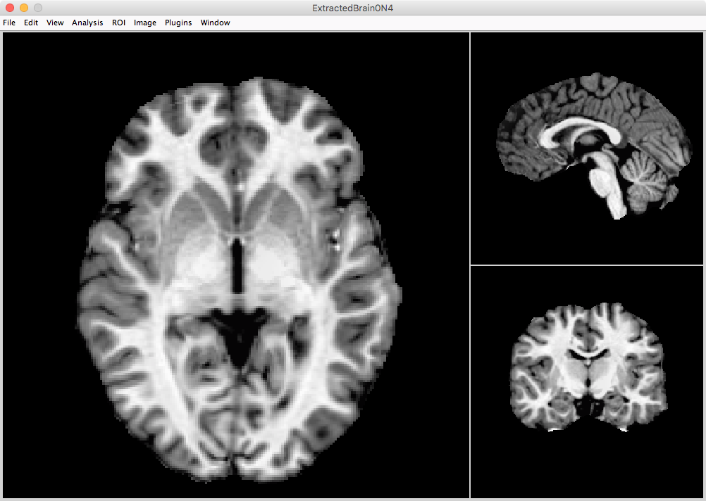

## Brain Histogram

The intensity value of the brain can be plotted in a histogram with voxel count versus intensity value. From that histogram, the background, CSF, WM, and GM have a range of potential values for each pixel (mixed Gaussians).


## ROIs versus Overlays

### ROIs

Regions of interest (ROIs) have a *single* value within the ROI. That value can be any number, but within that ROI it is a single uniform number. A single ROI will often be 1 and the background would be 0. However, you can combine ROIs and give each ROI a different number. Although an ROI can be the whole brain, typically (by definition) it is a subset of the overall dataset.

### Overlay

An overlay is like a regular scan acquired from the scanner. In fact, different sequences can be overlaid on top of each other: PET scan over a T1, fMRI activation over a T1. Overlays contain data can be visualized on top of a T1 or T2 or whatever modality you want. Overlays like normal T1 images have a range of values and not a single binary value.

----


----


## Pot 'O Gold

The following pipeline creates various ROIs and overlays that can be used in a number of ways.

* Brain Mask
* Tissue Segmentation
* Whole Brain Cortical Thickness
* Log Jacobians

## Brain Mask

The purpose of a brain mask is not for any specific quantification, but more generally, to remove "data" that does not need to be included in any analyses. Depending on what you want to analyze, it is always best to clean up your dataset. In terms of brain analyses, we want to remove anything not brain. This process is sometimes called brain extraction or skull-stripping. Most likely, you will never be analyzing the skull, dura mater, arachnoid space, etc. Therefore, you will want to remove these structures from the image. A "good" brain mask is typically the subarachnoid space and then all brain tissue therein contained.   


## The Good, The Bad, The Ugly

Many programs will have their own brain extraction protocols. These protocols are fast and not always reliable. For example, FSL brain extraction tool may be one of the more common brain extraction programs available. 

In my experience, if you are working with non-typical or even children images, these traditional brain extraction protocols will fail either leaving out brain tissue or including more than just brain.

One alternative is to use a pipeline designed to utilize the analytical power of ANTs. Remember, the brain mask does not have to be perfect, but it does need to include all the brain tissue and then not too much extra. The ANTs protocol also does tissue segmentation and from that dataset, if you wanted to get a hyper-specific brain mask, you could use just GM and WM to generate a mask.

----


----


----


## Tissue Segmentation

Back to the histogram of a brain. Recall that the histogram is voxel count versus intensity values and CSF, GM, and WM all have their own range of intensity values. Optimally you would want the CSF, GM, and WM to have very distinct and separate Gaussians, so that it would be easy to determine which voxels were what type of tissue. But that *NEVER* happens. There are many factors that will cause greater overlap between the Gaussians:

* Bias fields
* Blurring
* Low resolution
* Head motion
* Noise

Obviously, if you were just using histogram matching to do tissue segmentation, you would end up with a lot of incorrectly identified voxels. 

## ANTs Cortical Thickness Pipeline

The ANTs pipeline accomplishes tissue segmentation using a two-step approach: (1) an algorithm to separate the various tissue gaussians and (2) a probability approach. Part of the ANTs cortical thickness pipeline will take a template with known tissue segmentations and warp it to look like the participant image. The purpose is to create an overlay that gives the likelihood (or probability) for each voxel as to whether or not it is CSF, WM, or GM. By using this probability approach, you are able to reduce the total voxels within the histogram. By iterating between histograms and probability maps, ANTs cortical thickness is able to get closer to a valid tissue segmentation. The key ROIs generated are: CSF, WM, GM, subcortical, brainstem, and cerebellum. 

----

Let's set the subject directory again and make an output directory for antsCorticalThickness.sh:

```bash
subjDir=</path/to/subject/directory>
mkdir ${subjDir}/antsCorticalThickness/
```
Now let's set the template directory:

```bash
templateDir=</path/to/template/directory>
```
Running this code will take 8+ hours, so you can ONLY run this via `sbatch` on the FSL Supercomputer :

```bash
antsCorticalThickness.sh \
-d 3 \
-a ${subjDir}/n4.nii.gz \ 
-e ${templateDir}/T_template0.nii.gz \
-t ${templateDir}/T_template0_BrainCerebellum.nii.gz \
-m ${templateDir}/T_template0_BrainCerebellumProbabilityMask.nii.gz \ 
-f ${templateDir}/T_template0_BrainCerebellumExtractionMask.nii.gz \ 
-p ${templateDir}/Priors2/priors%d.nii.gz \
-q 1 \
-o ${subjDir}/antsCorticalThickness/
```

## Template Selection

If you are studying children between 8 and 12, it does not make sense to use an adult template or worse a template that's a 70 year old brain. Same goes for if you are just studying females, you don't want a template that includes males. Select a template that best matches your population.

ANTs has provided several templates already: http://figshare.com/articles/ANTs_ANTsR_Brain_Templates/915436

## Jackpot!

The output of antsCorticalThickness.sh provides lots of outputs for tons of possible analyses:


## 1. Brain only image



## 2. Brain mask


## 3. Tissue ROI segmentation 


## 4. Probability overlay of CSF


## 5. Probability overlay of GM


## 6. Probability overlay of WM


## 7. Probability overlay of subcortical


## 8. Probability overlay of brainstem


## 9. Probability overlay of cerebellum


## 10. Cortical thickness overlay in participant space


## 11. Cortical thickness overlay in template space


## 12. Template to subject warp transformation plus an image of the template morphed to look like subject


## 13. Log Jacobian! 


----


----


## Possible Studies

From these outputs, you can do:

1. Volumetric analysis on tissue segmentations 
2. Group cortical thickness analyses
3. Morphometry
