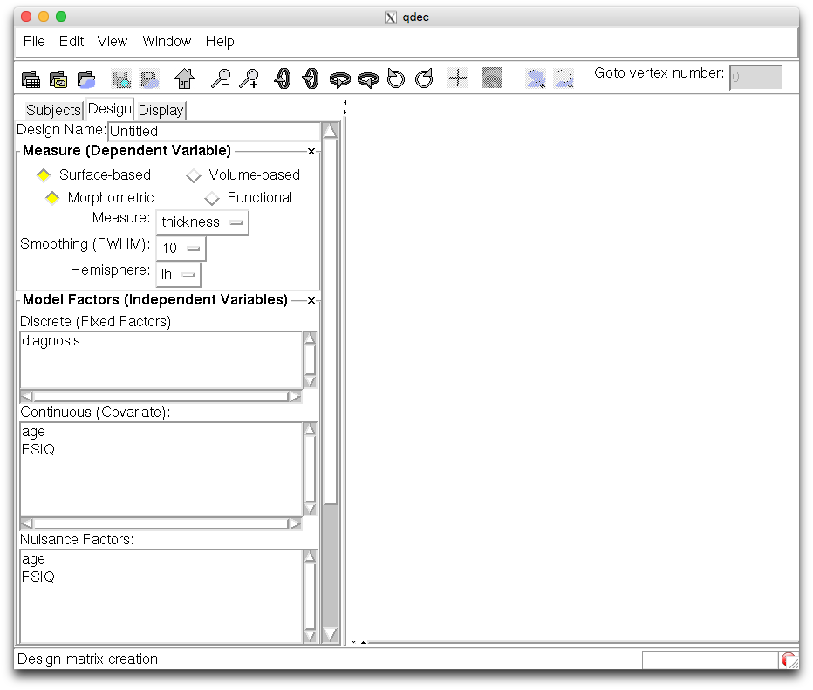
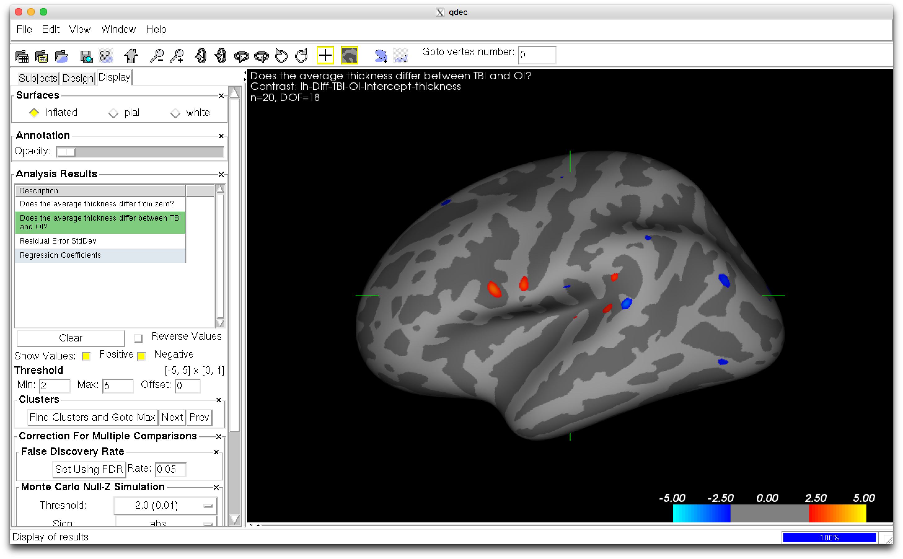

## Objectives

After you complete this section, you should be able to:

1. Preprocess group data
2. Create qdec.table.dat file and corresponding levels file

## Preprocess

In addition to running recon-all, qdec needs subject to have pre-computed smoothed data for the target surface (fsaverage is the default) for each measure (thickness, sulc, area, curv, etc.). Presmoothing the data onto the target surface is not part of the normal recon processing stream, but you can easily create this data with recon-all, using a command like this (you would replace the <subjid> with a real subject id). This process takes about an hour, so again you will need to create a batch and job script:

### Job Script


vi ~/scripts/class/fs_smooth_job.sh



#!/bin/bash

#SBATCH --time=02:00:00   # walltime
#SBATCH --ntasks=1   # number of processor cores (i.e. tasks)
#SBATCH --nodes=1   # number of nodes
#SBATCH --mem-per-cpu=16384M  # memory per CPU core

# Compatibility variables for PBS. Delete if not needed.
export PBS_NODEFILE=`/fslapps/fslutils/generate_pbs_nodefile`
export PBS_JOBID=$SLURM_JOB_ID
export PBS_O_WORKDIR="$SLURM_SUBMIT_DIR"
export PBS_QUEUE=batch

# Set the max number of threads to use for programs using OpenMP.
export OMP_NUM_THREADS=$SLURM_CPUS_ON_NODE

# LOAD ENVIRONMENTAL VARIABLES
var=`id -un`
export FREESURFER_HOME=/fslhome/${var}/apps/freesurfer
source $FREESURFER_HOME/SetUpFreeSurfer.sh

# INSERT CODE, AND RUN YOUR PROGRAMS HERE
~/apps/freesurfer/bin/recon-all \
-s ${1} \
-qcache \
-sd /fslhome/${var}/compute/analyses/class/FreeSurfer/


### Batch Script


vi ~/scripts/class/fs_smooth_batch.sh



#!/bin/bash

for subj in $(ls ~/compute/class/); do
sbatch \
-o ~/logfiles/${1}/output_${subj}.txt \
-e ~/logfiles/${1}/error_${subj}.txt \
~/scripts/class/fs_smooth_job.sh \
${subj}
sleep 1
done


### Submit Jobs


var=`date +"%Y%m%d-%H%M%S"`
mkdir -p ~/logfiles/$var
sh ~/scripts/class/fs_smooth_batch.sh $var


## qdec.table.dat

To keep things organized, create qdec folder within your SUBJECTS_DIR:


mkdir ~/compute/analyses/class/FreeSurfer/qdec


The primary input to Qdec is a text file, named qdec.table.dat, containing the subject IDs, and discrete (categorical) and continuous factors, in table format. This is essentially a table of demographics for your subjects including all the variables and factors that you wish to consider.


vi ~/compute/analyses/class/FreeSurfer/qdec/qdec.table.dat


Copy and paste the following into your qdec.table.dat file:


# This explicitly specifies the SUBJECTS_DIR:
export SUBJECTS_DIR=~/Desktop/FreeSurfer/
fsid diagnosis age FSIQ
1304 TBI 12.49 102
1306 TBI 8.85 101
1307 TBI 9.89 102
1308 TBI 9.74 110
1310 TBI 8.41 102
1315 TBI 8.25 102
1319 TBI 8.06 78
1320 TBI 8.20 115
1326 TBI 10.95 117
1327 TBI 10.20 107
2304 OI 9.86 139
2307 OI 11.92 109
2310 OI 130.2 113
2314 OI 11.96 84
2316 OI 11.10 113
2317 OI 8.52 132
2320 OI 8.33 113
2323 OI 11.61 118
2324 OI 10.02 95
2370 OI 9.82 102


For each discrete (categorical) factor, there should exist a file named <factor>.levels which lists all possible levels. For example, accompanying the example qdec.table.dat file must be a file named 'diagnosis.levels':


vi ~/compute/analyses/class/FreeSurfer/qdec/diagnosis.levels


Copy and paste the following into your diagnosis.levels file:


TBI
OI


Of course you may have different discrete (categorical) factor names and levels (or even no discrete factors, in which case all column data are assumed to be continuous factors). Continuous factors do not need a <factor>.levels file to define them, so no need to create a factor file for age or FSIQ.

## QDEC

### Before You Begin

In order to run the qdec GUI, you will need to move your data to your local computer:


rsync -rauv USERNAME@ssh.fsl.byu.edu:~/compute/analyses/class/FreeSurfer ~/Desktop/


If you haven't, you may need to install xquartz on your Mac. To start qdec, from your $SUBJECTS_DIR, simply type qdec. It may take a few seconds for Qdec to open. The ampersand directs the terminal to run this process in the background, so you may see your command prompt return before Qdec opens:


export SUBJECTS_DIR=~/Desktop/FreeSurfer/
cd $SUBJECTS_DIR
rm -rf fsaverage
ln -s $FREESURFER_HOME/subjects/fsaverage
qdec &


### Participants

When Qdec opens you are looking at the Subjects tab. The first thing you will need to do is to load your qdec.table.dat file. Click File -> Load Data Table, and traverse to your subjects directory and select the qdec.table.dat file. When you click Open, it should load the file, the contents scrolling-by in the terminal window. If the data is loaded correctly, you should see in the terminal window a summary, like this:


Loading data table /Users/njhunsaker/Desktop/FreeSurfer/qdec/qdec.table.dat...
Number of columns:  4
fsid column:        1
Number of factors:  3
Number of subjects: 20
Reading discrete factor levels from config file /Users/njhunsaker/Desktop/FreeSurfer/qdec/diagnosis.levels
	TBI
	OI
done.

Data table /Users/njhunsaker/Desktop/FreeSurfer/qdec/qdec.table.dat loaded.
Verifying subject data....................Subject verification complete.
Input table: /Users/njhunsaker/Desktop/FreeSurfer/qdec/qdec.table.dat
Subj#, SubjID, Data...
    1 1304 TBI 12.490000 102.000000
    2 1306 TBI 8.850000 101.000000
    3 1307 TBI 9.890000 102.000000
    4 1308 TBI 9.740000 110.000000
    5 1310 TBI 8.410000 102.000000
    6 1315 TBI 8.250000 102.000000
    7 1319 TBI 8.060000 78.000000
    8 1320 TBI 8.200000 115.000000
    9 1326 TBI 10.950000 117.000000
   10 1327 TBI 10.200000 107.000000
   11 2304 OI 9.860000 139.000000
   12 2307 OI 11.920000 109.000000
   13 2310 OI 13.020000 113.000000
   14 2314 OI 11.960000 84.000000
   15 2316 OI 11.100000 113.000000
   16 2317 OI 8.520000 132.000000
   17 2320 OI 8.330000 113.000000
   18 2323 OI 11.610000 118.000000
   19 2324 OI 10.020000 95.000000
   20 2370 OI 9.820000 102.000000
1  diagnosis  discrete 2
    1  TBI
    2  OI
2  age  continuous 0
3  FSIQ  continuous 0
                Continuous Factors:         Mean:       StdDev:
                -------------------         -----       -------
                                age        10.060         1.565
                               FSIQ       107.700        13.993

Number of subjects:   20
Number of factors:    3 (1 discrete, 2 continuous)
Number of classes:    2
Number of regressors: 6
============================================================
Data table loading completed successfully.
SUBJECTS_DIR is '/Users/njhunsaker/Desktop/FreeSurfer'


### Stats Data Import

**Press** the **'Generate Stats Data Tables'** button. This will run the FreeSurfer utilities asegstats2table and aparcstats2table on your group data. Upon completion (you should see the progress in the terminal screen), you should see a number of options listed under the **Stats Data Import** drop down menu. Within that menu, you can select 'aseg.volume'. Upon doing so, the volumetric data for various subcortical structures are displayed. You could **choose** for example **'Left-Lateral-Ventricle'**, then **click 'Add Selection to Data Table'**. Upon doing so, it will appear in the 'Discrete and Continuous Factors' display of the 'Data Table View'. 'Left-Lateral-Ventricle' is now available as a possible factor in your analysis.

### Design

When you click-over to the Design tab your discrete (diagnosis) and continuous (age, FSIQ) factors should appear.

Select 'diagnosis' as a descrete (fixed factor), leaving the 'Measure', 'Smoothing' and 'Hemisphere' in the Measure (Dependent Variable) menu at the top of the page at their defaults (thickness, lh and 10mm). Before you click the 'Analyze' button you will want to name your Design, something like 'lh-thickness-diagnosis-fwhm10', and enter that into the "Design Name" text entry box at the top of the window. Now click the 'Analyze' button and the stats-engine will begin processing, executing the mri_glmfit executable. Upon clicking 'Analyze', the terminal will display the output of this processing. Also, progress information is shown in the bottom bar of the Qdec application. An analysis make take a minute or two.

### Display

Once the analysis is complete (taking up to several minutes for a large subject set), you can click the Display tab and the fsaverage inflated surface will appear in the display window. You will see a list of questions summarizing the various analyses that were completed.

You can click on one of these questions to load the results. If you click on "Does the average thickness differ between TBI and OI", it will display the statistically significant regions thickness differs bewtween TBI and OI. Here is an example display:

'Find Clusters And Go to Max' button runs mri_surfcluster on a selected result, which will find clusters based on currently selected display threshold, output a table of results to the terminal, and move the cursor to the max vertex in the first cluster. 'Next' and 'Prev' buttons allow cycling movement of the cursor through the found clusters. On the displayed image, notice the green cross-hairs that indicate the vertex you have currently selected. Here is an example plot that corresponds to the shown selected:

### Killjoy

## Class Slides
