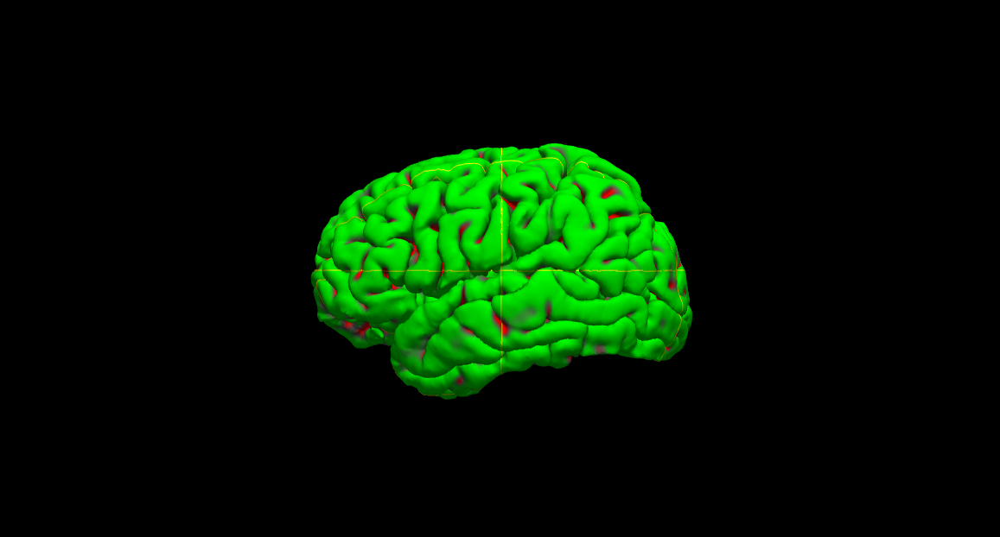
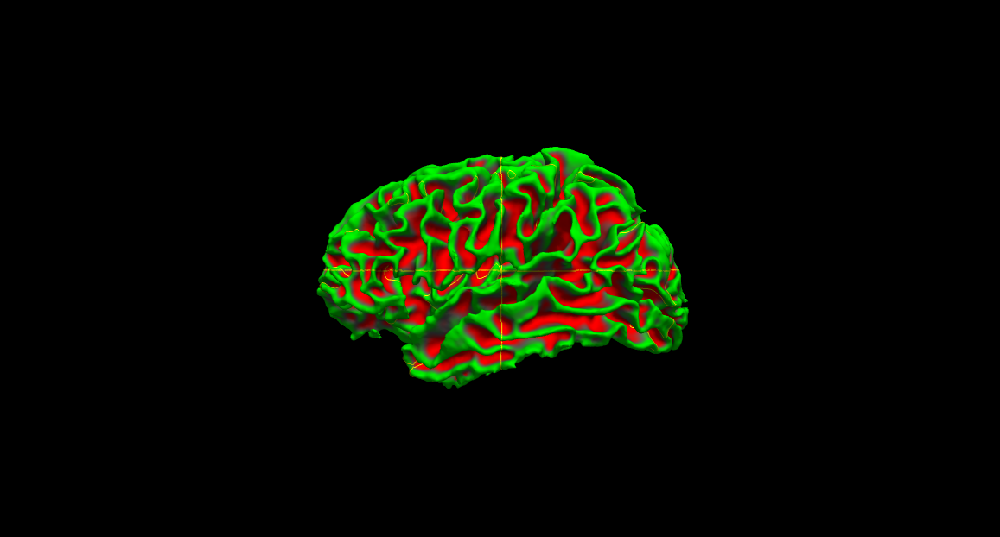
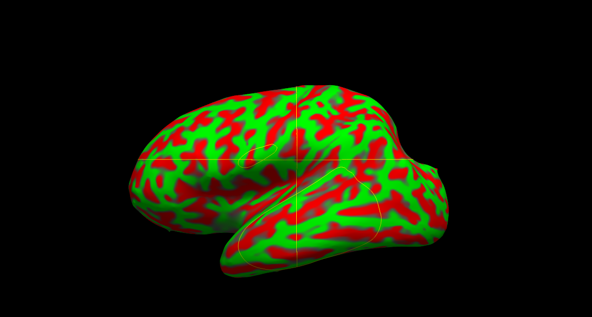
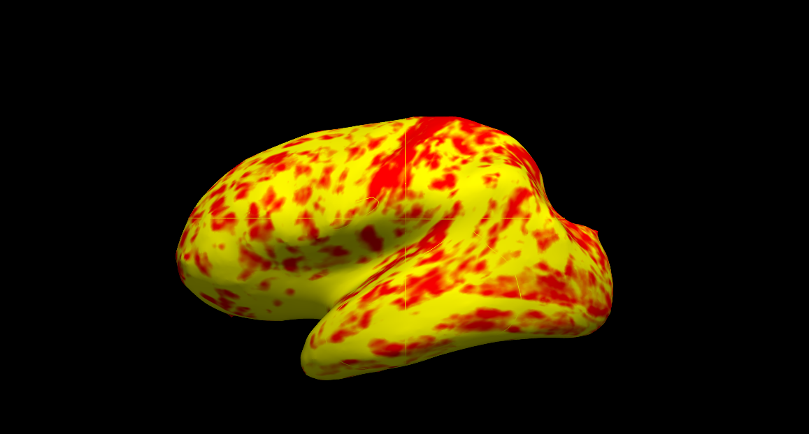
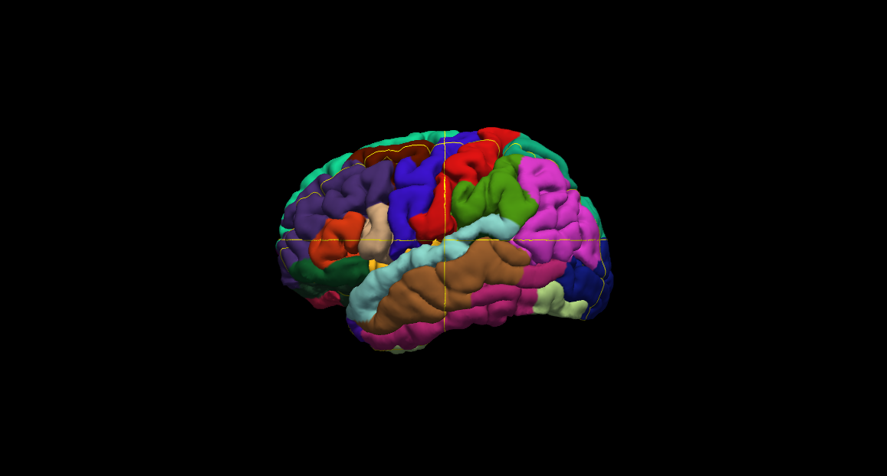

## Objectives

After you complete this section, you should be able to:

1. Perform full cortical reconstruction, parcellation, and labeling using FreeSurfer
2. View brain volumes in 2D: brain mask, white matter mask, and subcortical segmentation
3. View surfaces in 3D: pial, white and inflated surface; sulcal and curvature maps; thickness maps; cortical parcellation

## Before You Begin

Edit your ~/.bash_profile to include:


# FREESURFER
export FREESURFER_HOME=/fslhome/USERNAME/apps/freesurfer
source $FREESURFER_HOME/SetUpFreeSurfer.sh


## Full Cortical Reconstruction, Parcellation, and Labeling

Full FreeSurfer parcellation involves many, many steps. These steps have been *conveniently* batched in a script called recon-all. The steps are as follows:

**Autorecon Processing Stages:**

1. Motion Correction and Conform
2. NU (Non-Uniform intensity normalization)
3. Talairach transform computation
4. Intensity Normalization 1
5. Skull Strip
6. EM Register (linear volumetric registration)
7. CA Intensity Normalization
8. CA Non-linear Volumetric Registration
9. Remove neck
10. EM Register, with skull
11. CA Label (Aseg: Volumetric Labeling) and Statistics
12. Intensity Normalization 2 (start here for control points)
13. White matter segmentation
14. Edit WM With ASeg
15. Fill (start here for wm edits)
16. Tessellation (begins per-hemisphere operations)
17. Smooth1
18. Inflate1
19. QSphere
20. Automatic Topology Fixer
21. Final Surfs (start here for brain edits for pial surf)
22. Smooth2
23. Inflate2
24. Spherical Mapping
25. Spherical Registration
26. Spherical Registration, Contralater hemisphere
27. Map average curvature to subject
28. Cortical Parcellation (Labeling)
29. Cortical Parcellation Statistics
30. Cortical Ribbon Mask
31. Cortical Parcellation mapped to ASeg

### Batch Script

Because FreeSurfer takes 24+ hours, the process will have to be submitted with both a batch and job script. Create a script that will batch submit your job script:


vi ~/scripts/class/freesurfer_batch.sh


Copy and paste this code into your batch script:


#!/bin/bash

for subj in $(ls ~/compute/class/); do
sbatch \
-o ~/logfiles/${1}/output_${subj}.txt \
-e ~/logfiles/${1}/error_${subj}.txt \
~/scripts/class/freesurfer_job.sh \
${subj}
sleep 1
done


### Job Script

Create a job script:


vi ~/scripts/class/freesurfer_job.sh


Copy and paste this code into your job script:


#!/bin/bash

#SBATCH --time=30:00:00   # walltime
#SBATCH --ntasks=1   # number of processor cores (i.e. tasks)
#SBATCH --nodes=1   # number of nodes
#SBATCH --mem-per-cpu=16384M  # memory per CPU core

# Compatibility variables for PBS. Delete if not needed.
export PBS_NODEFILE=`/fslapps/fslutils/generate_pbs_nodefile`
export PBS_JOBID=$SLURM_JOB_ID
export PBS_O_WORKDIR="$SLURM_SUBMIT_DIR"
export PBS_QUEUE=batch

# Set the max number of threads to use for programs using OpenMP.
export OMP_NUM_THREADS=$SLURM_CPUS_ON_NODE

# LOAD ENVIRONMENTAL VARIABLES
var=`id -un`
export FREESURFER_HOME=/fslhome/${var}/apps/freesurfer
source $FREESURFER_HOME/SetUpFreeSurfer.sh

# INSERT CODE, AND RUN YOUR PROGRAMS HERE
~/apps/freesurfer/bin/recon-all \
-subjid ${1} \
-i /fslhome/${var}/compute/class/${1}/t1/resampled.nii.gz \
-wsatlas \
-all \
-sd /fslhome/${var}/compute/analyses/class/FreeSurfer/


### Submit Jobs


var=`date +"%Y%m%d-%H%M%S"`
mkdir -p ~/logfiles/$var
sh ~/scripts/class/freesurfer_batch.sh $var


## Viewing Volumes with Freeview

In order to view the output, you will need to download a participant directory to your local computer. Note you must have FreeSurfer installed on your local computer in order to run the following code:


rsync -rauv intj5@ssh.fsl.byu.edu:~/compute/analyses/class/FreeSurfer/1304 ~/Desktop/


With one Freeview command line, you can load several output volumes, such as brainmask.mgz and wm.mgz; the surfaces, rh.white and lh.white; and the subcortical segmentation, aseg.mgz. Copy and paste the command below inside the terminal window and press enter:


cd ~/Desktop/
freeview -v \
1304/mri/T1.mgz \
1304/mri/wm.mgz \
1304/mri/brainmask.mgz \
1304/mri/aseg.mgz:colormap=lut:opacity=0.2 \
-f 1304/surf/lh.white:edgecolor=blue \
1304/surf/lh.pial:edgecolor=red \
1304/surf/rh.white:edgecolor=blue \
1304/surf/rh.pial:edgecolor=red


Some notes on the above command line:

* 1304 is the name of the subject
* The flag -v is used to open volumes
* brainmask.mgz : skull-stripped volume primarily used for troubleshooting
* wm.mgz : white matter mask also used for troubleshooting
* aseg.mgz : subcortical segmentation loaded with its corresponding color table and at a low opacity
* The flag -f is used to load surfaces
* white & pial surfaces are loaded for each hemisphere & with color indicated by 'edgecolor'

### Pial Surface

  <iframe src="https://drive.google.com/file/d/0B7gwoaKa2xaTc3F0Z1VwWUpNeEk/preview"></iframe>

### White Surface

  <iframe src="https://drive.google.com/file/d/0B7gwoaKa2xaTZzNxOGptSHQzTjQ/preview"></iframe>

### Subcortical Segmentation

  <iframe src="https://drive.google.com/file/d/0B7gwoaKa2xaTcklEZzZJY1VzS0k/preview"></iframe>

## Viewing Surfaces in 3D using Freeview

With one Freeview command line, you can also view several surface volumes, such as pial, white and inflated surface; thickness maps; sulcal and curvature maps; and cortical parcellation. You can load them all in Freeview with the command below (be patient while they all load). The follow command only loads the left hemisphere, however you could also just view the right hemisphere or both hemispheres at the same time:


freeview -f  1304/surf/lh.pial:annot=aparc.annot:name=pial_aparc:visible=0 \
1304/surf/lh.inflated:overlay=lh.thickness:overlay_threshold=0.1,3::name=inflated_thickness:visible=0 \
1304/surf/lh.inflated:visible=0 \
1304/surf/lh.white:visible=0 \
1304/surf/lh.pial \
--viewport 3d


Some notes on the above command line:

* lh.pial:annot=aparc.annot loads the Desikan-Killiany cortical parcellation on the pial surface
  * :name=pial_aparc:visible=0 changes which name shows up in the menu display and turns off this layer
* lh.inflated:overlay=lh.thickness:overlay_threshold=0.1,3 loads the thickness overlay on top of the inflated surface and sets the min and max thresholds to display

### Pial Surface

The first volume you see is the pial surface. The green regions are gyri and the red regions are sulci. With this surface, the sulci are mostly hidden.

### White Surface

The white surface shows the boundary between white matter and gray matter. With this surface, we are able to see the sulci a bit better.

### Inflated Surface

With the inflated surface, you can fully see the sulci.

### Thickness Map

On the inflated surface, you can see the cortical thickness map.

### Cortical Parcellation

The parcellation that is loaded here was created with the Desikan-Killiany atlas. By default there are two parcellations that are made when recon-all is run. The second parcellation, called ?h.aparc.a2009s.annot, is created with the Destrieux atlas. The difference is the number and designation of the areas that are labeled. You can load the Destrieux parcellation by clicking on the drop down box next to 'Annotation' on the left panel and choosing Load from file.... Browse to lh.aparc.a2009s.annot and hit 'Open'.

## Class Slides

  <iframe src="//slides.com/njhunsak/ants-cortical-thickness/embed" scrolling="no" frameborder="0" webkitallowfullscreen mozallowfullscreen allowfullscreen></iframe>

