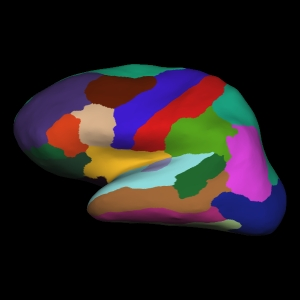
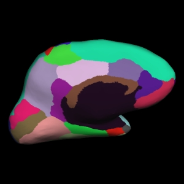
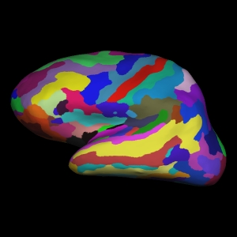
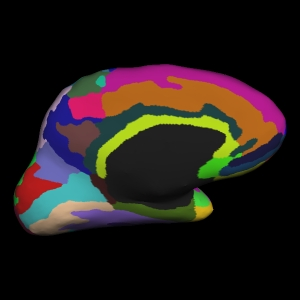

## Objectives

After you complete this section, you should be able to:

1. Deskian vs Destrieux Atlas
2. Combine the data from all participants into one table
3. Generate box plots
4. Recreate box plots in R

## FreeSurfer Atlases

FreeSurfer parcellates that cortex with two different atlases. The first atlas, Deskian atlas (AKA Deskian-Killiany atlas), is the default atlas. The files associated with this atlas are ?h.aparc.annot. The other atlas Destrieux atlas has files labeled ?h.aparc.a2009s.annot.

### Deskian Atlas

You can view the Deskin atlas segmentation with the following code:


cd ~/Desktop/
freeview -v \
1304/mri/orig.mgz \
1304/mri/aparc+aseg.mgz:colormap=lut:opacity=0.4


### Destrieux Atlas

You can view the Destrieux atlas segmentation with the following code:


cd ~/Desktop/
freeview -v \
1304/mri/orig.mgz \
1304/mri/aparc.a2009s+aseg.mgz:colormap=lut:opacity=0.4


## Group Statistics Files

The following commands will help you combine the data from all our participants into one table that will be easily read by R stats. First, set your SUBJECTS_DIR and change into that directory:


export SUBJECTS_DIR=~/compute/analyses/class/FreeSurfer/
cd $SUBJECTS_DIR
pwd


### Table of Segmentation Volumes

The first table will contain segmentation volumes:


asegstats2table --subjects 1304 1307 1310 1319 1326 2304 2310 2316 2320 2324 1306 1308 1315 1320 1327 2307 2314 2317 2323 2370 --tablefile aseg.vol.table


The file aseg.vol.table is your output - a text file consisting of all participants in your study and the values for all the structures. If you do the ls command, you should see that the text file aseg.vol.table has been created.

### Table of Surface Area of each Cortical Parcellation in the Desikan Atlas

Left hemisphere:


aparcstats2table --hemi lh --subjects 1304 1307 1310 1319 1326 2304 2310 2316 2320 2324 1306 1308 1315 1320 1327 2307 2314 2317 2323 2370 --tablefile lh.aparc.area.table


Right hemisphere:


aparcstats2table --hemi rh --subjects 1304 1307 1310 1319 1326 2304 2310 2316 2320 2324 1306 1308 1315 1320 1327 2307 2314 2317 2323 2370 --tablefile rh.aparc.area.table


### Table of the Average Thickness of Each Cortical Parcellation in the Destrieux Atlas

Left hemisphere:


aparcstats2table --hemi lh --subjects 1304 1307 1310 1319 1326 2304 2310 2316 2320 2324 1306 1308 1315 1320 1327 2307 2314 2317 2323 2370 --meas thickness --parc aparc.a2009s --tablefile lh.aparc.a2009.thickness.table


Right hemisphere:


aparcstats2table --hemi rh --subjects 1304 1307 1310 1319 1326 2304 2310 2316 2320 2324 1306 1308 1315 1320 1327 2307 2314 2317 2323 2370 --meas thickness --parc aparc.a2009s --tablefile rh.aparc.a2009.thickness.table


## Results


rsync -rauv
{% endhighlight}

  <iframe src="https://biabl.shinyapps.io/read-table/" style="border:none" scrolling="no"></iframe>

##  Introduction to Graphing in R

R is a powerful statistical and graphing program, but much like everything in this course, it requires you to learn a new coding language, R. Hopefully by now, you can easily pick out general items like variables, for loops, etc. The following code with import your aseg.vol.table, create a group variable and then using a for loop will loop through all the columns of data producing a box plot and give you the p-value for each column.


# Import data
mydata=read.table("~/Desktop/aseg.vol.table",sep="\t",header=T)

# Create group variable
x=ifelse(grepl("13??",mydata[[1]]),"TBI","OI")

# Create PDF and generate plots for each column
pdf("~/Desktop/aseg.vol.table.pdf",width=4,height=5)
for (n in 2:length(mydata))
{
  y=mydata[[n]]
  pvalue=t.test(y~x)$p.value
  selectedData=data.frame(cbind(x,y))
  p=boxplot(y~x,
    main=colnames(mydata[n]),
    xlab=paste("p < ",pvalue,sep=""),
    ylab="Volume mm^3",
    col=c("blue","red")
    )
  print(p)
}
dev.off()


Can you rewrite the code for the rest of your data sets? To get your started, here's the code edits if you wanted to look at the lh.aparc.area.table:

% highlight r %}
# Import data
mydata=read.table("~/Desktop/lh.aparc.area.table",sep="\t",header=T)

# Create group variable
x=ifelse(grepl("13??",mydata[[1]]),"TBI","OI")

# Create PDF and generate plots for each column
pdf("~/Desktop/lh.aparc.area.table.pdf",width=4,height=5)
for (n in 2:length(mydata))
{
  y=mydata[[n]]
  pvalue=t.test(y~x)$p.value
  selectedData=data.frame(cbind(x,y))
  p=boxplot(y~x,
    main=colnames(mydata[n]),
    xlab=paste("p < ",pvalue,sep=""),
    ylab="Area mm^2",
    col=c("blue","red")
    )
  print(p)
}
dev.off()


When you look at the ?h.aparc.a2009thickness.table, hint that thickness is just in mm.

## Class Slides
