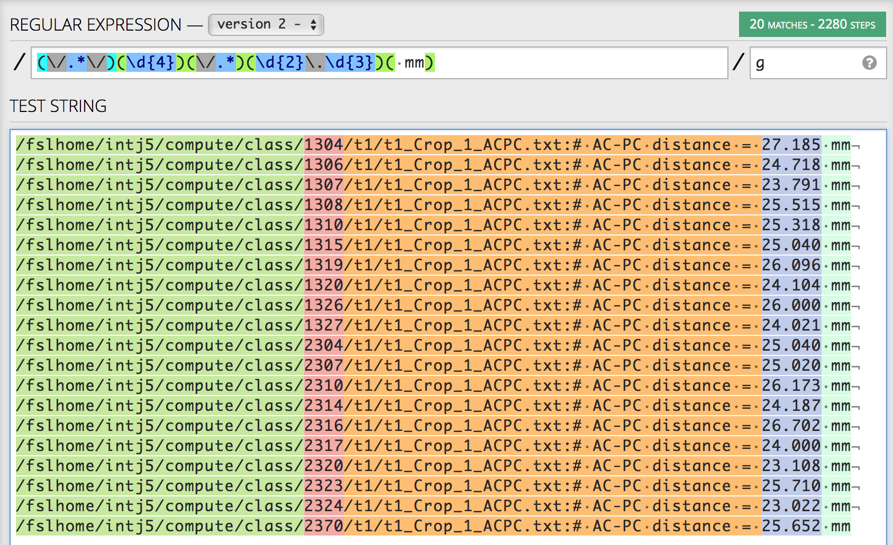
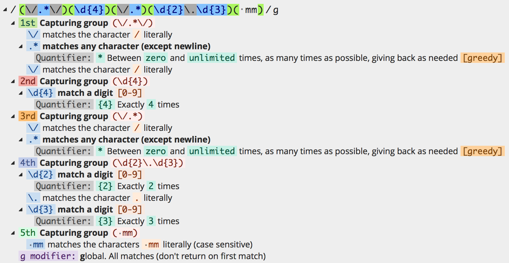

## Objectives

After you complete this section, you should be able to:

1. Use Mango and measure the length of the anterior commissure to posterior commissure
2. Export table and reformat table using regular expressions
3. Upload formatted table and generate box plots

  <iframe src="https://drive.google.com/file/d/0B7gwoaKa2xaTVW94QmVwU1N6aTA/preview"></iframe>

## Measure Between AC-PC (Third Ventricle)

The anterior commissure (AC) - posterior commissure (PC) line, also referred as the bicommissural line, has been adopted as a convenient standard by the neuroimaging community, and in most instances is the reference plane for axial imaging in everyday scanning. The creation of a standard image plane makes easier the comparison among exams. When brain scans are aligned along the AC-PC line, then one can measure the length between these two structures as a proxy measurement for the third ventricle.

  <iframe src="https://drive.google.com/file/d/0B7gwoaKa2xaTeWVTRTdCcFpaME0/preview"></iframe>

### Anterior Commissure

### Posterior Commissure

### Third Ventricle

## Regular Expressions

  <iframe src="https://drive.google.com/file/d/0B7gwoaKa2xaTV1NLNE4wRE8tY1E/preview"></iframe>

Regular expressions (regex for short) are a powerful way for describing a text string search pattern. If you are familiar with the use of wildcards, e.g., \*, then you can think of regular expressions as wildcards on steroids. You are probably familiar with wildcard notations such as \*.txt to find all text files in a file manager. The regex equivalent is ^.\*\.txt$. Regular expressions are a sequence of characters that define a search pattern.

For our text example, let's assume the following is your text:

> /fslhome/intj5/compute/class/1304/t1/t1_Crop_1_ACPC.txt:# AC-PC distance = 27.185 mm
> /fslhome/intj5/compute/class/1306/t1/t1_Crop_1_ACPC.txt:# AC-PC distance = 24.718 mm
> /fslhome/intj5/compute/class/1307/t1/t1_Crop_1_ACPC.txt:# AC-PC distance = 23.791 mm
> /fslhome/intj5/compute/class/1308/t1/t1_Crop_1_ACPC.txt:# AC-PC distance = 25.515 mm
> /fslhome/intj5/compute/class/1310/t1/t1_Crop_1_ACPC.txt:# AC-PC distance = 25.318 mm
> /fslhome/intj5/compute/class/1315/t1/t1_Crop_1_ACPC.txt:# AC-PC distance = 25.040 mm
> /fslhome/intj5/compute/class/1319/t1/t1_Crop_1_ACPC.txt:# AC-PC distance = 26.096 mm
> /fslhome/intj5/compute/class/1320/t1/t1_Crop_1_ACPC.txt:# AC-PC distance = 24.104 mm
> /fslhome/intj5/compute/class/1326/t1/t1_Crop_1_ACPC.txt:# AC-PC distance = 26.000 mm
> /fslhome/intj5/compute/class/1327/t1/t1_Crop_1_ACPC.txt:# AC-PC distance = 24.021 mm
> /fslhome/intj5/compute/class/2304/t1/t1_Crop_1_ACPC.txt:# AC-PC distance = 25.040 mm
> /fslhome/intj5/compute/class/2307/t1/t1_Crop_1_ACPC.txt:# AC-PC distance = 25.020 mm
> /fslhome/intj5/compute/class/2310/t1/t1_Crop_1_ACPC.txt:# AC-PC distance = 26.173 mm
> /fslhome/intj5/compute/class/2314/t1/t1_Crop_1_ACPC.txt:# AC-PC distance = 24.187 mm
> /fslhome/intj5/compute/class/2316/t1/t1_Crop_1_ACPC.txt:# AC-PC distance = 26.702 mm
> /fslhome/intj5/compute/class/2317/t1/t1_Crop_1_ACPC.txt:# AC-PC distance = 24.000 mm
> /fslhome/intj5/compute/class/2320/t1/t1_Crop_1_ACPC.txt:# AC-PC distance = 23.108 mm
> /fslhome/intj5/compute/class/2323/t1/t1_Crop_1_ACPC.txt:# AC-PC distance = 25.710 mm
> /fslhome/intj5/compute/class/2324/t1/t1_Crop_1_ACPC.txt:# AC-PC distance = 23.022 mm
> /fslhome/intj5/compute/class/2370/t1/t1_Crop_1_ACPC.txt:# AC-PC distance = 25.652 mm

But we want our text to look like:

> 1304,27.185
> 1306,24.718
> 1307,23.791
> 1308,25.515
> 1310,25.318
> 1315,25.040
> 1319,26.096
> 1320,24.104
> 1326,26.000
> 1327,24.021
> 2304,25.040
> 2307,25.020
> 2310,26.173
> 2314,24.187
> 2316,26.702
> 2317,24.000
> 2320,23.108
> 2323,25.710
> 2324,23.022
> 2370,25.652

How can we do that with regular expressions?

In TextWrangler you would find:

> (\/.*\/)(\d{4})(\/.*=\s)(\d{2}\.\d{3})( mm)

And replace with:

> \2,\4

## Upload Formatted Table

  <iframe src="https://drive.google.com/file/d/0B7gwoaKa2xaTRmJ5anNUMmlFLU0/preview"></iframe>

  <iframe src="https://biabl.shinyapps.io/acpc/" style="border:none" scrolling="no"></iframe>

## Class Slides
