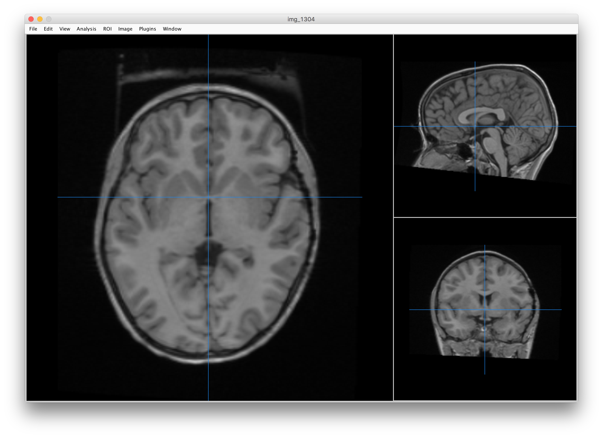

## Objectives

After you complete this section, you should be able to:

1. Use Mango and measure the length of the anterior commissure to posterior commissure
2. Export table and reformat table using regular expressions
3. Upload formatted table and generate boxplot results

## Measure Between AC-PC

### Anterior Commissure

### Posterior Commissure

## Upload Formatted Table

Text

  <iframe src="https://biabl.shinyapps.io/acpc/" scrolling="no"></iframe>

## Class
