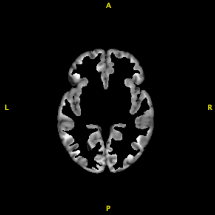
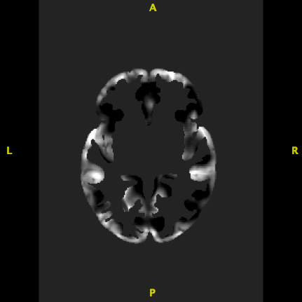

## Objectives

After you complete this section, you should be able to:

1. Describe tensor based morphometry (TBM)
2. Know what image is used in TBM
3. Describe voxel based morphometry (VBM)
4. Know how to generate the image used in VBM

## Tensor Based Morphometry

Tensor based morphometry measures the differences in shape of brain structures. Analyses are useful in studies interested in whether growth or volume loss has occurred. TBM is also useful in detecting small changes across time and is often used for longitudinal analyses.

When you warp a participant image (target image) to a template (template image), one of the files created is a warp matrix. The warp field only represents positions of brain structures, much like GPS cooridinates only provide location information. Warp fields do not tell us anything about whether a brain structure had to shrink or expand or any other shape information. Instead, the Jacobian determinant contains information about the local stretching, shearing and rotation involved in the deformation. In other words, the warp field provides information about how to move the voxels to template space, whereas the Jacobian determinant represents the **extent** of movement. Overlaying the Jacobian determinant will show which brain regions has to undergrow significant growth or reduction as compared to the template.

### Log Jacobian

Taking the log of the Jacobian makes it symmetric about zero. **Positive** values indicate tissue **enlargement**, whereas **negative** values indicate tissue **reduction** in the participant as compared to the template.

Since we have already completed antsCorticalThickness using a study specific template, we can easily generate the log Jacobian from the warp matrix:


for subj in $(ls ~/compute/class/); do
~/apps/ants/bin/CreateJacobianDeterminantImage \
3 \
~/compute/class/$subj/antsCT/SubjectToTemplate1Warp.nii.gz \
~/compute/class/$subj/antsCT/SubjectToTemplateLogJacobian.nii.gz \
1;
done


## Voxel Based Morphometry

Voxel Based Morphometry measures structural differences in tissue classes (e.g., gray matter atrophy). Analyses are useful in studies interested in tissue specific volumetric differences.

The normalized images (i.e., participant images in template space) are adjusted by scaling the intensity of each voxel by the log Jacobian. In other words the volume changes due to the non-linear spatial normalization are used to *modulate* the normalized image. Otherwise your analysis will give you null results because all the images look exactly alike (that's the point of normalizing to a template).

### Grey Matter Image

First, you will take the participant's GM ROI and multiply it with the normalized whole brain image. Remember the value inside the ROI is 1 and the value outside the ROI is 0. When you multiply anything by 0 it equals 0, so when you multiply these two images together, you are left with just normalized gray matter.

    

		
	

	

		
	


for subj in $(ls ~/compute/class/); do
~/apps/c3d/bin/c3d \
~/templates/class/template_6labels.nii.gz \
-threshold 2 2 1 0 \
~/compute/class/${subj}/antsCT/BrainNormalizedToTemplate.nii.gz \
-multiply \
-o ~/compute/class/${subj}/antsCT/GM.nii.gz
done


### Modulated Grey Matter Image

The image has been normalized to a template, so at this point the image should be nearly indistinguishable from the template. Any comparison will result in null results. However, if you multiply the image by the log Jacobian, then you are adjusting the intensity of each gray matter voxel by the amount of stretching, shearing, and rotation that occurred.


for subj in $(ls ~/compute/class/); do
~/apps/c3d/bin/c3d \
~/compute/class/${subj}/antsCT/SubjectToTemplateLogJacobian.nii.gz \
~/compute/class/${subj}/antsCT/GM.nii.gz \
-multiply \
-o ~/compute/class/${subj}/antsCT/modulatedGM.nii.gz
done


