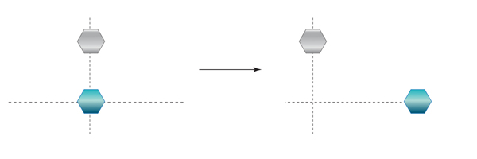
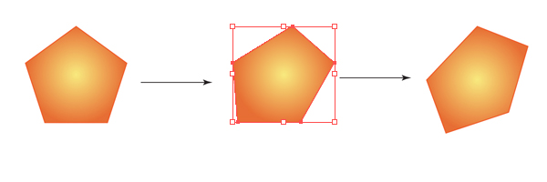
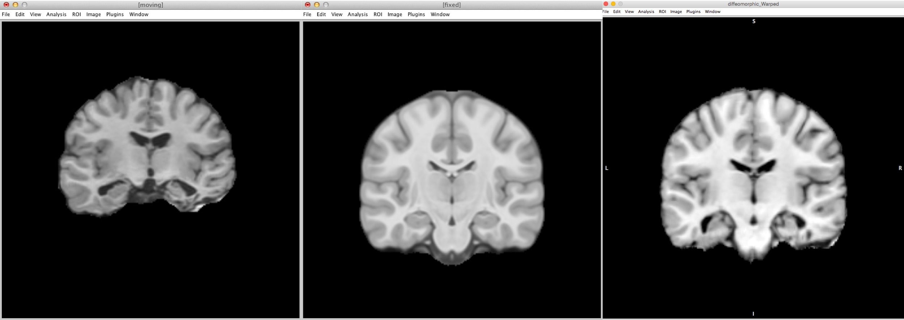
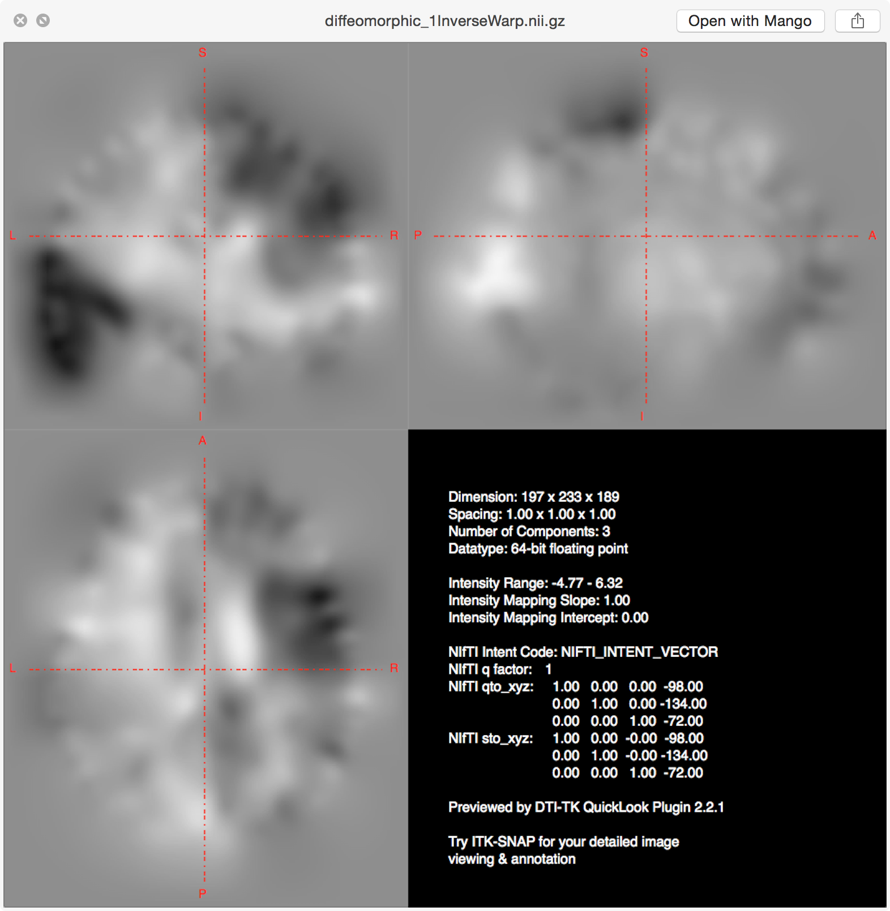

## Objectives

After you complete this section, you should be able to:

1. Define rigid, affine, and diffeomorphic based morphometry
2. Understand when you do and do not need to include brain volume as a covariate
3. Define fixed and moving image as it pertains to image registration
4. Run rigid, affine, and diffeomorphic registration using ANTs

Note that everything in "< >" is to be replaced. For example, \<fileName\> --> iLovePeanuts.txt

## Types of Morphometry

### Rigid Body

For a rigid body, you can:

#### Move

#### Rotate

#### Mirror

Rigid-body transformations involve displacements and / or rotations of the whole object. An object can therefore move: up or down; left or right ; front or back; rotate; and reflect across an axis (2D) or plane (3D). Whether you are dealing with a 2 or 3 dimensional object, the whole object must move. In other words, if you want to move one point up and to the left, then you must move ALL points within the object that same amount up and to the left.

Volume (size of the brain) is not affected by rigid body transformations.

### Affine 

For an affine transformation, you can:

#### Scale

#### Shear

Affine again effects the whole object as a rigid body and adds two additional transformations: scale and shear. Scaling means the object can increase or decrease in size. However, the ratio of each plane does not have to remain the same. You can increase the size along one plane only or all planes but differently. Shearing means you displace one plane, while leaving the rest of the planes fixed.

Affine transformations preserve proportions, it does not preserve volume, because it can change angles and lengths. Therefore, affine transformations automatically account of brain size differences, since affine transformations will make all brains the same size. 

### Diffeomorphism

{: .img-responsive }

Based on the mathematical field of topology, the simplest definition is that through *smooth, continuous* deformation, one brain can be warped to look like another brain. Using diffeomorphic morphometry, this smooth, continuous deformation, preserves the topology of the brain (i.e., sulci and gyri). The solution (how and where each voxel needs to be moved) is bidirectional. In other words, the solution, warp field, not only solves the problem of how to make the participant image look like the template, but to make the solution more robust, also finds how the make the template look like the participant image. Because of this smooth, continuous warping, the errors inherent to nonlinear warping are reduced.

## ANTs Nonlinear Registration

{: .img-responsive }

For reference, typically the *fixed* image is a *template* and the *moving* image is *each participant*.

ANTs has two shell scripts for running image registration: antsRegistrationSyn.sh and antsRegistrationSynQuick.sh. Both of these commands are simplified shell scripts of the actual command `antsRegistration`. You can view the code in these scripts by running either:


cat /usr/local/antsbin/bin/antsRegistrationSyn.sh
cat /usr/local/antsbin/bin/antsRegistrationSynQuick.sh


One of the differences between the two commands is the number of iterations in the last iteration step. For antsRegistrationSynQuick.sh there are 0 iterations and for antsRegistrationSyn.sh there are 100 iterations. The other difference is the metric used for registration. For antsRegistrationSynQuick.sh, the registration metric is based on mutual information (great for multimodal images). For antsRegistrationSyn.sh, the registration metric is based on cross correlation (great for T1 weighted image registration). The options for each is the same, but for this class, we will just show the quick version.

### Rigid


antsRegistrationSynQuick.sh \ 
-d 3 \
-f <fixedImage>.nii.gz \
-m <movingImage>.nii.gz \
-o <outputPrefix>
-t r


Here the participant image (moving) was rigidly aligned to the template (fixed). As you can see the participant brain was moved to the same location within the field of view box. The size of the participant image was not altered.

{: .img-responsive }

Here the inverse warp occurred (a unique feature of ANTs). The template (fixed) image was rigidly moved to the same space as the participant image (moving). The warp matrix was just reversed even though the original mapping was the participant image (moving image) to the template image (fixed image).

{: .img-responsive }

### Affine

For this transformation, rigid transformation is done first, then affine transformation.


antsRegistrationSynQuick.sh \ 
-d 3 \
-f <fixedImage>.nii.gz \
-m <movingImage>.nii.gz \
-o <outputPrefix>
-t a


Here the participant image (moving) was affine aligned to the template (fixed). The participant image was scaled to template. In this case the small participant image was enlarged to fit in the template space.

{: .img-responsive }

The opposite is true when the inverse warp matrix is applied. The template image shrinks in size to match the participant image.

{: .img-responsive }

### Diffeomorphic

For this transformation, rigid transformation is done first, then affine transformation, and finally diffeomorphic. You always want to do an affine transformation before a diffeomorphic transformation, because you want to eliminate brain size as a covariate. Therefore, any group analyses that result in differences is due to actual differences in regional volume and not due to general brain volume differences.


antsRegistrationSynQuick.sh \ 
-d 3 \
-f <fixedImage>.nii.gz \
-m <movingImage>.nii.gz \
-o <outputPrefix>
-t s


Here the participant image (moving) was warped to match the template (fixed). As far as possible, the participant image was nonlinearly morphed to look like the template. The participant in this case has some major brain damage and therefore the mapping isn't perfect.

{: .img-responsive }

More drastic is taking the inverse warp and seeing how well the template can be made to look like the participant image. Particularly take note as how well or not so well the hippocampus and ventricles mapped! This was an extremely difficult case to diffeomoprhically warp because of the extensive brain damage.

{: .img-responsive }

## Warp Field

The output from a rigid or affine transformation is a simple text file (not really useful). However, the output from the nonlinear deformation is a warp field. It is a 3D map that contains the data for each voxel's displacement. In other words, the warp matrix contains the directions for where each voxel in the participant image (moving image) needs to move in order to look like the template (fixed image). Because the ANTs nonlinear warp is bidirectional, ANTs also outputs the inverse warp field. This field contains opposite information; it contains the directions for where each voxel in the template (fixed image) needs to move in order to look like the participant image (moving image). These warp field files are not useful beyond providing displacement information, but more on that later. 

{: .img-responsive }
{: .img-responsive }

### Additional Classroom Materials

* [Lecture](presentation)
* [Assignment](assignment)