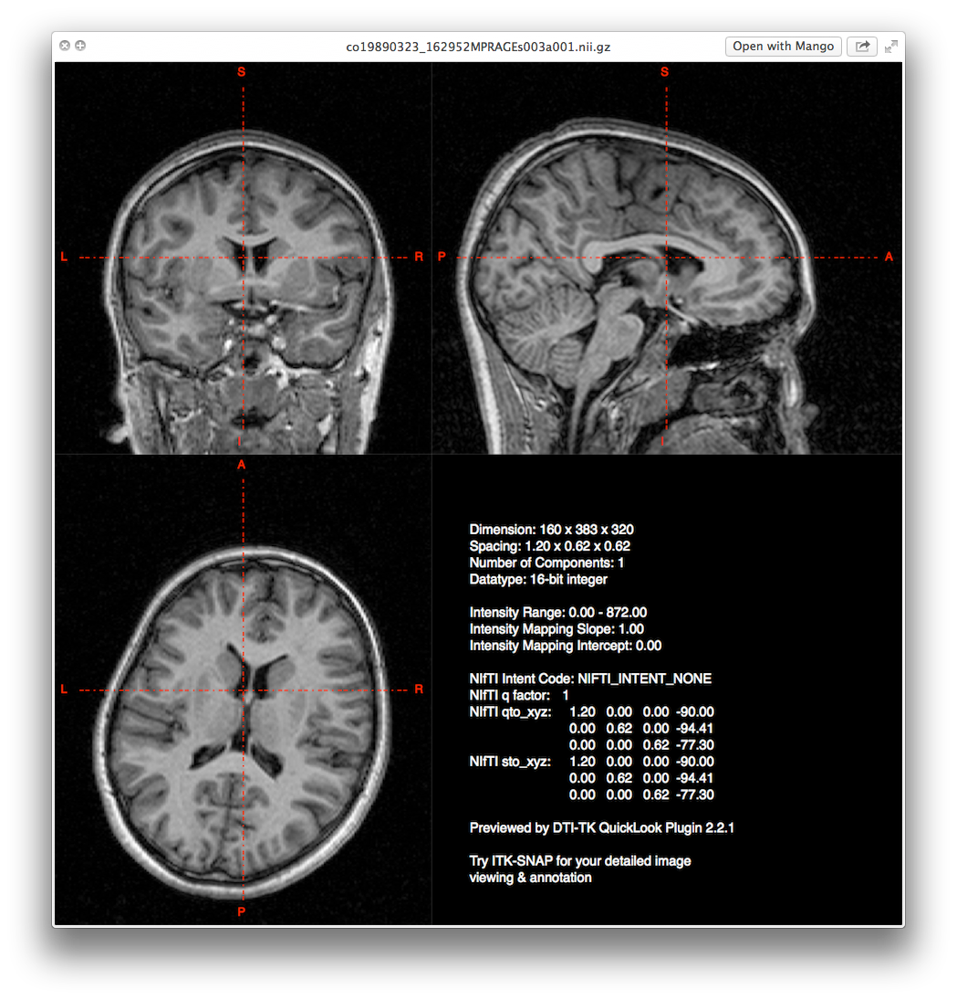

## Objectives

After you complete this section, you should be able to:

1. Convert a DICOM directory into a NIfTI image
2. Align images along the horizontal anterior commissure and posterior commissure plane, and why
3. Know what a bias field is and how to fix it
4. Know when and how to resample the size of voxels in an MR image
5. Write a script that will complete dcm2niix, acpcdetect, N4BiasFieldCorrection, and c3d
6. Double check the accuracy of your pipeline

<iframe src="https://player.vimeo.com/video/179387420?byline=0&portrait=0" frameborder="0" webkitallowfullscreen mozallowfullscreen allowfullscreen></iframe>

## Convert DICOM to NIfTI

<iframe src="https://player.vimeo.com/video/179372012?byline=0&portrait=0" frameborder="0" webkitallowfullscreen mozallowfullscreen allowfullscreen></iframe>

Most imaging programs and pipelines do not actually use DICOMs, but some other "standardized" image format. Similar to how pictures can be in various formats like jpeg, tiff, png, etc. MR images can come in different formats as well. The most common format is the NIfTI format (.nii) or the zipped NIfTI format (.nii.gz). Most programs will be able to use the NIfTI and the zipped NIfTI interchangeably, but there are still a few programs that prefer one over the other. **For the first part of our pipeline, we will use the NIfTI format, but eventually we will move to using the zipped NIfTI format exclusively for the rest of the pipeline.**

First let's create a T1 directory within our participant directory. Often times you will be working with multiple scan modalities and you will want to put those in separate directories (e.g., DTI, fMRI, T2w, etc.).


subjDir=</path/to/subject/directory>
mkdir ${subjDir}/t1


Time to convert the DICOMs to NIfTI format. The simplest way to run the code is:


dcm2niix \
-o ${subjDir}/t1/ \
-x y
${subjDir}/DICOM/


### Anonymize

DICOMs automatically contain patient name, date of birth, weight, location of scan, date and time of scan, etc. and this information needs to be removed for purposes of HIPPA regulations. Luckily, `dcm2niix` does this automatically.

### Crop and Reorient

There are three critical issues with brain orientation: (1) moving the brain to "standard orientation", (2) field of view size, and (3) alignment. The "standard orientation" is based off of the MNI template. The x coordinates go from negative to positive from left to right. In other words, the left side of the brain is denoted by negative x coordinates and the right side of the brain is denoted by positive x coordinates. The y coordinates increase from posterior to anterior. The z coordinates increase from inferior to superior. However, sometimes scans are acquired sagittally and thus the "standard orientation" is off. In other words, sagittal will be labeled as "coronal" and the rest of the brain orientation is thrown off. In the example below, the coronal view is rotated. Not all imaging programs will correctly read this rotation (e.g., ANALYZE), therefore it is important to make sure the brain is put into "standard orientation".

    

		
	

	

		
	

Second, each scan sequence has a set field of view (FOV) box. If studying children particularly, sometimes that FOV box is barely enough to acquire the brain, cutting parts of the skull out of the image. Other times the FOV box is so small that you are getting neck and spine in the image. When you begin any imaging analysis you want to make sure all the brains are orientated correctly and that you remove as much of the excess space and non-brain aspects of the image.

The `dcm2niix` program will reorient and crop the images using the `-x` option.

## AC-PC Alignment

<iframe src="https://player.vimeo.com/video/179387417?byline=0&portrait=0" frameborder="0" webkitallowfullscreen mozallowfullscreen allowfullscreen></iframe>

Participants are more times than not, not perfectly positioned in the scanner. In fact, misalignment is a common clinical occurrence. Image quality is compromised when the brain is not aligned in the scanner and there's a lack of standardization across participants and within participants if you are scanning over multiple sessions. Optimally, you want a way to standardize image acquisition and overall alignment.

Because it is very difficult to perfectly position people, a short sequence will be run to get a midsagittal image. From there, the field of view box can be adjusted so that the anterior commissure and posterior commissure are on the same horizontal plane. Here's an image with the scanner FOV box (yellow). As you can see the box is adjusted so the AC and PC are on the same horizontal plane. You can also see in this image, how you can have a brain bigger than the FOV box (see issue above about cropping and reorientation). You cannot make the FOV box bigger, because that would change the number of slices in your scan sequence.

Besides AC-PC alignment, you also don't want the brain tilted left or right. The interhemispheric fissure (AKA medial longitudinal fissure) should be straight! And finally, the alignment of the origin is also critical. In the native brain, you want some standardization of where the location of (0, 0, 0) is on the x-, y-, and z-axis. Typically, the origin is located at the anterior commissure or half way between the anterior commissure and posterior commissure along the horizontal plane. There's a program that can automatically fix all of these issues. However, the program only runs on Linux computers:


acpcdetect \
-M \
-o ${subjDir}/t1/acpc.nii \
-i ${subjDir}/t1/t1.nii


    

		
	

	

		
	

## Correct Bias Field

<iframe src="https://player.vimeo.com/video/179387418?byline=0&portrait=0" frameborder="0" webkitallowfullscreen mozallowfullscreen allowfullscreen></iframe>

Images often exhibit image intensity non-uniformities that are the result of magnetic field variations. These artifacts, often described as shading or bias, can be produced by imperfections in the field coils. These variations are often seen as a signal gain change. This can result in white matter measurements in one part of the image with the same intensity value as grey matter measurements elsewhere; an ideal T1-weighted image would display brighter white matter throughout the brain image.

Image processing algorithms such as tissue segmentation use the pixel gray level values. If there is a bias field, the gray level values of the pixels will cause the algorithms to produce unsatisfactory results. A pre-processing step is needed to correct for the bias field signal before submitting corrupted MRI images to such algorithms. ***Note that at this point, we will output our file as `.nii.gz`. From this point on, we will use `.nii.gz` files. Only the `acpcdetect` program requires NIfTI only files.***


N4BiasFieldCorrection \
-d 3 \
-i ${subjDir}/t1/acpc.nii \
-o ${subjDir}/t1/n4.nii.gz \
-s 4 \
-b [200] \
-c [50x50x50x50,0.000001]


## Resample to 1 mm Isotropic

<iframe src="https://player.vimeo.com/video/179387419?byline=0&portrait=0" frameborder="0" webkitallowfullscreen mozallowfullscreen allowfullscreen></iframe>

Sometimes you will need to resample your images. For instance, if the study involves MR images acquired at different locations and they are not all using the same sequence, (2) the study is longitudinal and there's been a scanner or sequence upgrade between time points, or (3) the study involves DTI analyses, fMRI analyses, T2 weighted analyses, etc., then you will most likely have to resample your images.

If you want to register a DTI image to your T1 image, you will definitely have to resample your T1 image. Most likely your T1 image will have about 1mm voxels, but your diffusion weighted image will be 2mm voxels. Therefore, you will have to resample your T1 image to have 2mm voxels.


c3d \
${subjDir}/t1/n4.nii.gz \
-resample-mm 1x1x1mm \
-o ${subjDir}/t1/resampled.nii.gz


## Bringing It All Together

<iframe src="https://player.vimeo.com/video/179387422?byline=0&portrait=0" frameborder="0" webkitallowfullscreen mozallowfullscreen allowfullscreen></iframe>

Let's create a script you can use to run participants individually:


mkdir -p ~/scripts/class/
cd ~/scripts/class/
vi preprocess.sh


In your script include:


mkdir $1/t1
~/apps/dcm2niix/bin/dcm2niix -o $1/t1/ -x y $1/DICOM
~/apps/art/acpcdetect -M -o $1/t1/acpc.nii -i $1/t1/t1_Crop_1.nii
~/apps/ants/bin/N4BiasFieldCorrection -v -d 3 -i $1/t1/acpc.nii -o $1/t1/n4.nii.gz -s 4 -b [200] -c [50x50x50x50,0.000001]
~/apps/c3d/bin/c3d $1/t1/n4.nii.gz -resample-mm 1x1x1mm -o $1/t1/resampled.nii.gz
ls $1/t1/


To run your script:


sh ~/scripts/class/preprocess.sh ~/compute/class/1306


The variable `$1` will represent the path to the participant that you provided, i.e., `~/compute/class/1306`.

## View the Files Locally

<iframe src="https://player.vimeo.com/video/179372008?byline=0&portrait=0" frameborder="0" webkitallowfullscreen mozallowfullscreen allowfullscreen></iframe>

After you have processed all the participants, you'll want to confirm that your images weren't over cropped, AC-PC alignment was done correctly, and N4 bias field correction was enough. Remember that when you are logged onto the supercomputer, you are working on a remote machine and not your local machine. The connection is one way, so you cannot copy files to your local computer when you are logged on remotely. To pull the files from the remote computer to your local computer, you need to exit from the supercomputer then use rsync to copy files.


rsync -rauv --exclude="DICOM" intj5@ssh.fsl.byu.edu:~/compute/class/1304 ~/Desktop/


## Advanced Techniques

<iframe src="https://player.vimeo.com/video/179387423?byline=0&portrait=0" frameborder="0" webkitallowfullscreen mozallowfullscreen allowfullscreen></iframe>

After eluding to a possible analysis, AC-PC distance, here's how to extract the data efficiently for graphing or statistical analyses. Use the following code to grab the pertinent information:


find ~/compute/class/ -type f -name "t1_Crop_1_ACPC.txt" -exec grep -H "AC-PC distance" {} \;


Copy the data and edit using TextWrangler or Atom, then have fun making beautiful graphs!

## Class Slides

  <iframe src="http://slides.com/njhunsak/preprocessing-t1-images/embed" scrolling="no" frameborder="0" webkitallowfullscreen mozallowfullscreen allowfullscreen></iframe>

