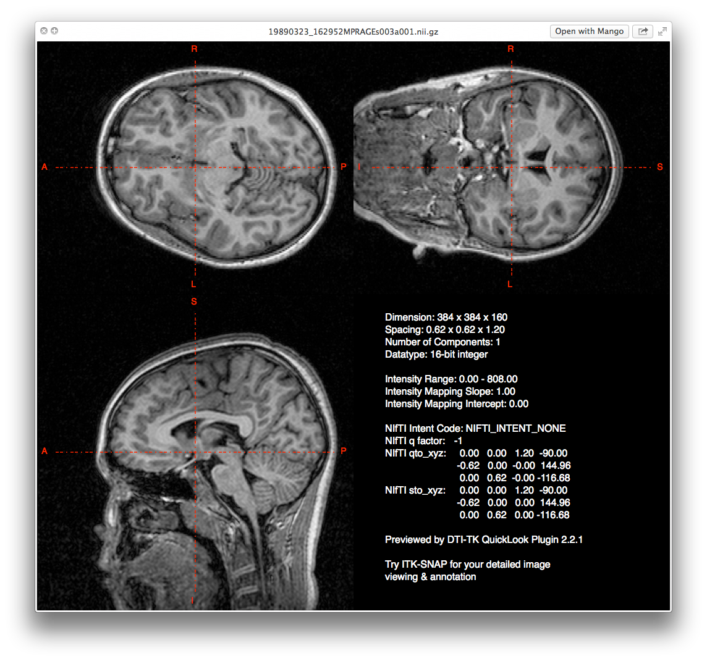

## Convert DICOMs to NIfTI

Most imaging programs do not use DICOMs, but require a "standard" imaging format. Similar to how pictures can be in various formats: PNG, JPEG, EPS,  TIFF, etc., MR images can be in different formats as well. The most common format is the NIfTI format (.nii) or the zipped NIfTI format (.nii.gz).

First let's create a T1 directory within our participant directory. Often times you will be working with multiple scan modalities and you will want to put those in separate directories (e.g., DTI, fMRI, T2w, etc.).

```
subjDir=/path/to/subject
mkdir ${subjDir}/t1
```

## Anonymize

 

## Fixing orientation problems

There are three critical types of brain orientation that need to be done before any analysis:

1. moving the brain into "standard" orientation
2. field of view size
3. alignment

## Standard Orientation

Standard orientation means based on the MNI template and can be measured in terms of orientation on a x-, y-, and z-axis. However, sometimes scans are acquired sagittally and thus the "standard orientation" is off.

- The center of the brain should be located at (0, 0, 0).
- X coordinates go from left (-) to right (+).
- Y coordinates go from posterior (-) to anterior (+).
- Z coordinates go from inferior (-) to superior (+).

## T1 not in Standard Orientation

 

## Field of View

If studying children particularly, sometimes that FOV box is barely enough to acquire the brain, cutting parts of the skull out of the image. Other times the FOV box is so big that you are getting neck and spine in the image.

When you begin any imaging analysis you want to make sure all the brains are orientated correctly and that you remove as much of the excess space and non-brain aspects of the image.

## The Before and After


## dcm2nii

The program `dcm2nii` will anonymize, reorient and crop images:

```
dcm2niix \
-x y \
-o ${subjDir}/t1 \
${subjDir}/DICOM/
```

Because the `acpcdetect` program is sensitive to the type of image it can read, use this program first in your pipeline. The program only uses NIfTI images and ***not NIfTI zipped*** images.

## AC-PC Alignment

Participants are often not perfectly positioned in the scanner. Image quality is compromised when the brain is not aligned in the scanner and there's a lack of standardization.


## acpcdetect

The program `acpcdetect` will AC-PC align images, but the program only runs on Linux:

```
acpcdetect \
-M \
-o ${subjDir}/t1/acpc.nii \
-i ${subjDir}/t1/t1_Crop_1.nii
```

----


## Center at midpoint


## Bias Field

Images often exhibit image intensity non-uniformities that are the result of magnetic field variations. These artifacts, often described as shading or bias, can be produced by imperfections in the field coils. These variations are often seen as a signal gain change. This can result in white matter measurements in one part of the image with the same intensity value as grey matter measurements elsewhere; an ideal T1-weighted image would display brighter white matter throughout the brain image.

Image processing algorithms such as tissue segmentation use the pixel gray level values. If there is a bias field, the gray level values of the pixels will cause the algorithms to produce unsatisfactory results.

----


## N4 Bias Field Correction

The way to fix the bias field is to use ANTs N4 Bias Field Correction tool:

```
N4BiasFieldCorrection \
-d 3 \
-i ${subjDir}/t1/acpc.nii \
-o ${subjDir}/t1/n4.nii.gz \
-s 4 \
-b [200] \
-c [50x50x50x50,0.000001]
```

----

 

----

 

## Voxel Size

```
c3d n4.nii.gz -info-full
Image #1:
  Image Dimensions : [165, 503, 427]
  Bounding Box : {[100.899 96.5478 -87.8256], [298.833 332.354 112.352]}
  Voxel Spacing : [1.1996, 0.4688, 0.4688]
  Intensity Range : [0, 3414.91]
  Mean Intensity : 346.085
  Canon. Orientation : LPI
```

## Resample to 1 mm Isotropic

```
c3d \
n4.nii.gz \
-resample-mm 1x1x1mm \
-o resampled.nii.gz
```

Never perfect though!

```
Image Dimensions : [198, 236, 200]
Bounding Box : {[100.999 96.2826 -87.5596], [298.933 332.089 112.618]}
Voxel Spacing : [0.999667, 0.99918, 1.00089]
Intensity Range : [0, 3145]
Mean Intensity : 346.092
Canon. Orientation : LPI
```