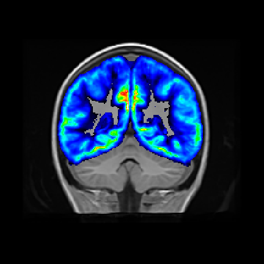
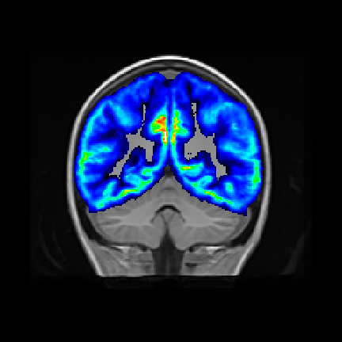

## Before You Begin

At this point, you should have three different group analyses you could complete:

1. Cortical thickness analysis using the **CorticalThicknessNormalizedToTemplate.nii.gz** images
2. Tensor Based Morphometry analysis using the **SubjectToTemplateLogJacobian.nii.gz** images
3. Voxel Based Morphometry analysis using the **modulatedGM.nii.gz** images

### Install FSL

We will be using FSL's **randomise** software to complete statistical analyses. You will need FSL installed on the supercomputer as well as your local computer:

<iframe src="https://player.vimeo.com/video/179801914?byline=0&portrait=0" frameborder="0" webkitallowfullscreen mozallowfullscreen allowfullscreen></iframe>

### Copy Files

For this lesson, we will be just focusing on the ANTs cortical thickness images, but this process can be applied to any of the above images to complete a TBM or even a VBM analysis as well. First, copy all the data into a single directory under your analyses directory. Much like we have done previously, rename each image with the participant ID:


mkdir -p ~/compute/analyses/class/CT/data/
for subj in $(ls ~/compute/class/); do
cp -v \
~/compute/class/${subj}/antsCT/CorticalThicknessNormalizedToTemplate.nii.gz \
~/compute/analyses/class/CT/data/${subj}_CT.nii.gz
done


### Smoothing

If you are completing these analyses with the Log Jacobian image or the modulate GM image, you need to smooth the image. The cortical thickness image has already been smoothed. The basic form of the code:


~/apps/ants/bin/SmoothImage \
3 \
/path/to/dir/<INPUTFILE>.nii.gz \
1 \
/path/to/dir/<OUTPUTFILE>.nii.gz


### Create 4D Image

In order to run group analyses, FSL requires that all your images be merged together, so we need to create a 4D image:


cd ~/compute/analyses/class/CT && mkdir stats
fslmerge -t stats/merged.nii.gz data/*.nii.gz


### Mask

We will use a mask (AKA ROI) to signify what voxels we do and do NOT want to include in the analyses. By using a brain mask, we only analyze brain tissue and not anything else.


cp -v \
~/templates/class/template_BrainCerebellumMask.nii.gz \
~/compute/analyses/class/CT/stats/


## Analysis Design

Before running **randomise** you will need to generate a design matrix file, e.g., **design.mat** and a contrasts file, e.g., **design.con**. Note that the order of the entries (rows) in your design matrix must match the order of your images in the 4D image. You can check the order with:


cd ~/compute/analyses/class/CT/data
imglob *.*


Luckily for our dataset, the first 10 participants are children who have sustained a traumatic brain injury and the last 10 participants are orthopedic controls. If your participants are not organized by group, you will need to be extra careful when creating your design matrix.

### Design.mat

Create a text file within your **stats** directory. Each column in the text file represents an explanatory variable (EV) and each row represents a participant. In our design matrix example, the first column represents the traumatic brain injury variable and the second column represents the orthopedic control variable. Looking at the text file contents below, can you imagine if your list of participants weren't organized by group, how meticulous you would need to be to make sure each row corresponded perfectly with the correct participant?


vi ~/compute/analyses/class/CT/stats/design.txt


Copy and paste into the design.txt file:


1	0
1	0
1	0
1	0
1	0
1	0
1	0
1	0
1	0
1	0
0	1
0	1
0	1
0	1
0	1
0	1
0	1
0	1
0	1
0	1


Save these data as design.txt, then run the following:


cd ~/compute/analyses/class/CT/stats/
Text2Vest design.txt design.mat


This will convert the design matrix data into the format used by the FSL tools, and save the matrix as design.mat.

### Design.con

Contrast files must have one row for each contrast, and a column for each EV. For example, we have 2 EVs in our design matrix above. A contrast matrix for this design might look like this (four contrasts, first two comparing the two groups and the last two giving the mean for each group in the study):


1 -1
-1 1
1 0
0 1


Copy and paste the contrasts into a new file:


vi ~/compute/analyses/class/CT/stats/contrasts.txt


After you save the contrasts.txt file, simply run:


Text2Vest contrasts.txt design.con


Additionally, if you want to keep things easy to remember during the analyses, add the follow lines to the top of your design.con file:


/ContrastName1	TBI > OI
/ContrastName2	OI > TBI
/ContrastName3	mean TBI
/ContrastName4	mean OI


## Voxelwise Statistics

**randomise** is FSL's tool for nonparametric permutation inference on neuroimaging data. For more information about FSL's tool, [click here for the user guide](http://fsl.fmrib.ox.ac.uk/fsl/fslwiki/Randomise/UserGuide).

Create a job script:


vi ~/scripts/class/CT_voxelwise.sh


Copy and paste into the job script:


#!/bin/bash

#SBATCH --time=05:00:00   # walltime
#SBATCH --ntasks=1   # number of processor cores (i.e. tasks)
#SBATCH --nodes=1   # number of nodes
#SBATCH --mem-per-cpu=16384M  # memory per CPU core

# Compatibility variables for PBS. Delete if not needed.
export PBS_NODEFILE=`/fslapps/fslutils/generate_pbs_nodefile`
export PBS_JOBID=$SLURM_JOB_ID
export PBS_O_WORKDIR="$SLURM_SUBMIT_DIR"
export PBS_QUEUE=batch

# Set the max number of threads to use for programs using OpenMP.
export OMP_NUM_THREADS=$SLURM_CPUS_ON_NODE

# LOAD ENVIRONMENTAL VARIABLES
var=`id -un`
FSLDIR=/fslhome/$var/apps/fsl
PATH=${FSLDIR}/bin:${PATH}
export FSLDIR PATH
. ${FSLDIR}/etc/fslconf/fsl.sh

# INSERT CODE, AND RUN YOUR PROGRAMS HERE
cd ~/compute/analyses/class/CT/stats/
randomise \
-i merged.nii.gz \
-o TBIvsOI \
-m template_BrainCerebellumMask \
-d design.mat \
-t design.con \
-n 5000 \
-T -V


### Submit Job Script

To run your 2 group analysis, submit the job script:


var=`date +"%Y%m%d-%H%M%S"`
mkdir -p ~/logfiles/${var}
sbatch \
-o ~/logfiles/${var}/output.txt \
-e ~/logfiles/${var}/error.txt \
~/scripts/class/CT_voxelwise.sh


## Results

    

		
	

	

		
	

On the left is the mean cortical thickness for the orthopedic controls (i.e., contrast 4) and on the right is the mean cortical thickness for the children with a traumatic brain injury (i.e., contrast 3). Does it appear that the OI group has slightly thicker cortical thickness compared to the TBI group?

In order to view the analyses, we need to copy the files locally:


rsync \
-rauv \
BYUNetID@ssh.fsl.byu.edu:~/compute/analyses/class/CT \
~/Desktop/


It will also be useful to have a template image to overlay the results:


scp \
BYUNetID@ssh.fsl.byu.edu:~/templates/class/template.nii.gz \
~/Desktop/


To view the images, you can use the folowing code to see if there are any significant clusters. What you are loading in fslview is the template image and overlaying the statistical results that have been corrected for multiple comparisons. The statistical overlay is thresholded so that p < 0.05 (FWE-corrected). If you remember when we set up our contrasts, the first contrast was TBI > OI, so that means the statistical image will show you any regions where cortical thickness is thicker in TBI compared to OI. The files labeled with **tfce_corrp** is actually 1-p, so that's why the threshold, **-b** is set to 0.95 to 1:


fslview \
~/Desktop/template.nii.gz \
~/Desktop/CT/stats/TBIvsOI_tfce_corrp_tstat1.nii.gz \
-l Red-Yellow \
-b 0.95,1


We also want to check whether there are any regions in which cortical thickness is thicker in OI compared to TBI. Recall from our design.con file that contrast 2 was OI > TBI:


fslview \
~/Desktop/template.nii.gz \
~/Desktop/CT/stats/TBIvsOI_tfce_corrp_tstat2.nii.gz \
-l Red-Yellow \
-b 0.95,1


The results from the cortical thickness analysis is that the thickness of the cortex does not significantly differ between children with a traumatic brain injury and orthopedic controls even though it may look like it from the mean overlays (contrasts 3 and 4 above).
