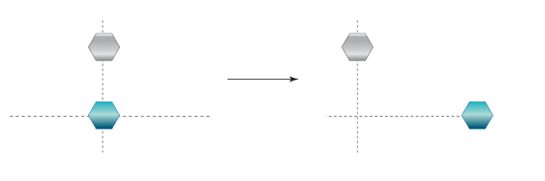
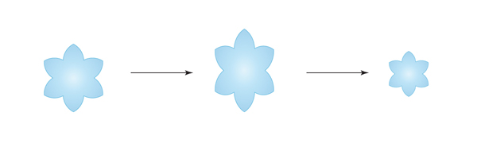
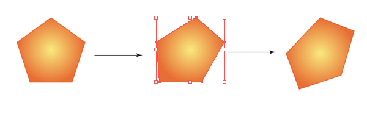
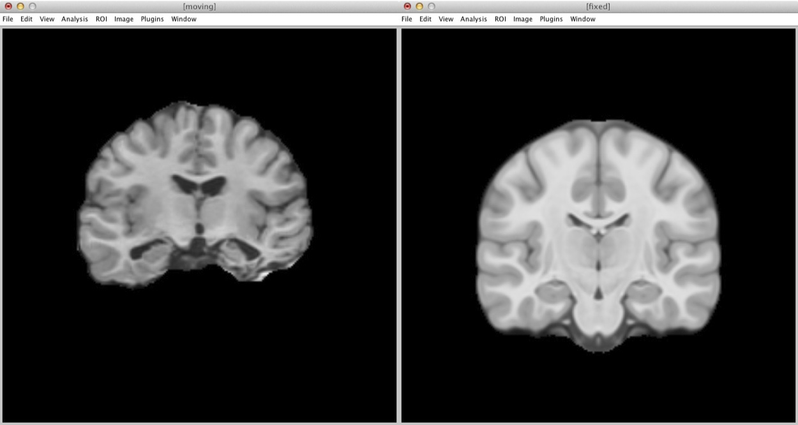
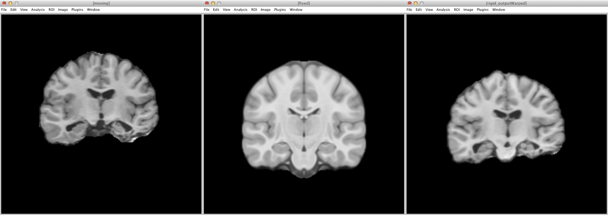
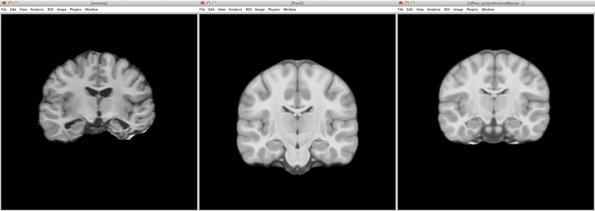
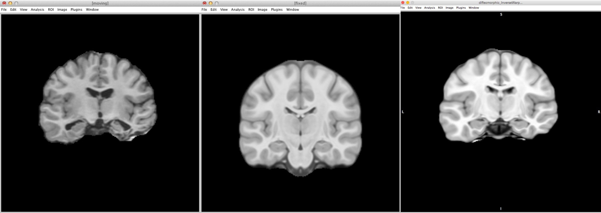
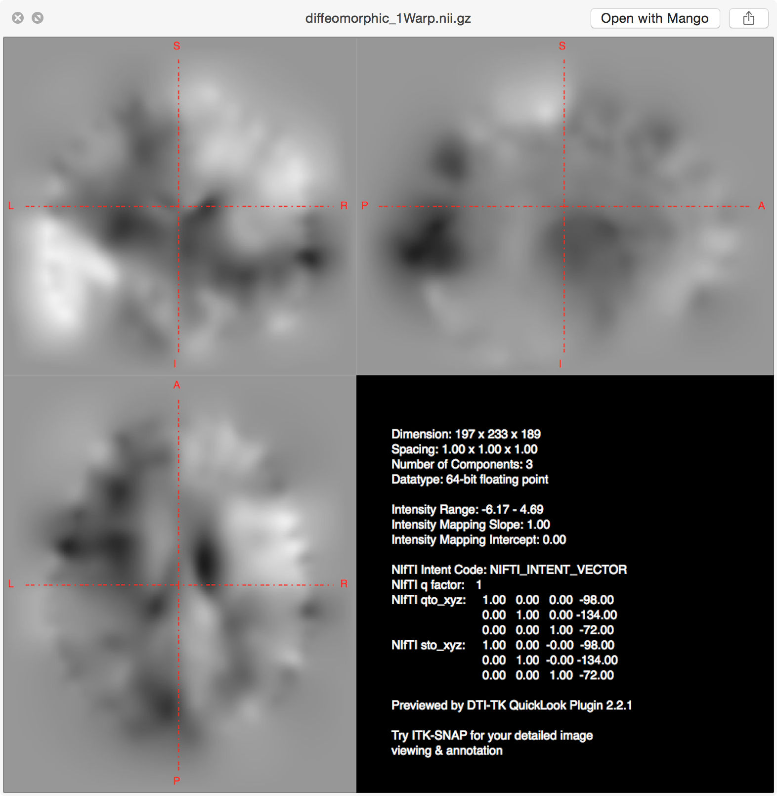

## Types of Brain Mapping

Moving the properties (whole brain, ROI, overlay, etc.) of a brain onto a template:

- Rigid Body
- Affine
- Diffeomorphic

## Rigid Body

Rigid-body transformations involve displacements and / or rotations of the whole object.

***Volume (size of the brain) is not affected by rigid body transformations.***

## Rigid Body - Move

 

## Rigid Body - Rotate

 

## Rigid Body - Mirror

 

## Affine

Affine again effects the whole object as a rigid body and adds two addition transformations: scale and shear.

***Affine transformations preserve proportions, it does not preserve volume, because it can change angles and lengths. Therefore, affine transformations automatically account for brain size differences, since affine transformations will make all brains the same size.***

## Affine - Scale

 

## Affine - Shear

 

## Diffeomorphic

Based on the mathematical field of topology, the simplest definition is that through smooth, continuous deformation, one brain can be warped to look like another brain.

Using diffeomorphic morphometry, this smooth, continuous deformation, preserves the topology of the brain (i.e., sulci and gyri).

## ANTs Nonlinear Registration

For reference, typically the fixed image is a template and the moving image is each participant.

ANTs has two shell scripts for running image registration: antsRegistrationSyn.sh and antsRegistrationSynQuick.sh. Both of these commands are simplified shell scripts of the actual command antsRegistration.

For this class, we will just use `antsRegistrationSynQuick.sh`.

## Comparing Apples and Oranges

 

## Rigid

```
antsRegistrationSynQuick.sh \
-d 3 \
-f <fixedImage>.nii.gz \
-m <movingImage>.nii.gz \
-o <outputPrefix>
-t r
```

----

 
 

## Affine

```
antsRegistrationSynQuick.sh \
-d 3 \
-f <fixedImage>.nii.gz \
-m <movingImage>.nii.gz \
-o <outputPrefix>
-t a
```

----

 
 

----

 
 

## Diffeomorphic

```
antsRegistrationSynQuick.sh \
-d 3 \
-f <fixedImage>.nii.gz \
-m <movingImage>.nii.gz \
-o <outputPrefix>
-t s
```
----

 
 

----

 
 

## Warp Fields

The warp matrix contains the directions for where each voxel in the participant image (moving image) needs to move in order to look like the template (fixed image).

ANTs also outputs the inverse warp field. This field contains opposite information; it contains the directions for where each voxel in the template (fixed image) needs to move in order to look like the participant image (moving image).

----

 
