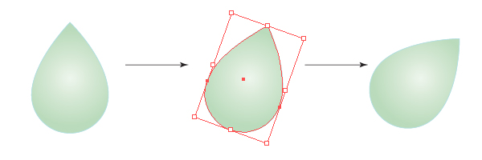
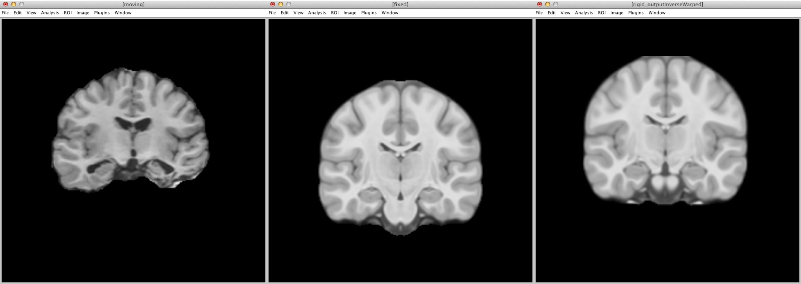
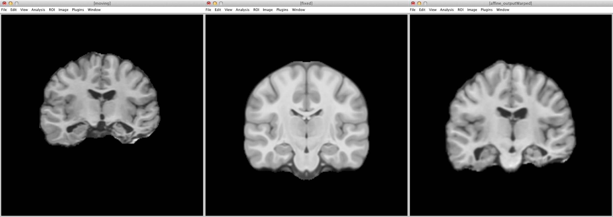

## Objectives

After you complete this section, you should be able to:

1. Define rigid, affine, and diffeomorphic based morphometry
2. Understand when you do and do not need to include brain volume as a covariate
3. Define fixed and moving image as it pertains to image registration
4. Run rigid, affine, and diffeomorphic registration using ANTs

## Types of Spatial Normalization

### Rigid Body

For a rigid body, you can:

#### Move

#### Rotate

#### Mirror

Rigid-body transformations involve displacements and / or rotations of the whole object. An object can therefore move: up or down; left or right ; front or back; rotate; and reflect across an axis (2D) or plane (3D). Whether you are dealing with a 2 or 3 dimensional object, the whole object must move. In other words, if you want to move one point up and to the left, then you must move ALL points within the object that same amount up and to the left.

Volume (size of the brain) is not affected by rigid body transformations.

### Affine

For an affine transformation, you can:

#### Scale

#### Shear

Affine again effects the WHOLE object as a rigid body and adds two additional transformations: scale and shear. Scaling means the object can increase or decrease in size. However, the ratio of each plane does not have to remain the same. You can increase the size along one plane only or all planes. Shearing means you displace one plane, while leaving the rest of the planes fixed.

Affine transformations preserve proportions, it does not preserve volume, because it can change angles and lengths. Therefore, affine transformations automatically account for brain size differences, since affine transformations will make all brains the same size.

### Diffeomorphism

{: .img-responsive }

Based on the mathematical field of topology, the simplest definition is that through *smooth, continuous* deformation, one brain can be warped to look like another brain. Using diffeomorphic morphometry, this smooth, continuous deformation, preserves the topology of the brain (i.e., sulci and gyri). The solution (how and where each voxel needs to be moved) is bidirectional. In other words, the solution, warp field, not only solves the problem of how to make the participant image look like the template, but to make the solution more robust, also finds how the make the template look like the participant image. Because of this smooth, continuous warping, the errors inherent to nonlinear warping when using programs like SPM and FreeSurfer are reduced.

## ANTs Nonlinear Registration

{: .img-responsive }

For reference, typically the *fixed* image is a *template* and the *moving* image is *each participant*.

### Rigid

  <iframe src="https://drive.google.com/file/d/0B7gwoaKa2xaTR1lscVRjOVdCSnM/preview"></iframe>

Here the participant image (moving) is rigidly aligned to the template (fixed). As you can see the participant brain moves to the same location within the field of view box. The size of the participant image is not altered.


antsRegistrationSynQuick.sh \
-d 3 \
-f <fixedImage>.nii.gz \
-m <movingImage>.nii.gz \
-o <outputPrefix>
-t r


{: .img-responsive }

Here the inverse warp occurred (a unique feature of ANTs). The template (fixed) image is rigidly moved to the same space as the participant image (moving).

{: .img-responsive }

### Affine

  <iframe src="https://drive.google.com/file/d/0B7gwoaKa2xaTOHpSUVo5LURhSU0/preview"></iframe>

For this transformation, a rigid transformation is done first, then affine transformation. Here the participant image (moving) is affine aligned to the template (fixed). The participant image is also scaled to match the size of the template. In this case the small participant image was enlarged to fit.


antsRegistrationSynQuick.sh \
-d 3 \
-f <fixedImage>.nii.gz \
-m <movingImage>.nii.gz \
-o <outputPrefix>
-t a


{: .img-responsive }

The opposite is true when the inverse is applied. The template image shrinks in size to match the participant image.

{: .img-responsive }

### Diffeomorphic

  <iframe src="https://drive.google.com/file/d/0B7gwoaKa2xaTVmRnYnFKOU8xcGs/preview"></iframe>

For this transformation, rigid transformation is done first, then affine transformation, and finally diffeomorphic. You always want to do an affine transformation before a diffeomorphic transformation, because you want to eliminate brain size as a covariate. Therefore, any group analyses that result in differences is due to actual differences in regional volume and not due to general brain volume differences.


antsRegistrationSynQuick.sh \
-d 3 \
-f <fixedImage>.nii.gz \
-m <movingImage>.nii.gz \
-o <outputPrefix>
-t s


Here the participant image (moving) is warped to match the template (fixed). As far as possible, the participant image is nonlinearly morphed to look exactly like the template. The participant in this case has some major brain damage and therefore the mapping isn't perfect.

{: .img-responsive }

More drastic is taking the inverse warp and seeing how well the template can be made to look like the participant image. Particularly take note as how well or not so well the hippocampus and ventricles mapped! This was an extremely difficult case to diffeomoprhically warp because of the extensive brain damage.

{: .img-responsive }

## What You End Up With

  <iframe src="https://drive.google.com/file/d/0B7gwoaKa2xaTbVl5Y3JnTGx3Mlk/preview"></iframe>

You can view the images on your local computer. Exit from your secure shell or just open a new terminal window. Copy the files to your Desktop:


rsync \
-rauv \
<BYUNetID>@ssh.fsl.byu.edu:~/compute/examples/morphometry \
~/Desktop


## Class Slides

  <iframe src="http://slides.com/njhunsak/preprocessing-t1-images-2/embed" scrolling="no" frameborder="0" webkitallowfullscreen mozallowfullscreen allowfullscreen></iframe>

