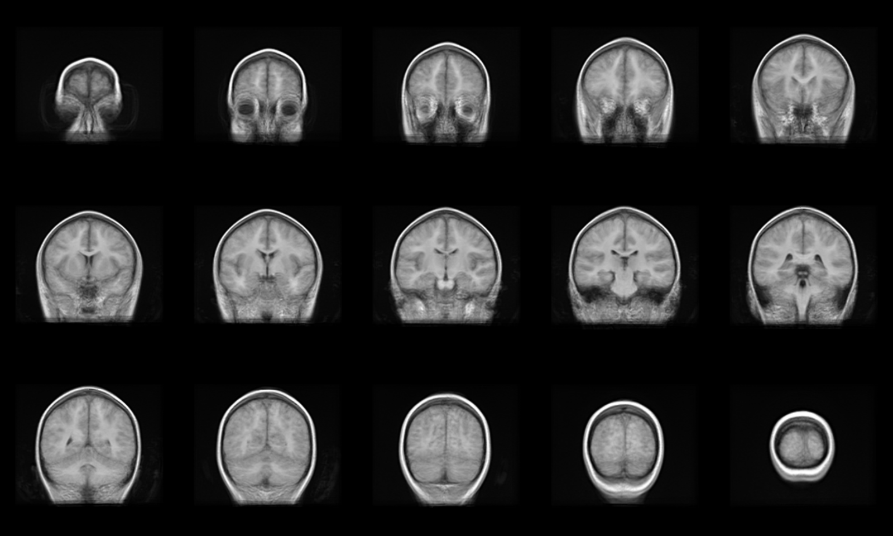
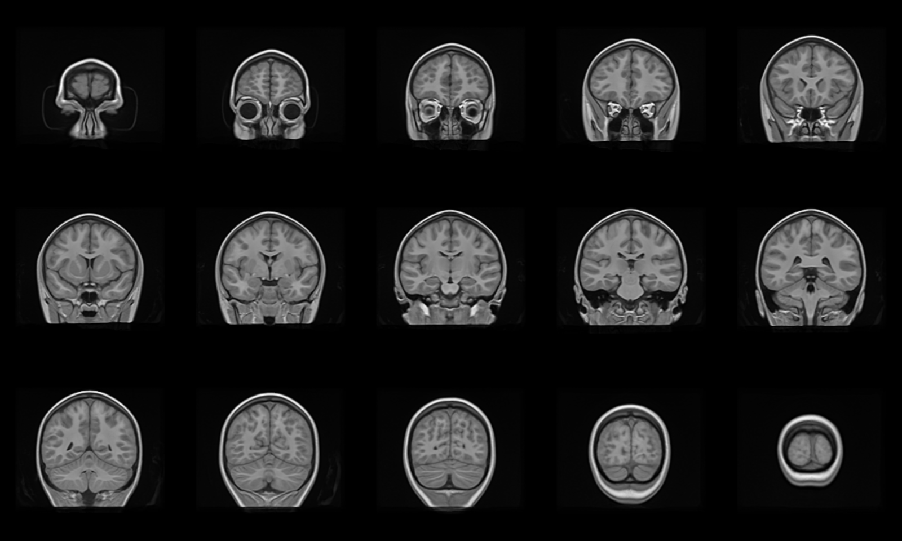

## Objectives

After you complete this section, you should be able to:

1. Use a for loop to copy  and rename preprocessed images to a single directory
2. Write a job script and submit it to the supercomputer compute nodes
3. Create an initial population template
4. Create a high-resolution population template

## Copy Files

  <iframe src="https://drive.google.com/file/d/0B7gwoaKa2xaTTlcwSFhuSWtqX1E/preview"></iframe>

The first step in generating a population template is to copy the preprocessed images (i.e., resampled.nii.gz) to a single directory, but the files must be uniquely named. Currently all the files are named exactly the same, so copying files to a single directory would result in files just being overwritten. Not only do files have to be copied, but they also need to be renamed. You cannot use just the move command, because you want to leave the original file in the original location. Using a for loop allows iterate over each item in the list of files it finds and copy it to a new directory.

### For Loop

Bash loops are very useful. Loops allow us to take a series of commands and keep re-running them until a particular situation is reached. They are useful for automating repetitive tasks. The basic structure of a for loop is as follows:


for var in <list>
do
<commands>
done


What the following for loop does, says "for each of the items in a given list, perform the given set of commands".

First, create a template directory:


mkdir -p ~/templates/class


Next, run this for loop to copy and rename the files:


for x in $(ls ~/compute/class/); do
cp -v ~/compute/class/$x/t1/resampled.nii.gz ~/templates/class/img_${x}.nii.gz
done


In English, create a list of all the directories under the ~/compute/class directory. Conveniently, the directory names are also the subject ID names (that was intentionally done). For each item in that list, assign the item to the variable $x and do the following commands on $x. Copy the resampled.nii.gz found under ~/compute/class/$x/t1/ and paste the file to ~/templates/class with the file name of "img_${x}.nii.gz". Each file will now contain the subject ID!!

## Build Initial Template

  <iframe src="https://drive.google.com/file/d/0B7gwoaKa2xaTWGNwTDFpNjRSbUE/preview"></iframe>

When building a template you need to have a target image, it is advisable to run a few iterations with affine normalization only (-m 1x0x0) to get a sensible initial template, then pass this with -z to run full deformable registration. You will have to submit this script as a job:


cd ~/scripts/class/
vi template-pt1.sh


Copy and paste the following code into the script:


#!/bin/bash

#SBATCH --time=05:00:00   # walltime
#SBATCH --ntasks=1   # number of processor cores (i.e. tasks)
#SBATCH --nodes=1   # number of nodes
#SBATCH --mem-per-cpu=16384M  # memory per CPU core

# COMPATABILITY VARIABLES FOR PBS. DO NO DELETE.
export PBS_NODEFILE=`/fslapps/fslutils/generate_pbs_nodefile`
export PBS_JOBID=$SLURM_JOB_ID
export PBS_O_WORKDIR="$SLURM_SUBMIT_DIR"
export PBS_QUEUE=batch
export OMP_NUM_THREADS=$SLURM_CPUS_ON_NODE

# LOAD ENVIRONMENTAL VARIABLES
var=`id -un`
export ANTSPATH=/fslhome/$var/apps/ants/bin/
PATH=${ANTSPATH}:${PATH}

# INSERT CODE, AND RUN YOUR PROGRAMS HERE
cd ~/templates/class
~/apps/ants/bin/buildtemplateparallel.sh \
-d 3 \
-m 1x0x0 \
-o pt1 \
-c 5 \
img*.nii.gz


To submit the job, use the following code:


var=`date +"%Y%m%d-%H%M%S"`
mkdir -p ~/logfiles/$var
sbatch \
-o ~/logfiles/$var/output-template-pt1.txt \
-e ~/logfiles/$var/error-template-pt1.txt \
~/scripts/class/template-pt1.sh


Now wait! It takes approximately 2 - 3 hours for this initial template to be created. You can kind of check the progress by looking at the output file:


cat ~/logfiles/$var/output-template-pt1.txt


The initial template image will look something like this:

## Build Template

Once you have an initial template created, now a complete template can be generated.


cd ~/scripts/class/
vi template-pt2.sh


Create another job script, but add the initial template and change the output prefix:


#!/bin/bash

#SBATCH --time=30:00:00   # walltime
#SBATCH --ntasks=1   # number of processor cores (i.e. tasks)
#SBATCH --nodes=1   # number of nodes
#SBATCH --mem-per-cpu=32768M  # memory per CPU core

# COMPATABILITY VARIABLES FOR PBS. DO NO DELETE.
export PBS_NODEFILE=`/fslapps/fslutils/generate_pbs_nodefile`
export PBS_JOBID=$SLURM_JOB_ID
export PBS_O_WORKDIR="$SLURM_SUBMIT_DIR"
export PBS_QUEUE=batch
export OMP_NUM_THREADS=$SLURM_CPUS_ON_NODE

# LOAD ENVIRONMENTAL VARIABLES
var=`id -un`
export ANTSPATH=/fslhome/$var/apps/ants/bin/
PATH=${ANTSPATH}:${PATH}

# INSERT CODE, AND RUN YOUR PROGRAMS HERE
cd ~/templates/class
~/apps/ants/bin/buildtemplateparallel.sh \
-d 3 \
-z ~/templates/class/pt1template.nii.gz \
-o pt2 \
-c 5 \
img*.nii.gz


Submit the job script as before with a new timestamp:


var=`date +"%Y%m%d-%H%M%S"`
mkdir -p ~/logfiles/$var
sbatch \
-o ~/logfiles/$var/output-template-pt2.txt \
-e ~/logfiles/$var/error-template-pt2.txt \
~/scripts/class/template-pt2.sh


Now really really wait! It takes approximately 12 - 24 hours for the template to be created. You can check the progress by looking at the output file:


cat ~/logfiles/$var/output-template-pt2.txt


The final template image will look something like this:

## Class Slides

  <iframe src="//slides.com/njhunsak/preprocessing-t1-images-2-3-4/embed" scrolling="no" frameborder="0" webkitallowfullscreen mozallowfullscreen allowfullscreen></iframe>

